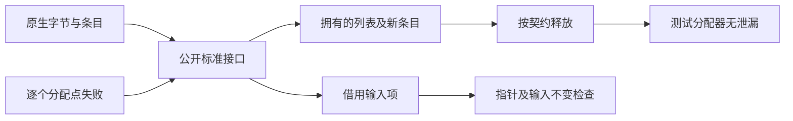
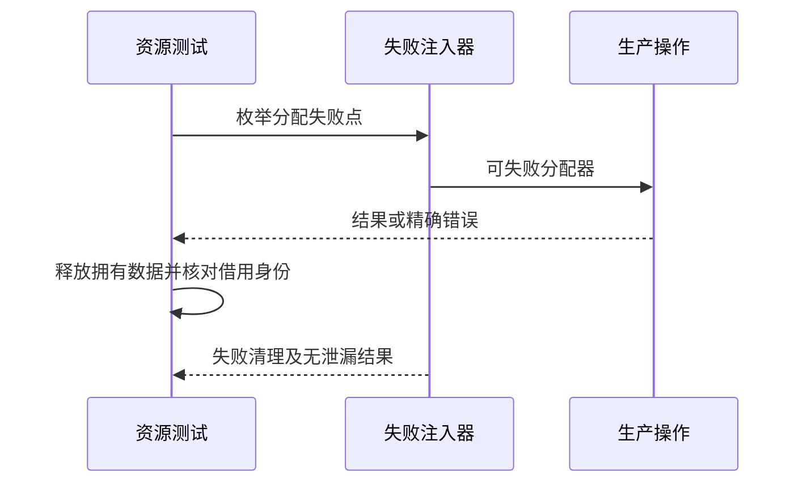

# URL 查询参数资源验证

## Intent：最终目标

阶段三百三十六：验证URL查询参数操作在成功、非法原生UTF-8输入和任意分配点失败时遵守所有权与释放契约。

## Data：可用证据

前阶段8640项验证语义与输入不变，但执行arena统一释放，不能证明函数内部失败清理。现有querystring资源测试提供直接调用、逐点分配失败注入和InvalidUtf8验证样式。新模块parse分配条目与字符串；append/set只拥有新增条目与列表；remove/sort仅拥有结果列表，getAll/keys/values仅拥有外层列表。

## Edges：边界与限制

测试放packages/test/tests/standard/resources/url_search_params。通过compiler公开standard模块取得真实生成ABI，不手写替代生产布局。借用字符串和已有条目不由输出释放；测试明确销毁拥有的数据并核对共享指针。解析非法字节使用替换字符，stringify非法键或值、sort非法键应返回InvalidUtf8。

## Answer：交付格式与成功标准

独立codec、edit、views资源测试，接入test-standard-resources。以std.testing.allocator和checkAllAllocationFailures运行，不能用arena掩盖泄漏。失败预期必须精确，OutOfMemory向注入器传播。

## 自我复核

共享输入条目的输出不能深释放；新增条目不能因与借用项同处列表而遗漏。错误测试在已经产生部分输出后触发非法UTF-8，避免只验证零分配拒绝。排序按key处理，不对不参与比较的value假设额外字符校验。

## 验证结果

在packages/test运行`zig build test-standard-resources -j4 --summary all`，22/22步骤、54/54测试通过，其中本轮新增17项：codec6、update3、lists4、views4。既有37项资源测试保持通过。

所有新增测试均使用checkAllAllocationFailures，正常运行明确销毁拥有的字符串、条目或外层列表，错误路径让OutOfMemory返回失败注入器。parse同时核对原生非法字节及百分号编码的非法序列被替换；stringify在已有输出后拒绝非法key/value；sort在已经分配前序UTF-16键后拒绝非法key。

append/set核对新增条目的key/value借用与保留条目身份；set重复键只保留首个新条目，缺失键走追加分支。remove按键、按值及不匹配三类路径均保持条目共享。sort稳定顺序与共享身份通过。keys、values、getAll只释放外层列表并核对字符串指针；空结果的释放路径通过。

没有修改生产实现，没有发现需报告给实现聊天的缺陷。格式与diff检查通过。测试与实现摘要、完整日志保存在URL查询参数资源草稿。JSONL73834、上游2036已审阅等计数不变；17项属于独立Zig资源测试，不重复计入JSONL。未重跑完整根回归。
