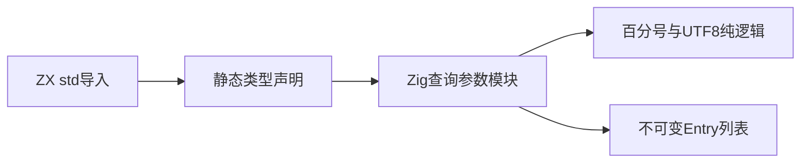

# URL 标准库实施计划

## Intent：最终目标

补齐 URL 标准库的解析、构造、相对地址、域名及查询参数能力，以 Node.js 的功能和 WHATWG 算法为参考。底层为静态 Zig 模块，保持不可变数据接口，不引入 zxc 专用运行库。

## Data：可用证据

- [Node.js URL 文档](https://nodejs.org/api/url.html)区分 WHATWG URL 与旧 API。
- [WHATWG URL 标准](https://url.spec.whatwg.org/)分别定义 URL 状态机与 application/x-www-form-urlencoded 算法。
- 本地 Zig 0.16.0 的 std.Uri 明确说明不是完整标准实现；空密码、空 authority 等信息的处理不能直接作为 WHATWG URL 实现。
- 既有 std:querystring 提供百分号解码及 UTF-8 错误替换，可复用不依赖 ABI 的纯字节逻辑；它的编码字符集、默认条目上限和前导问号规则与 URLSearchParams 不同。

## Edges：边界与限制

URL 全部能力保持在目标中，不把已有 querystring 或 std.Uri 包装器视为完整 URL 交付。先建立查询参数的独立接口，再实现 URL 状态机与域名处理。ZX 使用有效 UTF-8 字符串与静态 Entry 列表，不引入 JavaScript 字符串强制转换、可变类或迭代器运行库。

不生成新测试用例，不运行全量测试；使用真实构建和可复制的使用示例检查接入。原有测试会话继续负责回归覆盖。所有代码草稿位于本目录 URL标准库/草稿。

## Answer：交付格式与成功标准

第一项交付 std:url/search_params：parse、stringify、get、getAll、has、append、set、remove、sort、keys、values、size。保留参数顺序和重复键；删除与匹配可指定值；set 保留首个同名位置并移除其余同名项；稳定排序按 UTF-16 单元比较。编辑返回新列表，不修改输入，也不深拷贝已有只读项。

解析仅去掉一个前导问号，按 & 拆分、首个等号分隔，+ 解码为空格，百分号字节按 UTF-8 错误替换规则恢复。格式化仅保留 ASCII 字母数字和 *-._，空格写 +，其他字节使用大写百分号编码。没有 querystring 的默认 1000 项截断。

成功标准包含正式 std 导入、CLI 应用构建和执行、app/lib 静态打包可见性及使用/reference 文档。完整 URL 解析、主机规范化、IDNA、文件 URL 与 origin 仍须独立实现和验证。

## 自我复核

std.Uri 的存在不能证明 URL 能力完整。查询参数使用独立子模块名，防止把一个完整子功能误称为完整 URL 模块；后续总清单仍保留 URL 状态机缺口。排序不能按 UTF-8 字节替代 UTF-16，编辑也不能因不可变模型而复制整个字符串树。

## 实施与验证

已注册 std:url/search_params，新增真实声明接口与六个按职责划分的 Zig 文件，使用既有 querystring 百分号解码和 UTF-8 替换逻辑。实现覆盖上述 12 个公开操作；编辑只新建列表或新条目，原条目和字符串按只读引用共享。

根构建 14/14 通过。示例应用实际调用全部 12 个成员，生成 14 个单元并运行；同一输入的 Node.js URLSearchParams 对照结果一致，包含重复键、指定值删除、首项替换、空格/加号/波浪号编码，以及补充平面字符与 BMP 字符的 UTF-16 排序。没有以该示例声称所有标准输入均已验证。

lib 导出复用全部 14 个生成缓存单元；独立 Zig 消费者 3/3 构建通过并实际运行，ZX 工作区消费者也已构建运行。发布目录移到消费者的 workspace 子目录后复核消费路径，正式实现及可重建示例保留，生成的整份标准库拷贝不纳入版本管理。

示例最初使用了不符合 ZX 契约的具名默认函数、未导出类型和保留字 match 字段，已修正示例，未为它放宽语言规则。Zig 消费者清单补齐编译器要求的 fingerprint。未新增测试用例，未运行全量测试或浏览器。

完整接口、语义边界与复制命令见 [URL查询参数参考](URL查询参数参考.md)。完整 URL 状态机、域名处理及文件 URL 仍在后续目标中。

只读复核确认 std.mem.sort 使用稳定排序；utf8ToUtf16LeAlloc 后逐单元 littleToNative 转换覆盖大端比较语义。parse/set/append/sort 的失败清理未发现确定遗漏。Zig 直接消费方必须保持被共享输入条目和字符串的存活期，不能单独释放输入后继续访问编辑结果；ZX 应用沿用执行 arena 生命周期。
