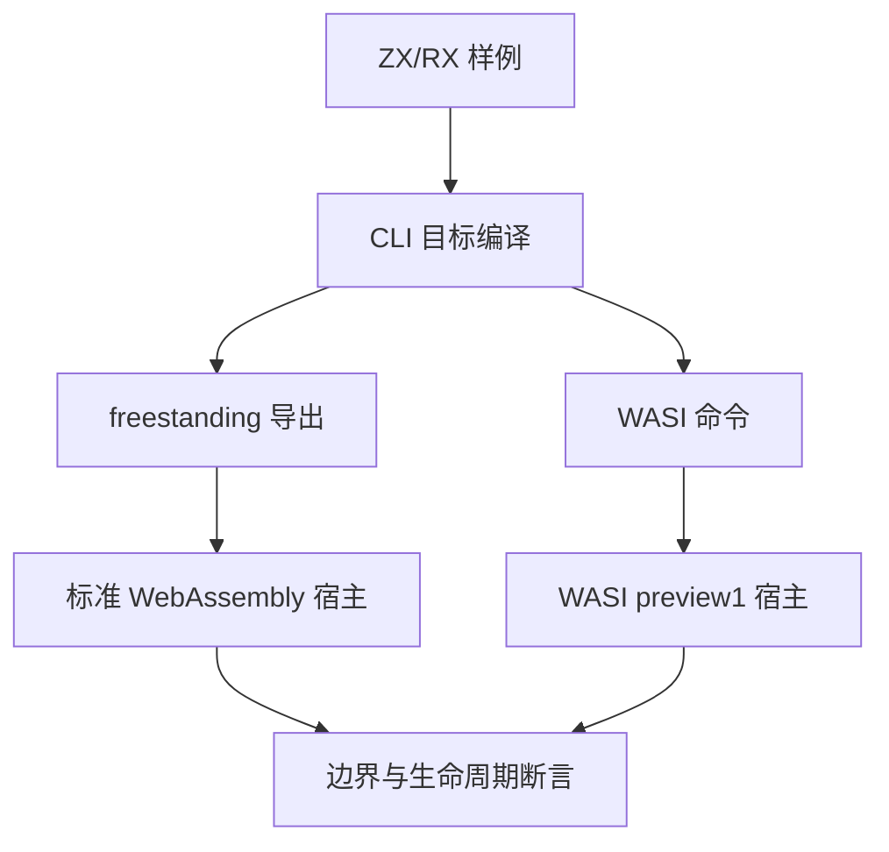
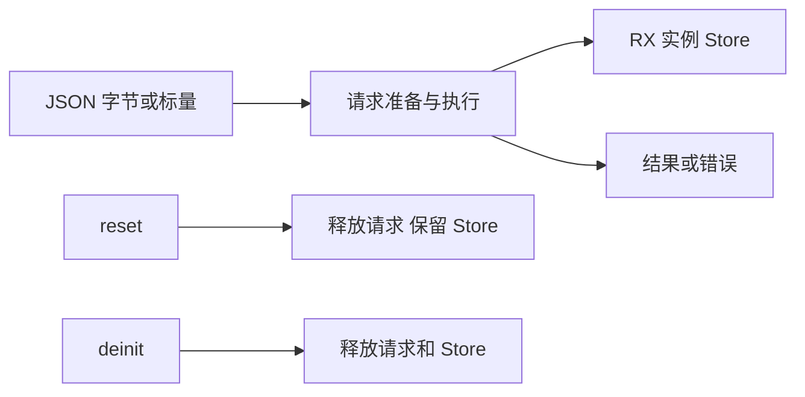

# WASM 协议验证计划

## Intent：最终目标

验证 ZX/RX 的 WASM 目标在真实 WebAssembly 宿主中的调用、数据、错误与状态生命周期，不能以编译成功代替可执行性。

## Data：可用证据

依据 WASM参考、22e4bf90 实现和当前 runner/scalar 协议。核心 Scalar 枚举支持 void、bool、u8、u16、u32、u64、i32、i64、f32、f64，字符串和复合记录走 JSON。宿主使用本机 Node 的标准 WebAssembly API。

## Edges：边界与限制

WASM i32/i64 参数在进入模块前遵守宿主数值转换；无符号结果按对应位宽还原，不能把 JavaScript 参数域误当模块声明范围。每次分配后重新读取 memory.buffer，结果即刻复制；不访问失效指针、不测试未授权内存写入。WASM trap 后丢弃实例。Store 一般内存回收限制沿用现有契约，不用无状态稳定内存结果证明所有 Store 有界。

## Answer：交付格式与成功标准

按宿主协议、标量、JSON、状态和 WASI 分组建立正式用例。真实 CLI 构建 wasm32-freestanding 与 wasm32-wasi；freestanding 产物不得引入系统导入。Debug/ReleaseSafe 两模式逐项执行，错误保留并反馈指定实现会话。记录来源、结果、自审，完成本部分后提交推送。

