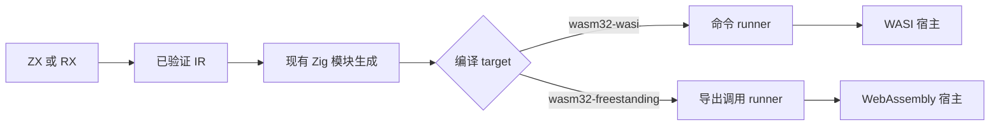
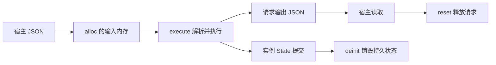

# WASM 实施计划

## Intent：最终目标

让编译后的 ZX/RX 应用在 WebAssembly 宿主中实际执行。保留 app/lib 的职责划分，以 target 选择 WASI 命令模块或 wasm32-freestanding 可调用模块。

## Data：可用证据

已有 build 管线可以把 bool ZX 应用编译为 wasm32-wasi，Node WASI preview1 已实际执行并输出 true。当前 native runner 依赖进程参数与 stdout；freestanding 需要独立宿主入口。artifacts 已将 runner 源码纳入缓存摘要，生成 Store 提供持久 State 和每次调用 Request 生命周期。

官方依据：[Zig WebAssembly](https://ziglang.org/documentation/0.15.1/#WebAssembly) 的无入口构建与显式导出机制。实际工具链为 Zig 0.16.0，最终参数以本机实际构建为证据。

## Edges：边界与限制

没有 ZX 解释器。生成代码、内存管理和 JSON 边界编解码均静态编译进 WASM。JSON 边界有解析与分配成本，不能称其为零成本 ABI；计算图继续复用现有原生生成路径。本次同时提供直接数值 ABI，整数、浮点和布尔输入输出无需 JSON 编解码。

freestanding 不提供操作系统 I/O、进程或 Gateway 能力。外部模块必须能由 Zig 编译至目标平台，不能把 native host 库自动当 WASM 导入。WASI 依宿主提供 preview1 能力。此工作不修改语言语法或生成正式测试，不运行全量测试。

## Answer：交付与成功标准

- wasm32-freestanding 构建自动使用专用 runner，导出线性内存及明确生命周期函数。
- 输入由模块分配，宿主写入 UTF-8 JSON，再执行；输出为 JSON 或错误名称，读取后可释放。
- 每次 alloc/reset 释放上次请求；State 跨调用保留，deinit 明确销毁整个实例状态；下一次分配可重新初始化。
- 同一输入最多执行一次，防止无意重复提交 Store；宿主不可在执行期间重入。
- 实际验证 ZX 复合输入、RX、连续 Store 调用、错误恢复和 WASI 命令模块；保留宿主脚本与观察结果。

## 实施结果与证据

新增 CLI wasm/target.zig、runner.zig 和 scalar.zig。构建层按解析后的 target 选择 freestanding runner，沿用模块生成、ABI、依赖图、缓存及 staged 发布。runner 的实际文本包含标量入口实现，一并进入现有内容摘要。链接使用 -fno-entry、--export-memory、-rdynamic；普通 pub Zig 内部函数不会因此成为宿主导出，实际产物的导出表已在标量调用记录中保存。原生依赖自行声明的 export 符号仍可能进入导出表，使用这些依赖时应审核其公开边界。

已完成实际执行：

| 路径                | 结果文件                | 观察                                                       |
| ------------------- | ----------------------- | ---------------------------------------------------------- |
| ZX 复合输入         | WASM/复合数据调用.json  | Unicode 字符串与数组计算正确，非法 JSON 返回 SyntaxError   |
| RX 服务与新属性语法 | WASM/RX调用.json        | 字符串字面量、表达式、模板和服务调用成功                   |
| RX Store 连续调用   | WASM/Store连续调用.json | 状态跨请求保留，错误输入不执行应用，随后可继续             |
| State 销毁与重建    | WASM/状态生命周期.json  | 第二次调用累加，deinit 后恢复初始状态，重复 execute 被拒绝 |
| 直接 bool           | WASM/布尔标量调用.json  | 0/1 正确，2 被拒绝，后续调用恢复                           |
| 直接 i64            | WASM/整数标量调用.json  | 超过 Number 精确范围的 BigInt 保真                         |
| void 输入/输出      | WASM/空输入输出.json    | 无参数调用及无返回值调用成功                               |
| WASI 命令           | WASM/WASI输出.json      | 同一复合应用在 Node WASI preview1 执行成功                 |

freestanding 记录中的 imports 均为空。`std:stdio` 应用在 freestanding 构建时被明确拒绝，诊断说明该目标无 I/O/process 能力。发行构建 13/13 成功；未运行全量测试或新增正式测试。

## 自我批判

不能把 Zig 支持 target 等同于完整宿主支持。WASI 先通过实际执行获得证据，再补 freestanding 生命周期与导出协议。第一次链接只显式保留固定 JSON 导出，动态选出的标量函数被链接器移除；检查真实导出表发现问题后改用 -rdynamic，复核导出与 BigInt 调用，而不是只看构建退出码。

直接标量调用免除 JSON 转换，但仍有 WASM 宿主调用及错误状态协议；复杂数据仍有编解码成本。未验证浏览器 UI、全部标准库的 WASM 可移植性、所有原生依赖或无界 Store 工作负载。释放请求允许分配器复用空间，WASM 线性内存本身不会缩小。此交付不代表 SIMD、N-API 或自举目标已完成。

补充标准库证据：完整 URL 示例的 12 个公开接口已编译至 freestanding WASM 并实际执行，输出逐字段等于此前保存的原生运行结果，宿主 imports 为空。记录见 WASM/URL标准库调用.json。提交后的发行构建再次 13/13 成功。
