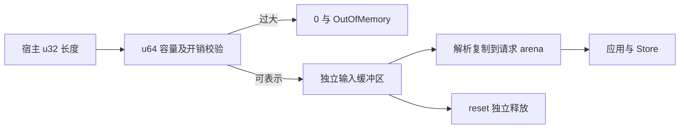

# WASM 输入分配边界修复

## Intent：最终目标

超大 zxc_alloc 请求返回 0 和 OutOfMemory，不能在分配器整数运算中 trap；失败后实例仍可执行正常请求。

## Data：可用证据

测试会话提供 record.zx 与 Debug 日志，zxc_alloc(0xffffffff) 在 ArenaAllocator.alloc 中溢出。当前 Zig 0.16.0 Arena 为节点增加元数据及增长余量；底层 wasm_allocator 是 BrkAllocator，按页与尺寸类别分配。直接把宿主 u32 长度传给 Arena 不能保证中间运算可表示。

## Edges：边界与限制

只修改 WASM 宿主输入缓冲区。JSON 解析仍使用 allocate=alloc_always，将需要保留的内容复制到请求 arena；因此输入缓冲区可独立释放，不必跟随 Store 保留。其他生成代码的分配语义不改。

容量检查依据当前内嵌工具链 BrkAllocator 的尺寸类别数量、WASM 页大小与 free-list 指针开销，用 u64 中间运算计算上界，不对某个请求常量特判。该检查与已固定工具链的分配器实现关联，升级工具链时应重新核对，不能当成 WebAssembly 规范自带的固定输入限制。

## Answer：实现

zxc_alloc 先 reset，再检查分配长度加页对齐和指针开销是否超出最大尺寸类别。无法表示的请求立即返回 OutOfMemory。输入缓冲区直接由 wasm_allocator 分配，避开不必要的 Arena 扩容中间运算；独立保存完整分配切片，使 alloc(0) 的实际一字节分配也能正确释放。reset/deinit 释放该切片，解析后的 Store 数据继续沿原请求生命周期保留。

## 自我批判

此前把分配器的 error.OutOfMemory 当成所有失败的保证，遗漏了进入分配器之前的可表示性前提。修复必须同时处理层级分配开销与输入缓冲区生命周期，不能只捕获错误或识别最大 u32 常量。

## 验证结果

用反馈中的 record.zx 构建 Debug WASM，多个超过可分配类别的长度都返回 0/OutOfMemory，随后正常 JSON 往返成功，alloc(0) 与 deinit 正常。证据见 WASM/输入分配边界.json。重新构建 Store 示例后，连续调用结果与此前记录完全一致。发行构建 13/13 成功，未运行全量测试。
