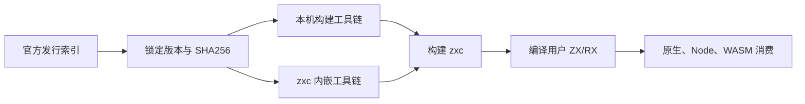
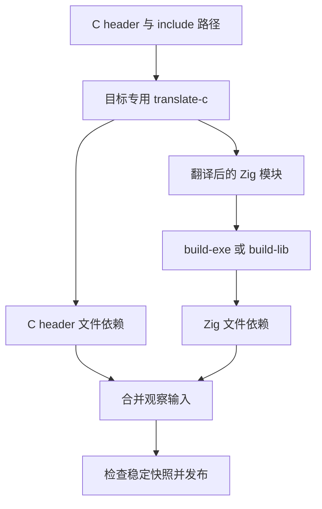

# Zig 0.17.0 升级实施计划

## Intent：最终目标

将仓库最低 Zig 版本、内嵌工具链和 CI 固定版本升级到官方 0.17.0，修复实际构建暴露的兼容问题。

## Data：可用证据

[官方下载索引](https://ziglang.org/download/index.json) 确认 0.17.0 于 2026-10-01 发布。当前本机 Zig 为 0.16.0，内嵌工具链清单包含五个宿主发行包；CI 的 Windows ARM64 使用 x64 发行包。

## Edges：边界与限制

不执行全量测试、不新增测试用例。保留其他会话变更，历史实施记录保留当时版本。更新公开安装文档、所有自有包最低版本及官方归档 SHA256。检查既有 WASM 分配边界所依赖的标准库结构。

## Answer：交付与成功标准

官方归档校验通过，0.17.0 构建发行产物成功，实际使用内嵌工具链编译并加载原生、Node 与 WASM 示例，CI 生成文件检查通过。按实际证据记录未覆盖平台，完成后提交与推送。

## 实施记录

- 本机默认 `zig` 已切换为官方 x86_64 macOS 0.17.0，按用户要求删除旧 0.16.0 安装目录。归档 SHA256 与官方索引一致，内嵌清单五个宿主的 URL 与 SHA256 同步更新。
- 自有包最低版本、CI TypeScript 定义及生成 YAML、安装文档同步升级。CI 使用 `-Doptimize=safe`；zxc 的 `--optimize` 保留旧名称兼容并接受新名称。
- 更新构建路径 API、AST parse options、结构体反射、Tuple/Int 内建和已删除的数组重复语法。已有测试资源仅做兼容迁移，没有新增用例或运行全量测试。Grit 的当前语言列表不支持 Zig，机械迁移使用限定路径脚本，随后进行 AST 检查和 diff 复核。
- libyaml 使用构建阶段 C 翻译模块。用户 C header 导入通过 `translate-c --listen=-` 翻译，保留 `module.c` 接口；发布的 Zig 库同样在消费端按目标翻译 C 头。
- 翻译阶段文件依赖合并进入后端观察结果，保持新增依赖重试、头文件变动跟踪、失败后保留旧产物和稳定快照发布。普通编译和 C 翻译按各自协议的结束消息判定完整响应。
- Zig 新增 build_root 路径前缀：观察构建显式传入 --build-root，并按同一目录解析返回路径。源码指纹和标准库资源扫描登记配置阶段文件/目录依赖，避免新 configure 缓存复用旧指纹。

## 验证与自我复核

实际记录见 [验证记录](Zig升级/验证记录.json)。0.17 发行构建 14/14 成功，重复构建命中缓存；Node 插件真实执行并保留 BigInt/Buffer/nullable 契约，WASM 完成 JSON 往返与超大输入拒绝。C 直接调用和发布库的普通 Zig 消费者均输出 7；观察构建修改头文件后输出 8，错误头文件保留旧产物，恢复后再次输出 7。完整 URL 标准库示例也已重新编译并执行成功，覆盖字段反射迁移。CI TypeScript 与 YAML 一致性检查通过。

自我复核发现，仅按发布说明推断协议是不够的：真实 build-exe 即使未显式提供 build_root，也会返回此类路径；现已显式固定并正确解析。translate-c 成功时没有 error_bundle 结束帧，因此不能直接使用原编译响应的完整性判定。两项均由真实调用复验。WASM BrkAllocator 的结构仍与既有边界校验一致，实际超大分配返回 0，没有删除保护。

29 个已有测试资源文件通过 `zig ast-check`，这只证明语法兼容，不等同于测试通过。未执行全量测试，也未声称 Linux/Windows 的真实运行已经覆盖。其他测试会话的新增用例及未提交修改保持独立。
