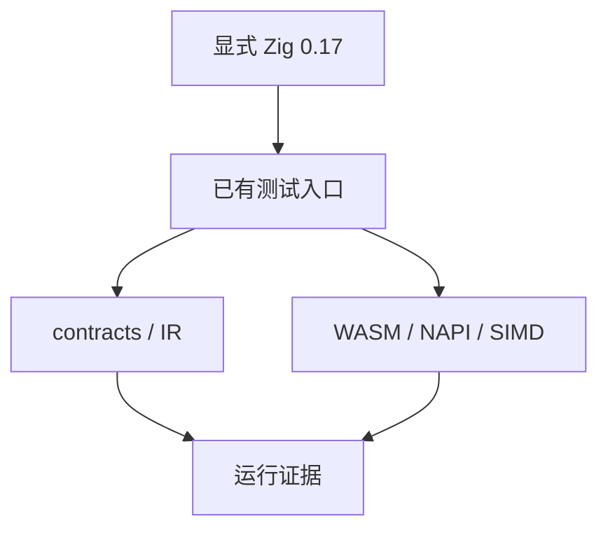
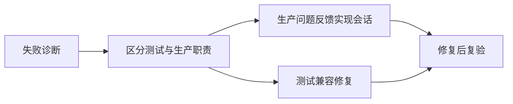

# Zig 升级测试回归计划

## Intent：最终目标

核对 Zig 0.17.0 迁移后的既有测试入口和语言行为，避免发行构建成功掩盖测试包或生成产物的兼容问题。类型绑定阶段的提交等待实现会话完成升级，本计划推进独立回归工作。

## Data：可用证据

当前默认 Zig 仍为 0.16.0，新工具链位于 `/Users/xiewendao/.local/share/zig/zig-x86_64-macos-0.17.0/zig`。显式新工具链已通过 NAPI 类型绑定 43 个场景的 Debug/ReleaseSafe。WASM、NAPI 协议和 SIMD 门禁此前基于 0.16.0 已通过。

## Edges：边界与限制

- 使用显式 0.17.0 路径，不修改全局默认工具链。
- 先运行 contracts/IR 和近期宿主协议，保留失败诊断；生产兼容问题反馈指定实现会话，测试自身兼容问题才在本会话修复。
- 不将几组门禁通过替代整个测试包通过；扩大检查范围时记录实际命令和结果。
- 与实现会话共享工作区，记录执行时的未提交升级状态；发布测试提交时只纳入本会话改动。

## Answer：交付与成功标准

日志保存在 `Zig升级测试回归/`，按命令记录通过、失败、待修复，不重复创造语义用例计数。需修复的测试兼容改动单独记录和提交；无问题不向实现会话发送例行消息。

