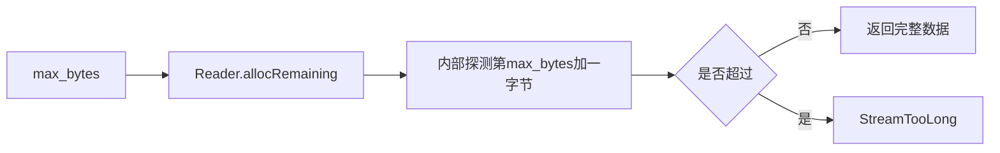

# Zig 0.17 读取上限修复

## Intent：最终目标

保持 std:process.readStdin/readStdinText 的 max_bytes 为允许的最大字节数：空输入与恰好达到上限可读，超过一字节必须拒绝。

## Data：可用证据

测试会话复现 max_bytes=0 时 1 字节、max_bytes=3 时 4 字节被错误接受。0.17 Reader.allocRemaining 内部向 appendRemaining 传递 limit+1，实现“超过才拒绝”的新契约；调用方原有 +1 导致实际接受上限多一字节。

## Edges：边界与限制

同版本的 Dir.readFileAlloc 仍调用 allocRemainingAlignedSentinel，后者直接把 limit 传递给 appendRemainingAligned，保留“达到就拒绝”的契约。因此 fs.readFile 的 max_bytes+1 仍然必要，本次不机械删除所有 +1。HTTP 与 Gateway 在读取后显式检查实际长度，未发现同样的放宽错误，保留已有实现。没有新增测试用例或运行全量测试。

## Answer：修复与验证

标准输入去掉调用点的 +1，文本读取复用同一边界。复验既有 test-process-stdio 专项，并记录实际结果。

自我复核：同名或近似 API 不保证相同边界语义，必须读取实际调用链；文件读取采用不同底层入口，不能随标准输入一起改成错误的排他上限。

复验结果：既有 `zig build test-process-stdio -j2 --summary all` 18/18 步骤成功、49/49 Zig 资源测试通过，另有 50 项 Node 驱动的真实标准流应用检查全部通过。覆盖零上限、恰好上限、超出一字节、多字节 UTF-8、错误后资源释放及输出策略。
