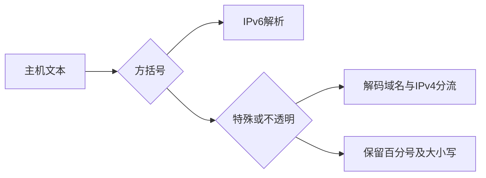
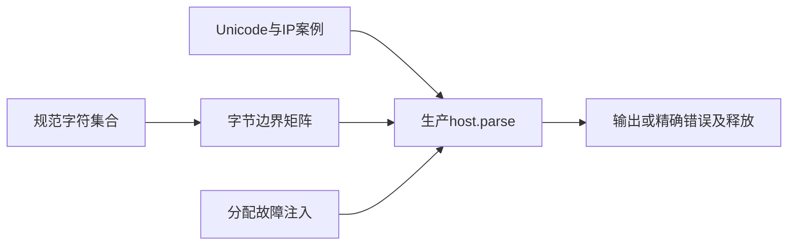

# 主机解析验证计划

## Intent：最终目标

阶段409：验证 host.parse 的特殊/不透明分支、IPv4/IPv6 分流、Unicode 与百分号边界，并保证错误与分配失败清理。

## Data：可用证据

生产 a6f77569；[WHATWG 主机规则](https://url.spec.whatwg.org/#host-miscellaneous)与[域名解析](https://url.spec.whatwg.org/#concept-domain-parser)，页面日期 2026-09-10。禁止 host/domain 字符按规范数字集合建立独立预期；不复制生产 helper。

## Edges：边界与限制

直接输入主机文本，不执行完整 URL 的空白清理、端口拆分或 file 空主机处理。不透明主机保留大小写和百分号串；特殊主机先百分号解码。当前规范对非 strict 纯 ASCII 域名直接小写，即使 ACE 内容无效也不据此拒绝；混入非 ASCII 后仍应走完整 IDNA。Node 旧版不能覆盖这一新兼容行为。

## Answer：交付与成功标准

新增 test-url-host，显式案例与全部 ASCII/单字节百分号矩阵分开，正例精确输出、负例精确错误、所有显式案例分配故障注入。Debug、ReleaseSafe 通过并提交推送；发现生产缺陷才反馈指定会话。





## 实施与验证

正式测试通过编译器的 standard 模块引用 url.host，使用完整生产模块边界。最初直接将 host/root.zig、url/root.zig 当作模块根会使合法的兄弟目录导入越界，这是测试构建配置问题；改用成熟 standard 模块后通过，没有调整生产导入来迎合测试。

显式案例共 67 项：47 个成功路径、20 个精确拒绝路径。覆盖大小写、百分号点、非 ASCII 与组合字符、全角 IPv4、缩写与非十进制 IPv4、方括号 IPv6、混合 IPv4 尾部、zone/缺少括号/端口混入，以及 ASCII ACE 兼容与非 ASCII 域名重新进入 IDNA 的边界。

四组字节矩阵共执行 1,024 次解析：128 个特殊主机 ASCII、128 个不透明主机 ASCII、256 个百分号单字节的双模式处理、128 个孤立高字节的双模式拒绝。禁止字符预期按规范数字集合建立；固定 A/字节/b 的外壳避免数字后缀意外触发 IPv4 分流。矩阵循环计为四个组合测试，没有膨胀独立测试数量。

另两组故障注入遍历所有 67 个显式案例。成功路径精确比较输出，失败路径匹配 InvalidHost、InvalidDomain 或对应 IP 错误；分配失败保持 OutOfMemory，临时解码、域名和 IPv6 序列化缓冲均释放。

Debug 与 ReleaseSafe 各 10/10 构建步骤、73/73 测试通过。生成器 --check、Zig 格式及 diff 检查通过；无生产修改，没有发现生产缺陷，未发送实现会话消息。

## 自我批判

直接主机解析的 C0、TAB、LF、CR 输入不能用完整 URL 构造器预期替代，完整 URL 层会先做输入清理。当前纯 ASCII ACE 兼容行为依据已核对的 2026-09-10 WHATWG 算法，不按旧 Node 的拒绝行为改写结果。主机层也不承诺报告非致命 validation error，本套件只验证输出或失败。

这些检查不覆盖完整 URL 状态机、基址解析、origin、file 平台转换或公共 ZX 接口；这些已出现后续实现，继续单独跟进。本阶段不改变 Test262 适配或既有 JSONL 计数，整体目标仍在进行。

## 复验命令

仓库根验证显式用例生成一致性：

```sh
python3 docs/2026-10-05/主机解析验证/生成用例.py --check
```

在 packages/test 执行：

```sh
zig build test-url-host --summary all
zig build test-url-host -Doptimize=ReleaseSafe --summary all
```
