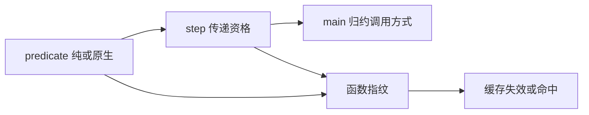
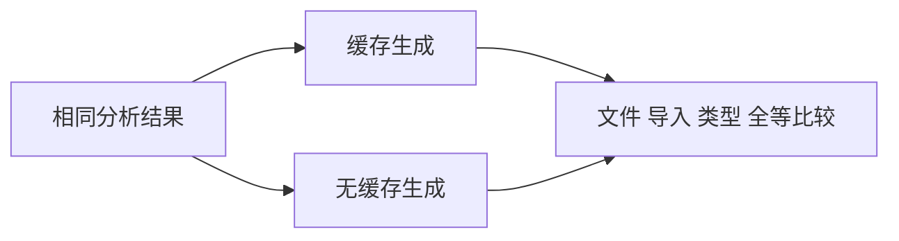

# 值返回缓存资格测试计划

## Intent：最终目标

验证值返回资格发生传递变化时模块生成缓存正确失效，并且普通纯函数体改动不导致无关调用者重建。

## Data：可用证据

生产提交 6b37d623 在函数和 FunctionId 指纹中加入 value_functions 位。现有 module_generation 测试只覆盖普通标量 helper 体修改，未覆盖三层调用链的纯/原生依赖切换。

## Edges：边界与限制

使用固定 main -> step -> predicate 链和相同公开签名，predicate 在纯计算与原生接口调用之间切换。只修改测试，不手工篡改 IR 资格位。本组验证生成文件及导入集合相对无缓存结果完全一致，不将源码比较称为运行时执行测试；运行时由 value_return 专项承担。

## Answer：交付与成功标准

分别验证纯到原生、原生到纯、重复命中、纯函数普通体改动；生成缓存所有输出与无缓存生成逐字一致。资格切换必须改变 entry 的调用方式，普通纯体改动保持 entry 不变。Debug/ReleaseSafe 专项通过后提交push。

## 执行结果与自我复核

新增三个正式测试分别执行纯到原生、原生到纯、纯体普通变化；每个测试还执行重复命中和恢复原版本。原生接口注册与公开签名固定，通过实际分析产生 IR，没有直接修改纯度或缓存键。调用链含 scalar predicate 和 flat-object step，可观察传递资格对归约入口的影响。

初次 Debug 10/10 步骤、12/12 模块生成测试通过。调整分析结果的 defer 注册顺序后，最终 Debug 退出 0，10/10 步骤、新测试 3/3 重跑通过，其余 9 项缓存复用；最终 ReleaseSafe 退出 0，10/10 步骤、12/12 用例通过。git diff --check 与 Zig 格式检查通过。

比较包含 entry、全部模块的稳定文件名、完整源码、导入集合和类型源码。额外确认优化资格变化时 entry 的 callValue 调用方式确实变化，普通纯体修改保持 entry 不变；文本标记只作路径控制，正确性以缓存/无缓存完整输出一致为准。未声称本组执行了生成程序；运行时状态与失败恢复已由独立 value_return 测试负责。没有复现新实现缺陷，无需发送修复请求。
