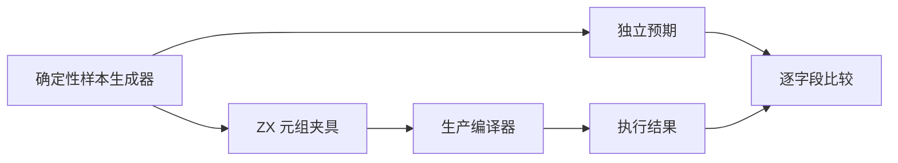

# 元组绑定顺序回归

## Intent

补齐 ZX 静态元组解构的独立绑定顺序、类型和值检查，同时保持 Test262 协议边界准确。

## Data

全文审阅 Test262 const/dstr/ary-name-iter-val.js，三个断言为 x=1、y=2、z=3。ZX analysis/statements.zig 要求解构源为 tuple 且覆盖所有槽；它不执行 JS 数组 IteratorBindingInitialization。既有消费集合测试包含二槽元组解构，但独立三槽与混合类型重排需要直接回归。

## Edges

本轮仅增加本地测试，不把 JS 数组迭代改成静态元组后记为上游 adapted。实现会话正在研究列表复用草稿，未启用前不把草稿推断当正式能力。全量 ReleaseSafe 已另行启动，其构建图不包含此后新增注册。

## Answer

以动态输入构造三槽标量元组并解构，检查绑定与逆序重组；补混合类型元组和中间槽丢弃，检查不同类型不会串槽。使用生产编译器生成执行，Debug 与 ReleaseSafe 验证，保留目录审计、生成器复现与原文哈希。

## 实施记录与自我复核

新增 generate_tuple_bindings.ts、三个 ZX 夹具及对应目录样本，接入 suites.json 和 test-tuple-bindings，完整 test-runtime 也会执行此组。标量五例包含原文 1/2/3、逆序、正负零、重复值和 32 位边界附近值；混合与丢弃各四例包含空字符串、ASCII、多字节 Unicode 和 NUL。预期直接描述每个槽的目标字段与逆序，不在测试里重写编译器的投影逻辑。

首次执行被 spacing 门禁拒绝：元组常量声明和解构声明之间没有空行。生成器已补语义分隔，重新生成后 Debug 22/22 步骤、13/13 用例通过。生成器 --check、包级 TypeScript 类型检查和覆盖审计通过；目录共 80146 项。上游适配/等价/排除计数保持 687/103/1424。

只读协作复核同意不把静态元组投影登记成 JS 数组迭代绑定；另几份非法赋值 target 候选也未适配，因为当前 ZX 对合法 JS 可变局部赋值同样拒绝，通用语法拒绝不能证明特定 target 规则。没有添加投机映射。

此轮验证的是静态三槽绑定、重组与中间槽丢弃，不证明 JS iterator 协议、默认值、rest 或嵌套解构。全量 ReleaseSafe 在新增注册前启动，所以不包含这 13 项；它们另行执行专项门禁。未发现生产实现问题，不发送实现会话消息。

ReleaseSafe 专项最终正常退出：22/22 构建步骤、13/13 用例通过。
