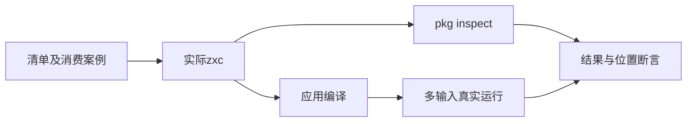
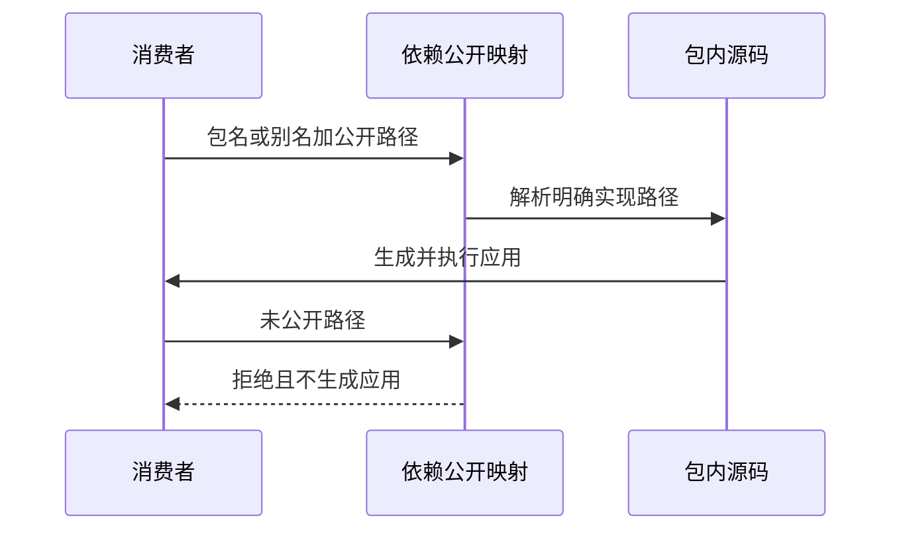

# 公开模块清单与消费验证

## Intent：最终目标

阶段三百四十二：为e8c371ea新增exports公共模块映射补真实CLI测试，覆盖公开边界、包别名及自引用，保持原有entry兼容。

## Data：可用证据

当前exports支持`.`和多层显式路径，与entry互斥；目标必须留在包内。映射进入package.project的依赖及自身解析。既有package_manifest测试只覆盖单entry；其中无入口错误文字已改为no public modules，需要同步测试契约。

## Edges：边界与限制

实现聊天正在开发统一库联结。本批只验证已经提交的清单及源包消费，不将其解释为RX/ZX统一发布完成；不修改生产实现，不触碰进行中的联结实现。

## Answer：交付格式与成功标准

在packages/test/tests/package_manifest下新增exports清单与消费案例，复用现有真实CLI驱动；合法应用实际执行多个输入，非法公开路径不产生应用。精确核对清单诊断及位置，完成TypeScript检查和相关专项。代码草稿与日志存放公开模块测试草稿。

## 自我复核

仅测试inspect不能证明公开表进入解析器，必须包含真实消费；不能仅断言命令成功而忽略exports内容，也不能把最新诊断文字变化误报为生产缺陷。

## 验证结果

新增export_cases.ts含41项清单案例，export_import_cases.ts含14项真实消费案例，分别接入既有inspect与import驱动和构建文件输入。扩展测试fixture的exports字段，不改生产实现。更新旧无入口案例的诊断为当前no public modules契约。

清单驱动160/160通过；消费驱动30/30通过。新增消费中7项成功应用分别执行0、7、123三个输入，共21次新增真实运行，核对组合、默认公开入口、依赖别名、scoped包、自引用、共享实现别名和内部相对依赖。7项非法引用精确拒绝，包含无默认导出、隐藏文件、私有源码后缀路径、目录前缀和额外子路径、别名原包名。

TypeScript检查通过，新增文件Prettier检查通过，build.zig的zig fmt检查与diff检查通过。首次对既有驱动同时做Prettier检查报告其原有排版差异；仅格式化两个新增文件，不扩大格式重写范围。日志与五个相关测试源码副本已保存在公开模块测试草稿，另存CLI和生产契约文件哈希。

本轮调用两个真实Node驱动，没有运行test-package-manifest其余驱动或完整根回归，也未重新编译实现聊天正在修改的统一联结源码。CLI来自前一阶段成功构建；结果对应已提交的公开映射功能。55项新增Node测试不计入JSONL，JSONL73834及Test262已审阅2182保持不变。

没有发现需通知实现聊天的生产缺陷。本批未证明清单write接口的资源/序列化往返，也未证明exports驱动的统一库发布、RX/ZX混合公开消费或产物搬迁；这些应继续按对应实现进度验证。
