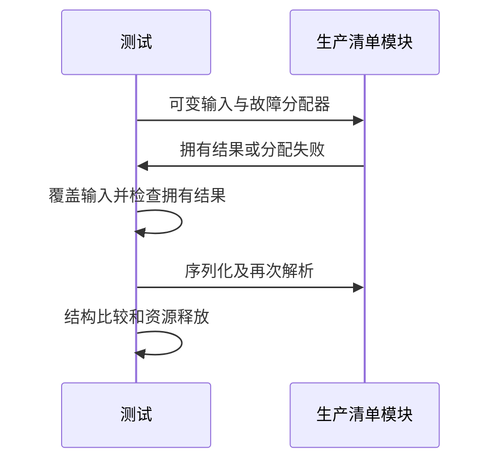

# 公开模块清单资源与往返验证

## Intent：最终目标

阶段三百四十三：验证exports解析结果拥有名称和路径、生产write保留公开表、写出后重读一致，以及Zig分配失败清理。

## Data：可用证据

manifest.parse返回arena所有的Result；write接收Manifest并输出YAML。上一轮CLI覆盖不调用含exports的write分支。解析器使用libyaml的C内存和Zig arena两个分配体系。

## Edges：边界与限制

只添加packages/test测试与构建入口。测试构建复制原始生产文件到生成目录统一导入，避免更改生产导出接口或手写替代序列化器。Zig故障注入不能覆盖libyaml内部malloc，明确不声称C分配点都已注入。

## Answer：交付格式与成功标准

交付独立Zig测试、专项构建入口及日志；验证释放/覆盖输入后仍可使用解析结果、二次解析与首轮结果结构相等、失败路径不泄漏。写出分配失败应按Writer接口错误表达，不将所有错误笼统记通过。

## 自我复核

测试需要独立期望公开路径与顺序，不能仅用同一解析器的往返掩盖对称错误。Writer容量失败另行明确断言，C库分配边界不虚报覆盖。

## 验证结果

新增resources/exports_test.zig六个测试，专项test-package-manifest-resources通过7/7步骤、6/6测试；该专项已挂入packages/test的test入口。测试覆盖输入覆盖后独立拥有、含空格/中文/引号/井号实现路径、导出顺序与默认路径、完整Manifest往返、序列化缓冲覆盖后第二份结果仍有效、重复映射/后续越界项/entry冲突的清理、有限Writer失败，以及legacy entry保持exports为空。

成功往返和三个解析拒绝场景均使用checkAllAllocationFailures遍历Zig分配点。Allocating Writer的WriteFailed仅在该内存writer上下文转换成OutOfMemory供故障注入检查；固定容量writer另行断言WriteFailed。没有对libyaml内部malloc做故障注入，不能从本结果宣称其C分配点已覆盖。

初轮测试夹具用了禁止的冒号源路径，导致解析拒绝和随后未检查union标签的测试崩溃；已改为合法的井号/空格路径并增加成功类型断言，保留初轮日志，未误报生产缺陷。最终zig fmt与diff检查通过。

构建通过WriteFiles原样复制生产manifest.zig及manifest目录，同一模块共享真实model类型，并链接生产所用libyaml源码；未修改生产公开接口或手写替代实现。生产文件哈希、测试及构建源码副本与日志保存在公开模块资源草稿。

没有生产缺陷或需发往实现聊天的消息。JSONL73834、Test262审阅2182保持不变；没有重跑完整根回归。当前HEAD已推进到9cdd393b的统一模块联结，下一批可跟进该新增API的真实分析/联结/消费及生命周期测试。
