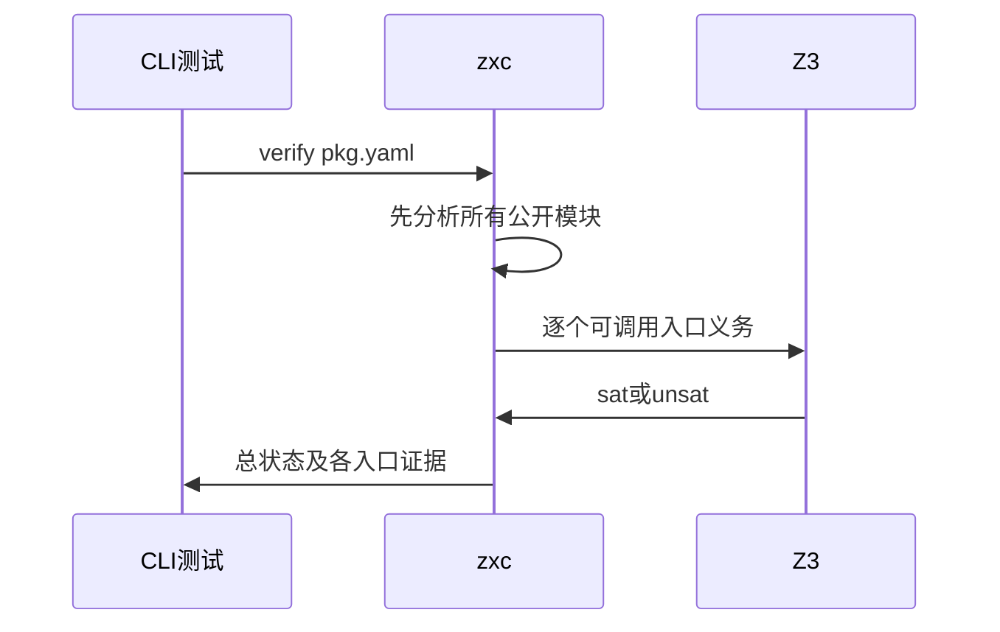

# 公开模块集合证明入口验证

## Intent：最终目标

阶段三百五十：验证zxc verify pkg.yaml完整遍历公开集合，分别证明所有可调用模块，校验纯类型模块，拒绝公开语法错误并保留逐模块诊断。

## Data：可用证据

ae7fb3d4实现先分析所有exports，再link并依次verify；证明输出按公开名称SHA256分文件。真实Z3沿用已有ZXC_TEST_SOLVER配置。

## Edges：边界与限制

这是证明入口，不是库发布。反例时生成SMT与模型属于诊断证据，不误判为损坏发布产物。未公开文件可以不参与集合；公开但未被其他入口引用的文件必须分析。只新增测试。

## Answer：交付格式与成功标准

注册Node CLI测试，构造真实pkg.yaml和ZX/RX源码，运行实际CLI/Z3。检查所有公开名、证明文件隔离、sat/unsat、错误顺序无关、纯类型不需要solver和分析失败前不产出部分证明。

## 自我复核

总退出码不足以证明完整集合遍历，必须逐公开名称检查输出和证明。不能把只有类型的成功当作执行证明通过，也不能要求反例时删除有用诊断文件。

## 验证结果

新增public_cases.ts与public_test.ts，共8个Node CLI测试，独立test-public-verification挂到既有test-verification。当前CLI重新构建并使用真实Z3，专项10/10步骤、8/8测试通过；TypeScript、两新增文件Prettier与本次diff检查通过。

覆盖两个公开函数及未公开坏文件、同源默认导出与别名、纯类型无需可用solver、未引用公开语法错误、公开目标缺失、RX/ZX混合集合，以及反例在首/末两个位置。所有可调用公开入口逐名核对诊断、按名称SHA256隔离的SMT、sat/unsat结果和实际Z3版本记录；初始分析错误不留下部分证明文件。

这一结果不表示验证失败时不产出文件：反例SMT/模型属于必要诊断证据，会保留；只有在证明前整体分析失败时才要求没有部分证明。没有生产缺陷，无需发送实现聊天消息。测试源码副本和结构化结果归档于公开模块证明草稿，本地日志遵循忽略规则不纳入提交。

JSONL73834和Test262审阅2182不变，未重跑完整根回归。按用户要求提交并push本部分；尚未覆盖所有公开模块的证明输出路径异常、solver失败恢复，以及最终库发布/消费。
