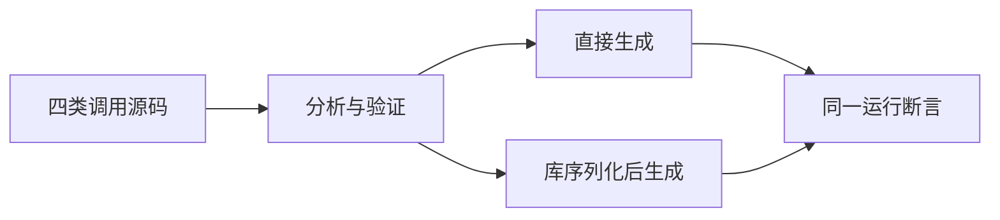
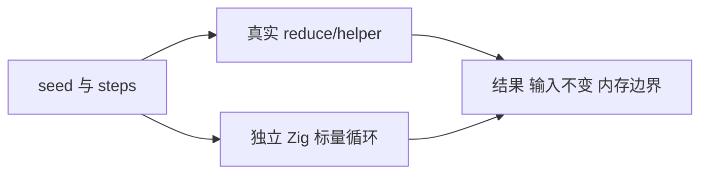

# 内部值返回测试计划

## Intent：最终目标

为新实现的纯函数扁平状态值返回增加正式端到端测试，确认 reduce 调用优化保持状态语义并消除逐项 arena 增长。

## Data：可用证据

《内部状态值返回实施》明确公开对象指针 ABI 不变、内部新增 callValue；只优化传递纯、非消费、扁平标量及 optional 返回。现有 collections/object_reduce fixture 的 State 带 string/list/child，不能触达这个资格条件。

## Edges：边界与限制

本部分用 count/total/last/bool/optional 标量状态，覆盖直接、封装、转调、条件返回。复用源码编译与库 encode/decode 双路径，每条路径执行真实生成代码。不能以查看生成文本代替执行，也不把本部分当成契约失败、缓存失效和排除资格全部覆盖；这些保留后续独立边界。

## Answer：交付与成功标准

新目录 collections/value_return，固定父级构建 target test-value-return。空、短、长、零项、optional 初值及故障分配输入均核对独立循环预期和 seed/input 不变；长序列含禁止 resize 模式要求分配不随项数线性增长。Debug/ReleaseSafe 两模式通过后提交push。

## 执行结果

源码生成与库 encode/decode 后生成各四种模式，每组八项检查：Debug 与 ReleaseSafe 均退出 0，31/31 构建步骤、64/64 用例通过。序列长度覆盖 0/1/2/3/31/128/2048/16384，optional 初值包含 null/0/29；两种长序列检查分别允许和禁止 resize，arena capacity/allocated bytes 均不超过 4096，backing allocations 不超过 4。故障注入复用已有确定性 allocation_testing。

每一步的预期由独立 Zig 标量循环按旧 count 更新 total/last，再递增 count；bool 翻转和 optional 首次回填验证跨字段更新。执行后核对 seed 和 steps 未改变，空输入保留 seed 指针。没有把生成文本中出现 callValue 作为通过条件。zig fmt --check 和 git diff --check 通过。

为核对排除引用字段后的兼容性，另执行既有 test-object-reduce：73/73 构建步骤、192/192 用例通过，覆盖原有字符串、列表、子对象、失败恢复和库往返路径。未修改这组旧测试。

## 自我复核与提交边界

在等待实现提交时继续补充执行错误边界：使用借用的嵌套列表作为动态输入，helper 从当前行索引取值并返回扁平状态。把空行依次放在第一、中间和最后一步，验证 IndexOutOfBounds 传播、seed/输入保持不变、同一 arena 后续调用恢复；配套空输入不调用 helper 和全部有效行成功控制。源码与库往返继续使用同一失败检查，并枚举故障分配。

本部分验证功能值、执行错误传播和有界分配，不是所有纯度资格边界或完整缓存验证。公开指针 ABI 通过 program.execute 返回值继续使用；源码与库路径均实际调用生成代码。原有含引用对象测试保持不变。曾等待生产实现提交以避免独立检出缺依赖；现依赖已提交为 6b37d623，可以独立提交本部分测试，未代替实现会话提交其源码。

## 最终文件复验

新增 fallible 两条路径各四项检查，覆盖第一/中间/最后空行失败与同 arena 恢复、有效行重复调用、空列表不调用 helper、故障分配清理。输入不变断言在处理错误之前执行，OOM 也必须先验证原数据。总目标包含 72 项测试。

最终 Debug 退出 0，38/38 步骤成功，重新执行的错误组 8/8 通过，其余 64 项复用此前通过缓存。最终 ReleaseSafe 退出 0，38/38 步骤、72/72 用例通过。日志分别为《内部值返回最终Debug.log》《内部值返回最终ReleaseSafe.log》。未发现需要反馈的新生产缺陷。全量旧进程仍在运行，其间记录的已修复编译失败不能由本专项结果覆盖。
