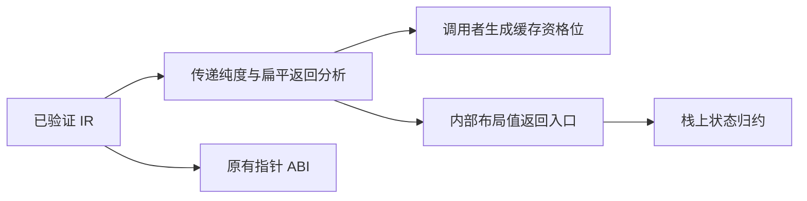
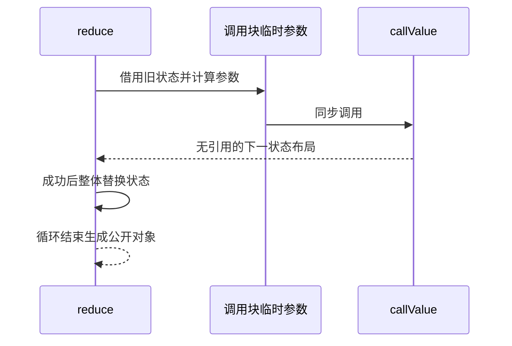

# 内部状态值返回实施

## Intent：最终目标

消除纯计算状态转移在 reduce 内部反复构造扁平对象的 arena 分配，为真正 ZX/RX 编译器迁移提供通用生成能力。保留公开对象指针 ABI、正常所有权检查、契约与错误传播。

## Data：可用证据

数字扫描草稿 bceb5b5f 已完成 95 个既有样本重放；导出代码显示每个字节的状态返回及调用参数仍执行 allocator.create。现有 object_reduce 仅支持对象字面值、条件分支与原累加器，根调用会回退普通生成。生成缓存用函数稳定身份而非整个被调函数体作依赖，因此新增优化资格必须进入调用者指纹。

## Edges：边界与限制

按值返回入口只用于非原生、无 Store、无 Parallel 的传递纯计算函数，且不消费输入。输出为扁平对象，字段仅含数值、bool、enum 或递归 optional 标量，排除 string、列表、对象和元组。输入参数对象仅在同步调用块内临时存放；返回类型没有可逃逸引用。保留旧 call/execute，新增内部 callValue，符合条件的 reduce 显式选用。

根调用的参数可以直接借用累加器或在对象构造中引用它；不放宽普通表达式中的整体累加器逃逸。参数先完整求值，调用成功后才替换旧状态。常规验证与契约生成先于该优化，不能绕过。全量测试仍由另一会话执行，不新增正式测试用例。

## Answer：实施步骤与验收

1. 在 genz 建立同一份传递纯度和输出布局资格分析，供生成与缓存指纹使用。
2. 生成布局值返回的函数变体，按返回路径直接构造布局；直接返回已有对象时解引用复制其标量值。
3. object_reduce 接入符合条件的根调用，使用栈上累加器与调用参数，结束时仍生成普通对象结果。
4. 将数字扫描改成无需前瞻的单字节状态转移，延迟确认小数点；扫描只使用一个扁平累加器，不构造每字节 source 包装对象。
5. 构建编译器与数字扫描，重放已有样本，检查单文件与模块生成，核对公共调用、内存分配和缓存资格变更。

## 执行结果

- genz 增加传递资格分析与布局返回生成；单文件 helper 和独立模块都生成值返回入口。既有 call/execute 参数和返回契约保留。
- object_reduce 对受支持根调用持有栈上累加器，临时参数覆盖整个同步调用，成功返回后才写入下一状态。普通完整对象逃逸仍走旧生成路径。
- 生成缓存指纹升为 v3，包含当前函数及各调用目标的值返回资格位；未引入整个被调函数体依赖。
- 数字扫描改成 FractionStart 延迟确认小数点，去掉每步源数组包装。95 个既有数字样本全部一致。
- 发行构建 14/14 步成功；现有 test-module-generation 定向检查 9/9 通过，未新增正式测试、未运行全量测试。旧对象归约和列表追加示例分别返回 count=3,total=10 与 count=3,values=[2,3,5]。
- 单文件导出及正式发布库都由独立 Zig 宿主消费，输入 64、4096、65536 字节时 arena 容量均为 72 字节，见 [单文件观测](内部状态值返回/优化后内存.jsonl)、[发布库观测](内部状态值返回/发布库内存.jsonl)。上一版为 9292、197416、2699456 字节；这是生成优化与扫描状态简化的共同效果。
- 对实际数字扫描源码临时切换 isDigit 实现：从纯数值比较切到 std:encoding 的数字字节视图，再恢复。每阶段重放同一组 95 个已有输入，无失败。纯计算热构建生成 0、复用 6；引入传递原生依赖后生成 3、复用 3；恢复后生成 0、复用 6。详情与临时替换的完整定义见 [缓存资格变更](内部状态值返回/缓存资格变更.json)。临时副本已删除，正式 is_digit 仍为纯数值规则。

## 审阅与自我复核

只读审阅指出表达式缓存不能被布局构造绕过，已在结果表达式和调用参数两处保留缓存优先；避免共享 IR 重复求值字段。资格筛选排除原生、Store、Parallel 与消费输入，标量字段明确排除 string。源码没有数字扫描文件名、变量名、输入长度或样本值的专用优化分支。

默认 zig build 还会编译历史 RX 测试，最初在 packages/compiler/tests/rx/helpers.zig 的 std.meta.fields 旧 API 处失败；该文件未纳入本次修改。随后使用发行目标 dist 验证当前编译器，另运行现有模块生成定向检查。不能将 dist 成功表述为全仓测试通过。

当前优化仅消除已匹配路径的返回对象与临时参数分配；对象局部绑定、其他聚合布局及复杂返回表达式仍可能分配。完整词法器、解析器和自举阶段编译尚未完成。后续应继续推进真正的核心迁移，不把数字扫描与一次局部优化当作自举交付。
