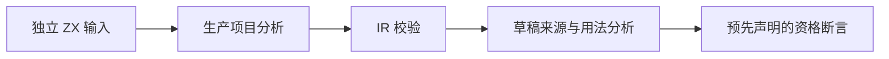
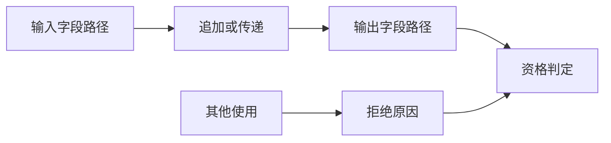

# 列表流草稿独立验证

## Intent

使用独立真实 ZX 项目验证跨函数列表流草稿的候选与拒绝边界，避免词法器项目成功被扩大为通用安全证明。

## Data

1787478a 提交草稿 flow/trace/may/audit，正式生成优化尚未启用。观测器先调用生产项目分析及 IR 校验，再输出内部函数来源摘要。

## Edges

只在 docs 中建立草稿验证资源，不把日期目录依赖接入正式测试包。验证的是候选资格，未执行优化后的程序，不声称验证缓冲生命周期或性能。与实现会话的草稿目录分离，不改其观测结果。

## Answer

独立项目覆盖 push、concat、原样传递、条件同来源、重置、reverse、借用输入、元素读取、多列表字段。每项写明预期后执行现有观测器，保存诊断、摘要及源码指纹；有效性失败不得误计为安全拒绝。

## 实施与结果

观测器 ReleaseSafe 构建正常退出（4/4 步骤）。验证.py 为每组输入建立真实模块项目，要求项目分析成功且 IR 校验通过，然后比较预先定义的拒绝原因或路径映射，11/11 项通过：

| 项目                                | 预期与实际                                                 |
| ----------------------------------- | ---------------------------------------------------------- |
| push / concat / carry / conditional | 单条来源候选且 rejection 为 null                           |
| reset / reverse                     | 不产生来源候选                                             |
| borrowed                            | borrowed_input                                             |
| read                                | element_read                                               |
| separate_fields                     | 两个不同输入字段各自映射至对应输出，不因列表类型相同而合并 |
| forward_identity                    | 跨内部函数维持两条路径，各记录一次调用传递                 |
| forward_swapped                     | 跨函数参数重建交换两字段，输入 1→输出 0、输入 0→输出 1     |

所有检查都要求观测进程正常退出；语法错误、所有权错误或 invalid IR 不会被计为预期拒绝。验证结果.json 包含每个函数的完整摘要、预期、退出码、ZX 与草稿源码散列及观测器二进制散列。资源与结果保存在本目录，没有覆盖作者的来源观测文件。

复现：在仓库根目录运行 python3 docs/2026-10-05/列表流草稿独立验证/验证.py。脚本自动重建观测器，构建及观测前后核对草稿源码指纹；期间发生变化则失败，不记录为通过。

## 自我批判

有限资格检查仍不能证明别名审计完备。尤其可选引用、嵌套 transform、原生调用和实际 builder 首次复制/增长/异常退出尚不在这批输入中，仍需后续覆盖。此处没有启用生成优化，不增加正式目录数量或 Test262 已审阅计数。未发现与预期矛盾的分析结果，因此未向实现会话发送消息。

首次提交后的源码复核检测到作者并行增加 cached_append 拒绝规则。原提交结果保留其历史源码和二进制指纹；随后为脚本加入自动构建与前后指纹检查，在当前草稿上重跑，避免未来使用旧观测器配上新源码哈希。
