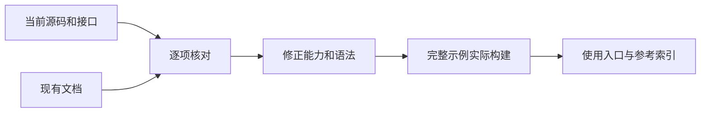
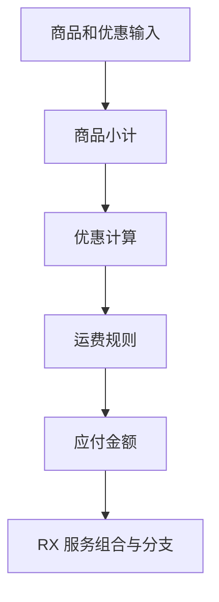

# 功能文档核对

## Intent：最终目标

让首页、包 README 与功能 reference 对应当前编译器行为。首页示例必须有完整可构建源码，能力说明区分已实现、有限支持与尚未实现，不把历史执行计划当作当前事实。

## Data：可用证据

当前基线包含 Node 原生异步桥接、模块签名 arena 修复和开发期自动重启。根 README 仍把表达式写在 RX 引号字符串内，并把 Store 称为持久状态、把未实现的事件与非 HTTP Gateway 表述为可执行能力。CLI 与 compiler README 还保留统一库、Store、完整 URL 等功能实现前的描述。

以当前源码、公开接口、命令解析和实际构建为证据；已有 reference 用于定位，但与源码冲突时先核验源码。两个只读分析任务分别核对 compiler 与 CLI/RX 的重点说明，正式修改由主流程汇总。

## Edges：边界与限制

不借文档工作扩展语言语义，不为示例硬编码生产实现，不修改另一会话的测试。新增完整业务示例存放于本日期文档目录，不新增正式测试用例或运行全量测试。每个功能入口的链接不代表该功能已经覆盖所有平台、所有输入或完整 Node.js API。

## Answer：交付与成功标准

交付修正后的 README、完整首页示例、功能使用/reference 索引和核对记录。成功标准为首页示例可由现有 zxc 构建执行、示例片段与完整文件一致、链接目标存在、修正文案有当前源码依据，并保留未实现边界和整体自举尚未完成的状态。

## 执行结果

- 首页 RX 片段改为当前属性语法，Call 使用无后缀路径；七个完整源码文件收口到首页示例目录，四个首页片段逐字匹配相应源码。
- checkout 与 order 由正式 CLI 成功构建，三组输入分别执行，实际结果写入示例目录。没有新增正式测试或运行全量测试。
- bounded_discount 使用已有 Z3 5.1.0 安装的绝对路径完成验证，前提 sat、违例 unsat。PATH 中没有 z3，因此使用说明明确了求解器前提。
- compiler、CLI、RX 与 genz README 修正已落地功能仍标为未实现的旧说明，以及 Store、Gateway、Emit 和 Parallel 的能力边界。修复 compiler 中已迁移 IR 契约文档的失效链接。
- 增加功能参考索引、14 个标准模块接口映射、跨平台发行参考及首页示例使用说明。

## 关键源码依据

| 核对项         | 当前依据                                         | 文档结论                               |
| -------------- | ------------------------------------------------ | -------------------------------------- |
| IR 版本        | packages/core/src/root.zig                       | 当前版本 13，非稳定跨版本 ABI          |
| 统一库发布     | packages/cli/src/cli/library/build.zig           | CLI 已接通库发布，不再标为待接通       |
| Store 初值编码 | packages/compiler/src/library/codec.zig          | 产物携带 store_initializers            |
| 标准模块       | packages/compiler/standard/modules.json          | 当前清单共 14 个 specifier             |
| 跨平台发行     | .github/tsflows/build.ts、targets.ts             | Bun 生成工作流，Zig 构建发行包         |
| 独立发行验证   | .github/scripts/package.ts、verify_standalone.ts | 打包前实际执行验证，远端结果需独立查看 |

## 自我复核

文档核对消除了明显过期表述，但不是所有特性完整性审计的替代。首页业务结果只证明这些输入的实际行为；单函数 SMT 证据不覆盖完整业务。跨平台参考来自源码配置，本次没有执行六平台 CI。功能索引明确自举尚未完成，不把归档分支存在或 Zig 后端生成当作自举成功。后续仍须完成剩余实现核对及真正的 ZX/RX 自举。
