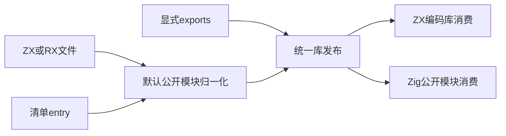
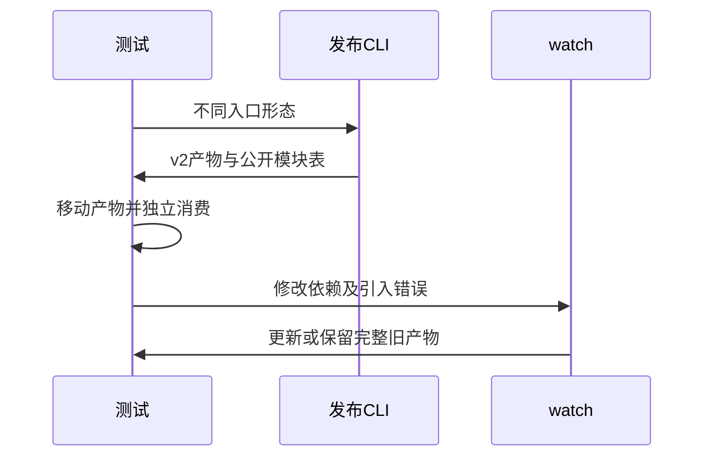

# 单入口统一库与兼容消费验证

## Intent：最终目标

阶段三百六十：验证8c9046bb单入口归一化，覆盖ZX/RX文件入口、清单entry与显式默认exports的发布和独立消费，同时恢复旧构建与watch测试对新元数据契约的覆盖。

## Data：可用证据

CLI README规定：单entry/文件入口保留root.zig及Zig library模块，zxc默认包导入使用编码库；显式exports使用完整公开名。元数据format_version已变为2，旧测试仍读取entry_dependencies并断言版本1，属于测试驱动滞后。

## Edges：边界与限制

不添加兼容旧元数据的兜底，不修改生产；按当前公开契约断言。watch快照需包含library.zxcir和pkg.yaml，不能只证明Zig源码未损坏。真实CLI与Zig执行，不只读取文件名。

## Answer：交付格式与成功标准

五种入口路径分别验证产物格式、Zig公开名称、独立ZX/Zig执行。现有build-modes和watch-library回归通过。问题若来自生产则提交复现给实现聊天；完成一部分后提交push。

## 自我复核

不能把metadata版本变化误报生产缺陷，也不能删除旧运行断言以追求绿灯。直接文件输入必须按用户选定文件执行，不能静默改用清单里的不同entry。

## 实施与验证结果

新增 `test-library-entry`，同时接入 `test-library-publish`。五个场景分别覆盖无entry的ZX文件、覆盖不同清单entry的RX文件、ZX清单entry、RX清单entry和显式默认exports。每个场景检查v2元数据、公开模块名、默认编码库导出及源码不外泄；移动产物并删除原源码后，运行ZX应用和独立Zig消费者。

旧驱动改为按public_modules查找library模块及其依赖，仍要求root.zig。watch错误恢复快照新增library.zxcir和pkg.yaml，保留原运行与用户文件保护断言。

| 验证                                  | 结果                                            |
| ------------------------------------- | ----------------------------------------------- |
| test-library-entry                    | 10/10步骤，5个Node场景全部通过                  |
| 独立消费                              | 13次ZX应用执行、5项Zig测试通过                  |
| test-build-modes + test-watch-library | 12/12步骤通过                                   |
| 原生兼容                              | 72次聚合调用、2次分配失败遍历、25项调用输入通过 |
| zlib兼容                              | 264次独立解码或拒绝检查通过                     |
| @zxc/test typecheck                   | 退出码0                                         |

本轮未发现新的生产缺陷，未向实现聊天发送无问题通知。相关源码副本和机器可读结果保存在单入口库测试草稿目录；原始日志为本地忽略文件。

## 验证边界与交付复核

验证启动基线为caabded8，检查提交前实现聊天已推进至a42806c8，且存在并行生产工作区变更。本轮结论仅覆盖上述实际执行，不将结果扩展到并行新增的有限枚举证明实现。本次提交只纳入测试与对应文档。未执行根目录完整回归；Test262整体对齐和ZX全部特性覆盖仍未完成。

直接RX文件与清单中ZX入口产生不同类型和结果，能够识别错误的入口优先级。独立消费删除原源码，可识别对原工程路径的隐性依赖。仍需后续覆盖统一库原生发布、Store初始化边界等新实现，不能用本轮的单入口兼容测试替代。
