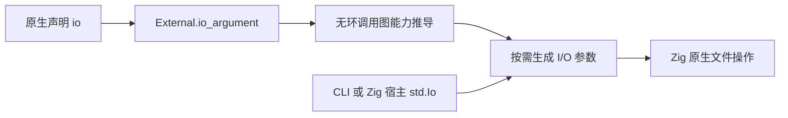

# 原生 I/O 能力与文件标准库

## Intent：最终目标

为 zxc 标准库和自举编译器提供文件系统能力。原生调用显式声明 I/O 依赖，编译器沿无环调用图传递宿主 std.Io；纯计算函数保持原有调用签名。std:fs 参考 Node.js 文件系统文档，底层直接调用 Zig std.Io。

## Data：可用证据

- `.d.zx` 当前支持裸 allocator 注入，pkg.yaml externals 支持 allocator_argument；二者汇合到 core.ir.External。
- genz 所有函数已有 allocator 参数，调用点在 lower.zig，原生适配在 external.zig，独立函数文件由 modules.zig 生成。
- CLI runner 已持有 process.Init.io。库没有合法的隐式宿主 I/O 来源。
- Store 初始化当前拒绝原生函数及外部依赖；请求执行需要传递 I/O，初始化语义保持当前限制。
- Zig 0.16 的 std.Io 由宿主提供。不能在库里使用隐藏的全局 Threaded 或每调用创建新线程池。
- 功能参考：[Node.js File system](https://nodejs.org/api/fs.html)。参考操作语义，不复制 JavaScript Promise、callback、动态重载或完整 Node 运行时。

## Edges：边界与限制

声明固定顺序为 `(allocator, io, ...业务参数)`，二者均可省略；有类型的 `io: T` 仍是业务参数。IR External 增加 io_argument，升级 IR 版本，传播至 manifest、链接比较、库产物和缓存。不能把有副作用的调用放行到纯 Parallel 或形式证明。

生成的普通入口按需增加末尾 `io: std.Io`；已有 Store context 参数位置保持不变。CLI 传入 init.io，Zig 库消费方显式提供。std:fs 访问进程文件系统，不将 I/O 标记冒充路径沙箱。

每项文件操作必须保持明确的错误和资源生命周期；二进制读取返回 u8[]，文本 API 校验 UTF-8，读取上限显式传入。目录和文件句柄在函数退出时关闭。失败分配清理已完成分配。没有 zxc 专用运行时。

不新增测试、不执行全量测试、不做浏览器 UI 验证。使用真实 docs 示例、既有定向目标、应用和已发布库消费验证。

## Answer：交付格式与成功标准

1. 声明、IR、genz、CLI、Store 请求与库发布的完整能力链。
2. std:fs 的文件读取写入、目录操作和元数据基础接口，逐项明确已实现范围；未实现的流、监听等不宣称完成。
3. docs 下保存草稿、可运行示例、执行记录和使用参考；验证 app、lib 再消费与纯计算签名兼容。
4. 本 feature 完成后提交 push。总体标准库与自举目标保持原范围。

## 实施与自我复核

能力标记、传递与 std:fs 首版已落地，正在验证真实应用。

真实 RX 流程发现既有无 out 的顺序 Call 仍创建 discard_N 变量，void 返回因此违反 IR 的无 void 绑定规则。新增 evaluate: ExprId 表达求值并丢弃结果，同步作用域、所有权、genz、artifact 复制、验证器与 Store begin 识别；不放宽 void 变量规则，不新增 ZX 表达式语句语法。IR 版本 11 同时覆盖此项协议变化。

Grit 的 Zig pattern 在本机解析失败，已退回按实际职责逐处编辑；不是无检查的文本批量重构。

成功标准必须由真实构建和运行证明，不能只以增加标记或标准库声明为依据。

## 最终验证记录

- 根编译器构建 14/14 步通过，包含最终读取边界修正后的标准库资源。
- 既有 test-native-runtime、test-library-bundle、test-package-manifest-resources 定向目标通过；没有新增测试文件。
- 既有 test-rx-runtime、test-rx-inference、test-library-native-publish 共 127/127 步、335/335 项通过，另含原生统一库发布与再次发布的 Node 驱动检查。
- 实际文件工作流覆盖读写、目录、复制、重命名、截断、查询和清理。读取符号链接示例覆盖 readlink、stat 与 lstat，合计执行全部 15 个接口。
- 最终同一工作流以直接 RX app、发布后的 ZX 消费者、显式传入 init.io 的 Zig 消费者运行成功；Zig 消费构建 3/3 步通过。输出文本与 hex 完全一致，临时目录已清理。
- Store 示例通过生成 State/Request 读取外部文件，再由无 out 的 void Call 提交单 Object，读取已提交内容成功；这直接覆盖 Store context 与 I/O 参数同时存在的入口。
- 原生示例实际运行覆盖 pkg.yaml io_argument 和 `.d.zx` 中普通 `io: string` 参数；返回原路径与真实文件字节数。
- 读取边界实测：5 字节文件在 max_bytes 为 4 时拒绝、5 和 6 时成功；max_bytes=0 的空文件成功；InvalidUtf8、InvalidPath 和 FileNotFound 正确传播。最初直接转交 Zig limit 会误拒绝恰好等长文件，已按排他 limit 语义修正为饱和加一。
- 最终源码交叉编译 x86_64-linux-gnu 与 x86_64-windows-gnu 成功；未在 Linux/Windows 上执行，不据此宣称运行时行为全部验证。
- 只读复核分别检查能力链、evaluate 消费路径及文件资源生命周期，未发现新的确定问题。该复核不是形式化证明。

运行数据见 [最终消费结果](原生IO与文件标准库/最终消费结果.json)、[读取边界](原生IO与文件标准库/读取边界结果.json)、[原生配置](原生IO与文件标准库/原生配置结果.json)、[跨目标构建](原生IO与文件标准库/跨目标构建结果.json)。可重现命令与全部接口见 [使用参考](文件标准库与原生IO参考.md)。发布产物与可执行文件仅用于验证，不提交重复的整份标准库；保留生成它们的源示例和构建配置。

## 最终自我复核

本功能补齐宿主能力传递和文件操作基础，不代表 Node.js 标准库已经完整实现，也不代表自举已经完成。实现阶段发现并修复了 void 顺序 Call 和读取上限两个真实问题，没有修改语言约束来迎合示例。ZX 保持无 void 局部绑定，多步副作用由 RX 编排；I/O 不进入纯 Parallel。所有能力标记、调用图推导和分配器状态仅用于生成过程，运行程序直接调用 Zig 标准库。文件句柄、数据缓冲和 OS 操作本身仍具有真实运行成本，不将它们宣称为可被编译器消除。

本轮文档遵循 IDEA：目标、证据、边界、交付标准分别独立记录。Store 长期回收、并发、事件/Gateway、完整 URL 及其他标准库和最终自举仍保持总体待完成范围。
