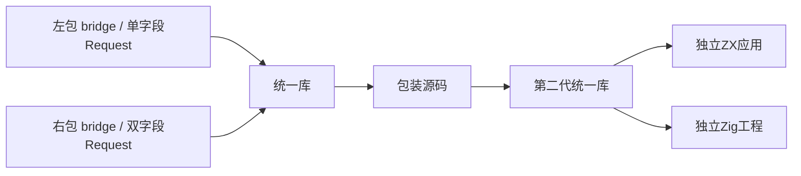
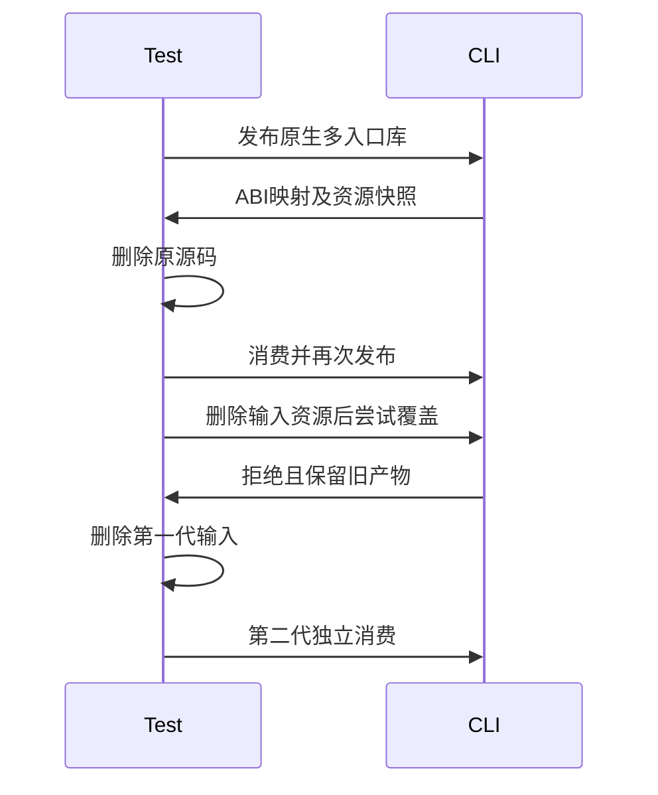

# 原生统一库发布与再发布验证

## Intent：最终目标

阶段三百六十二：验证原生依赖在统一库发布、搬迁、二次发布与独立消费时保持作用域、ABI和资源身份，不依赖原工程目录。

## Data：可用证据

CLI公开契约已支持多模块发布、原生资源重绑定和编译包再次发布。既有native_bundle验证单入口及资源路径，package_native验证源码包同名原生模块隔离；尚缺把同名模块、不同结构参数和资源一起跨越两次统一产物边界的回归。

## Edges：边界与限制

只改测试与文档，不触碰Store初始化的并行生产修改。外部原生调用不属于形式化证明范围，本轮通过实际执行和资源哈希验证，不声称solver证明原生语义。固定输入取值避开i32溢出，预期由两个独立资源增量计算。

## Answer：交付与成功标准

两个包均声明zig:bridge及bridge模块，但Request结构和资源内容不同。统一发布后检查资源哈希，删除源码；通过多个公开入口构建应用并核对结果，再发布包装库。删除第一代库和包装源码，仅消费第二代产物，执行ZX应用和Zig测试。删除输入原生资源后发布必须失败，且完整保留既有输出。每部分验证后提交push。

## 自我复核

只检查输出文件存在不能验证ABI隔离；必须执行两种不同Request参数，并逐一核对输出。最终独立消费者不能残留第一代包路径或原源码。失败检查使用全部产物快照，防止只保留入口文件却破坏资源。

## 实施记录

增加test-library-native-publish并接入test-library-publish。原始左右包均命名bridge原生模块与zig:bridge接口，左侧Request为单字段，右侧为双字段；两者通过嵌套Zig源码读取各自delta.txt。资源分别为3字节与11字节，右侧另接收delta=11。

原始包公开默认组合入口以及左右独立入口。第一代库放入包装工程后删除原源码和原产物；包装工程经三个入口调用两个独立原生作用域，再作为第二代统一库发布。资源校验验证两个模块名与ABI目标互不相同、六个文件路径唯一、逐文件SHA-256匹配、两项资源内容准确。

在包装输入中删除一个资源，重发到已有第二代目录，断言失败且所有文件快照一致。最终只复制第二代库到消费者，删除整个包装目录与第二代原目录，再构建执行消费者及独立Zig工程。消费方还使用workspace包别名和公开Result类型，覆盖重发布后的类型接口。

## 验证结果

| 验证                        | 结果                                   |
| --------------------------- | -------------------------------------- |
| test-library-native-publish | 10/10构建步骤成功，退出码0             |
| 成功发布                    | 2次，初次和重发布                      |
| 失败保护                    | 1次缺失资源，旧产物全量快照不变        |
| ZX应用                      | 2次构建、8次执行，输入-20、0、27、1000 |
| 独立Zig                     | 1项测试，4次调用、16项字段断言         |
| @zxc/test typecheck         | 退出码0                                |
| 格式及diff检查              | 通过                                   |

首轮在最后消费者使用了当前不支持的类型导入重命名语法，未到达最终执行。改为包装库显式导出Result，消费者直接导入后，完整链路重新通过。该问题来自测试源码假设，不作为生产缺陷报告。

没有确认新生产缺陷，未向实现聊天发送消息。测试启动与提交前基线为956ed0cb，工作区存在并行Store初始化实现，本次只提交自身测试与文档。未运行根目录全量回归，未声称证明原生调用语义或验证Store完整发布消费。

源码及资源副本、机器可读结果存放在原生统一库测试草稿目录，原始日志为本地忽略文件。文档遵循IDEA，整体Test262与ZX全部特性目标仍未完成。
