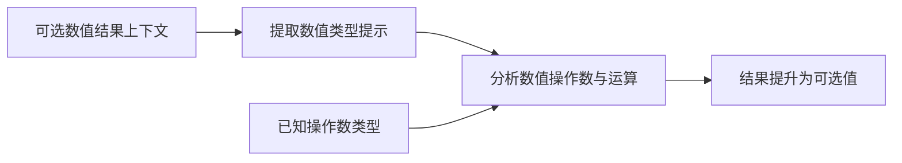
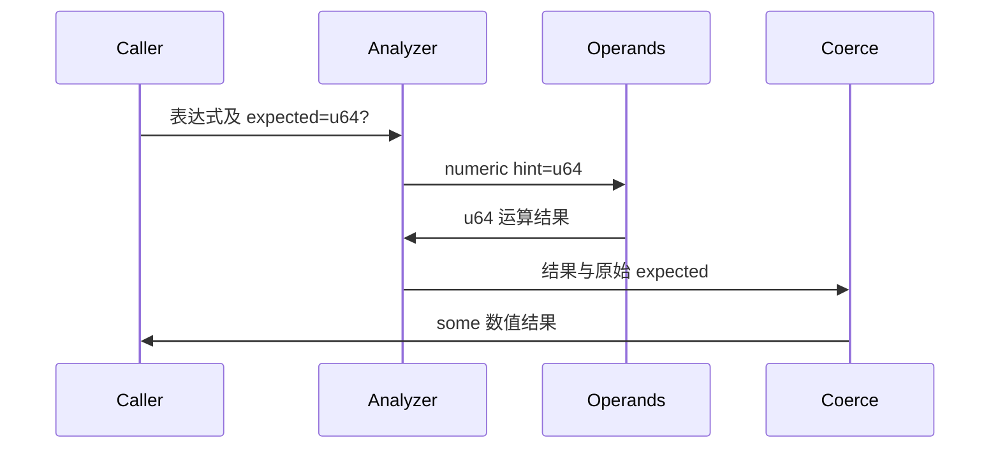

# 可选数值上下文修复

## Intent：最终目标

可选数值结果中的普通算术先计算数值，再提升为可选结果，不能将结果上下文错误注入为可选操作数。

## Data：可用证据

测试会话提供真实复现：Output=u64? 时 return 17 成功，return 8 + 9 失败，已有 u64 变量参与运算则成功。同样影响 Store 的 u64? 字段初值。修复前使用当前 CLI 重现 arithmetic.zx 在 6:10 报 operator is not supported for these operand types。

Analyzer.expression 在表达式分析结束后调用 coerce。binary 将 expected 原样传给左右子式，子式提前经过 coerce 被提升为 optional，随后数值操作检查拒绝。非字面量 unary negate 有同样边界问题。数字字面量和 aggregate 已使用 aggregates.payload 提取上下文载荷，可直接复用。

## Edges：边界与限制

仅剥离结果上下文中的 optional，用于推导普通运算操作数；保留已知操作数的真实类型。实际可选变量仍必须先显式处理空值，不能自动拆箱。比较、逻辑和 coalesce 的独立规则保持。复用其他会话提供的源码和专项，不新增或修改测试，不运行全量测试。

## Answer：交付格式与成功标准

生产实现修改两处上下文传递，保留现有 coerce 统一处理结果提升。验证提供的三份复现，以及 test-library-store-publish 中实际初始化执行；记录结果并独立提交。

## 自我复核

此修复不允许 optional 直接参与算术；它区分结果可选与操作数可选。成功的 Store 发布专项只证明其覆盖的初始化形状，不扩大为全部运算语义证明。

## 实施与验证结果

正式修改为 expressions.zig 的两处提示类型传递，没有修改运算准入规则，也没有修改测试源码。

- 测试会话提供的 literal、arithmetic、bound 三份 ZX 复现均生成成功。
- arithmetic 构建为原生应用并实际执行，输出 17。Input=void 的 CLI 应用不接受参数；执行记录保留首次误传 null 后的 ExpectedNoArguments，以及随后无参数成功运行。
- 运行提供的 `zig build test-library-store-publish --summary all`：10/10 构建步骤通过，1 项发布、搬迁、再次发布与初始化实际执行的组合用例通过，包含 Store 的可选数值初值。
- 最终根构建 14/14 通过。没有运行全量测试。

[复现验证结果](可选数值上下文修复/复现验证结果.json)记录实际命令和输出，生成源码及生产实现副本存放在同目录。非字面量取负修改依据同一上下文边界；本轮未新增其专门用例。
