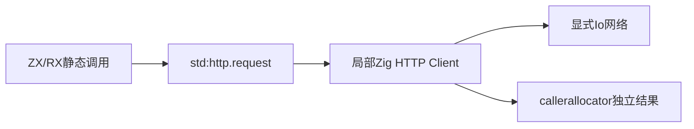
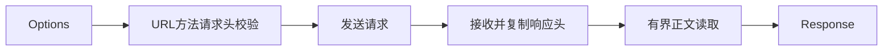

# 同步 HTTP 实施计划

## Intent：最终目标

为 ZX/RX 提供可在应用和发布库使用的同步 HTTP/HTTPS 请求，支持真实网络数据获取，作为后续自举包管理与网络能力基础。

## Data：可用证据

Node.js [http.request 与原始响应头](https://nodejs.org/api/http.html#messagerawheaders) 为功能参考。现有 package/store/download.zig 已使用 Zig HTTP Client；显式 allocator/io 注入与标准库 ABI 模型已成熟。Zig Response.head 在 reader 初始化后会失效，必须先复制。Request.deinit 可能为连接复用读取剩余内容，单次请求应从创建起标记 connection.closing。

## Edges：边界与限制

- 新增 std:http.request(Options): Response throws。Method 为 Get/Head/Post/Put/Patch/Delete/Options；Header{name:string,value:u8[]}保留原始头值字节与重复项。Options 包含 url、method、headers、可选 body、max_body_bytes、max_header_bytes；Response 为 status:u16、headers、body:u8[]。
- HTTP/HTTPS，单次连接、不自动重定向、不自动解压内容。状态码包括 4xx/5xx 正常返回，连接和协议错误抛出。不是 Node.js 事件流、HTTP Server 或完整 HTTP/2 实现。
- 请求头名为合法 token，头值拒绝 CR/LF/NUL 等非法控制字节；Host、Content-Length、Transfer-Encoding、Connection、Expect、Upgrade 由实现管理，不能通过额外头覆盖。URL 必须为有效 UTF-8 且无控制字节，只接受 http/https，拒绝内嵌用户密码，认证通过显式头提供。
- 依照 Zig Method.requestHasBody 支持请求体；不支持请求体的方法若 body 非 null 则显式报错，不能触发底层断言。可带请求体的方法在 body=null 时发送长度0。
- max_header_bytes 支持 1..16MiB，转换为主机 usize 后用于 Client 读缓冲；固定支持上界避免底层连接附加缓冲的算术溢出。接收后累计所有 informational 与最终 head 原始长度，超出总上限拒绝。正文通过 max_body_bytes 加一个 EOF 探测字节读取；超限报错不截断。
- 100/103 等 informational 响应继续等待最终响应，101 协议升级拒绝；HEAD、204、304没有响应体，不受声明 Content-Length 的虚假实际体积影响。连接从创建即标记关闭，确保早期错误不会隐式 drain。
- 临时客户端与连接存储采用局部 arena，返回结构、headers及body均独立分配在callerallocator，所有部分失败路径清理。TLS使用Zig证书校验，不提供跳过校验选项。
- 没有新增超时、代理配置或自动重试；等待受宿主 Io 控制，大小上限不是时间上限。用户允许的网络目标由调用者决定，协议验证请求本地回环服务；另以公开 example.com 的无认证 GET 核验受信任 HTTPS。
- 不新增测试、不运行全量测试、不使用浏览器；通过真实本地HTTP服务、应用和发布库消费验证。

## Answer：交付与成功标准

按 http/ 目录拆分请求、头校验与复制职责；接口、实现、草稿、参考和实际执行证据一并提交。核验请求方法/正文、重复头、字节保留、chunked、状态码、bodyless、上限与错误清理，完成后提交push。HTTPS跨平台运行仅在实际验证后声明。

## 自我复核

同步请求仍执行真实网络 I/O，零成本抽象指无专用动态运行库，不能声称网络工作在编译期完成。接口注册不代表协议边界和库生命周期已验证。

## 实际验证与自我复核

- 编译器 dist 与 HTTP 应用构建通过。15 项本地真实协议请求包含 GET、POST、空 POST、HEAD、204、304、404、302、chunked、103 early hints、正文上限、头上限、非法头、管理头与无支持的请求体，结果在本地请求结果.json。
- 重复头保持两项，0xff 头值和正文可返回；HEAD/204/304 即使 Content-Length=600 且 max_body_bytes=0 也返回空正文。302 原样返回，不跟随重定向。
- 服务端在无效编码头之后保持连接未结束时，客户端约 0.0034 秒返回 HttpHeadersInvalid，未隐式 drain 等待1000字节正文。
- 发布库分别由 ZX 和 Zig 宿主构建运行，返回 host 正文与重复头，说明输出不借用临时连接缓冲。
- Windows x86_64 交叉构建通过，未执行 Windows 二进制。实际本机向 https://example.com/ GET 得到200、577字节正文；本地自签名 TLS 被拒绝为 TlsInitializationFailed。错误名较粗，不能据此推断细分证书诊断能力。
- 未新增测试文件、未运行全量测试。HTTP服务端、超时、代理、自动重试、连接复用、压缩内容自动解码与完整 Node HTTP API 均未实现。
- 头部支持上限是显式接口边界；字节上限不提供响应时间保证。跨平台构建成功不能替代对应系统运行验证。
