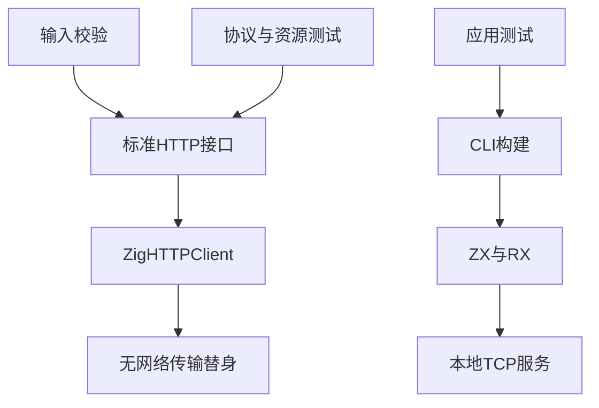
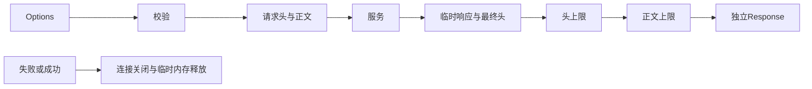

# 同步 HTTP 边界验证计划

## Intent：最终目标

第 392 部分验证 std:http.request 的输入校验、HTTP 协议收发、响应资源所有权、上限与失败清理，并用真实本地应用验证生成调用路径。

## Data：可用证据

基于 c77d2e42 的标准库 http/{root,options,headers}.zig 与同步 HTTP 参考，复用 test 包已有直接接口加真实应用测试组织。接口只接受七种 Method；Post/Put/Patch 可携带 body；头名为 token，值允许非 UTF-8 字节；六种系统管理头禁止覆盖。无重定向、无内容解压，4xx/5xx 是正常响应，临时响应继续读取，101 拒绝。

## Edges：边界与限制

直接测试以无网络 IO 替身提供精确响应字节并捕获请求，覆盖短读/短写和失败；真实网络只绑定回环动态端口。不得依赖外网、修改代理或系统信任存储。协议/内存测试不能替代所有平台 TLS 及 OS 行为验证。无内置超时的接口由测试宿主对子进程设置时间限制。

## Answer：交付格式与成功标准

以用途分类建立验证、请求响应、资源失败及真实应用文件；新 target 接入总测试。Debug/ReleaseSafe 均通过后，保存真实日志、执行记录、草稿和自我批判，提交 push。发现生产缺陷通知指定实现会话，不将失败写成预期成功。

## 执行结论

完成 157 项新检查：87 项直接接口与 70 项 ZX/RX 真实本地应用场景，Debug 和 ReleaseSafe 均通过。发现截断响应被误判为成功的生产缺陷，由指定实现会话在 a166b59a 修复；原失败断言、真实 TCP 复现和分配失败清理均已通过。TLS/证书及发布库路径仍需后续独立验证。
