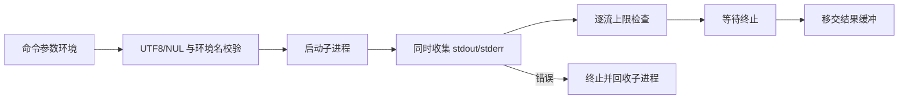

# 同步子进程实施计划

## Intent：最终目标

让 ZX/RX 能直接执行编译后端和普通外部工具，提供自举 CLI 所需的进程执行基础，不通过隐藏全局 I/O 或专用 runtime 调度器实现。

## Data：可用证据

Node.js 官方 [同步子进程文档](https://nodejs.org/api/child_process.html#child_processspawnsynccommand-args-options) 提供命令/参数、cwd、环境、独立输出和退出状态等能力。当前 Zig 0.16 的 std.process.run 基于注入的 std.Io，收集双管道并等待子进程，错误路径 defer kill。现有 std:fs 已证明 allocator/io 注入沿 ZX/RX、应用和库传递，无须为子进程新增 IR 字段。

## Edges：边界与限制

- 新增 std:child_process.spawnSync；参数为显式记录：command、args、cwd、env、max_stdout_bytes、max_stderr_bytes。结果包含字节 stdout/stderr、终止种类和数值 code。
- 不隐式启动 shell；stdin 关闭/忽略。本轮不提供流式 handle、stdin 写入、IPC、异步事件、超时或可配置终止信号，这些不视为完整进程 API 已完成。
- 非零退出是正常 Result，创建、管道和输出上限失败传播错误。限额逐流按字节计算，包含端点，0 允许空输出。
- command/args/cwd/env 字符串验证 UTF-8 与 NUL；环境变量名非空且不含等号。env=null 继承宿主，env=[] 使用空环境；重复名称按平台规则后项覆盖。
- Zig 的命令 PATH 查找使用宿主环境，显式 env 只替换子进程环境；与 Node options.env.PATH 查找语义有差异，文档明确说明并以绝对可执行路径演示。
- 底层 run 的 timeout 只覆盖管道收集，不完整覆盖随后 wait，不能直接包装成全程 timeout 保证。
- API 不吞掉进程错误、不加入业务命令特判、不截断后伪装完整成功。输出为原始字节，不假定 UTF-8。
- 不新增测试、不执行全量测试、不使用浏览器。执行真实工具并复用现有原生/库检查，跨目标构建与实际执行分开记录。

## Answer：交付与成功标准

标准接口、注册与 Zig 实现在 compiler/standard；解析/环境参数构造与进程执行按职责组织。草稿与实际应用/库/Zig 消费示例放在本功能目录。验证 argv 字面值、cwd/env、双流、非零退出、空及超限输出，再提交 push。公开 reference 明确已覆盖与尚未覆盖的 Node 功能。

## 自我复核

已实现注册、声明与标准实现。参数与环境构造由 options.zig 负责，root.zig 负责进程执行和结果移交。两轮只读复核未发现确定的 ABI 或资源错误：Map.put 自行复制字符串，argv 仅借用同步期间的输入；run 的成功与错误资源归属明确，结果对象和两个输出缓冲均有失败清理。

最初示例在 import type 与 import 之间插入空行，不符合当前 AST 分组，已用正式 zxc fmt --write 修正。没有因此放宽 formatter 或新增语法例外。标准索引也按仓库既有格式保存，避免无关重排。

### 底层边界核对

只读复核确认 std.process.run 使用 MultiReader 同时调度双流，成功 wait 后 kill 无操作，错误时 kill 终止并等待清理。输出限制是接受上限，不是严格内存占用上限：底层可能先读取/扩容后检查。包装层在移交 Result 前再次核对最终长度。

Zig 0.16 的 Child.Term.exited 为 u8；Windows wait 将系统 DWORD ExitStatus 截为 u8。因此 Exited 的 code 是 Zig 归一化值，不能声称保留 Windows 原始 32 位退出码。Signal/Stopped/Unknown 的 code 按对应终止类型解释。子进程后代若继续持有管道，收集仍会等待；本接口不提供进程树管理。

### 实际验证

- 本机 macOS 实际应用调用 17 组输入，覆盖 Zig version、参数字面值、cwd、继承/空/重复环境键、原始二进制输出、非零退出、正常信号终止、精确/零/超限输出、无效命令/NUL/环境名，以及 stdout/stderr 各 256 KiB 的双流输出。运行记录保存参数、结果或预期错误，大输出仅保存长度与摘要。
- 独立 ZX 应用、RX 应用、RX 发布后的 ZX 库消费、Zig 宿主显式 init.io 消费均构建运行成功，消费结果.json 保存二进制摘要。发布资源包含 std:child_process 实现，无须宿主另装该模块。
- x86_64-linux-gnu 与 x86_64-windows-gnu 交叉构建成功，未跨系统执行，记录中 executed=false。
- 既有 test-native-runtime 与 test-library-native-publish 成功，17/17 构建步骤、8 个 Zig 检查及 1 个 Node 原生库重发布检查通过。未新增测试文件，未执行全量测试或浏览器检查。

自我批判：本轮交付同步、无 stdin 输入的进程能力，不是 Node child_process 的完整替代；管道持有、严格内存上限、超时与 Windows 退出码保真仍有明确限制。实际运行覆盖当前宿主，交叉构建只证明目标可生成，不能代替 Windows/Linux 的进程行为验证。底层标准库仍承担 OS 资源管理，不把接口注册或成功退出样例当作全部生命周期证明。

最终根构建 14/14 步成功；正式源码与草稿逐字一致，diff 空白检查通过。
