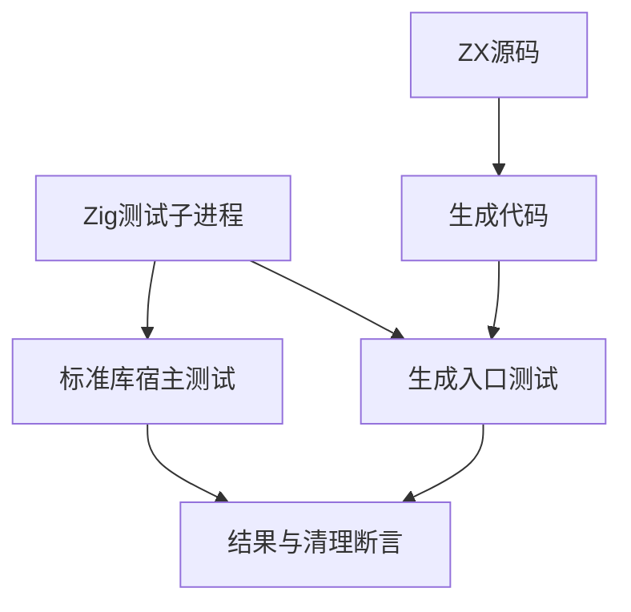
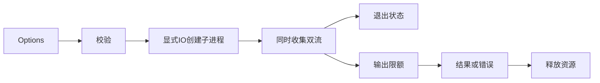

# 同步子进程验证计划

## Intent：最终目标

第 388 部分：验证显式 IO 的 std:child_process.spawnSync，在参数、环境、工作目录、双流收集、退出状态、输出上界和失败清理方面符合已公开契约，并确认生成入口实际转发宿主 IO。

## Data：可用证据

实现依据 1f9a8c35 及当前 standard/src/child_process 源码、child_process.d.zx 和同步子进程参考。成熟测试参考 standard/resources/fs 的资源释放、路径检查及原生 IO 失败注入。

## Edges：边界与限制

子进程使用本次构建生成的本地 Zig 可执行文件，不拼接 shell，不访问网络，不依赖系统 printf 或特定 PATH。只读取专用测试环境变量，不输出用户环境。stdin 当前固定忽略，仅验证 EOF，不扩展公开接口。输出为原始字节；非零退出返回 Result，超限抛错。进程能力 Process 的新实现仍由另一会话推进，单独跟踪。

## Answer：交付格式与成功标准

按结果、参数校验、资源失败分组；直接标准库调用和真实生成 ZX 入口共用结果检查。使用 testing allocator 验证成功/OOM/错误释放，用注入 IO 验证拒绝和验证顺序。完成 Debug 与 ReleaseSafe 验证后提交并 push。





## 执行与自我复核

### 交付与结果

新增 test-child-process，接入既有标准库资源测试与总测试。测试位于 packages/test/tests/standard/resources/child_process，按 results、validation、allocation、generated 分组；child.zig 是本次构建的受控子进程，不使用外部 shell 工具。

- 结果检查 20 项：参数含空白、引号、换行、Unicode 和 shell 符号时保持字面值；双流原始字节；0/73/255 退出码；stdin EOF；环境 null/空数组/替换/重复键/空值；cwd 与父目录保持；边界限额、最大 u64 限额、双流各 256 KiB；后续调用保持旧输出；POSIX SIGTERM；重复超限后的恢复。
- 校验检查 11 项：空命令，command/args/cwd/env 的 NUL 或无效 UTF-8，空环境名和等号，缺失程序、空/缺失 cwd。无效输入使用计数 IO 替身证明没有调用 processSpawn；合法输入则确认宿主 AccessDenied 原样传播。
- 资源检查 4 项：无环境/重复环境项的成功路径、环境部分初始化后校验失败、输出超限，均遍历所有分配失败位置并释放调用者拥有的结果。
- 生成入口 6 项：真实 CLI 生成 main.zx，再以共享 ABI 的标准库编译执行；检查 requires_io、consumes_input、原始双流输出、OOM、宿主 IO 拒绝、限额错误与恢复、非零退出。
- 合计 41 项。Debug：23/23 构建步骤、41/41 通过；ReleaseSafe：23/23 构建步骤、41/41 通过。两种模式及 OOM 内部迭代不重复累计用例。

验证命令在 packages/test 执行：

```sh
zig build test-child-process -j4 --summary all
zig build test-child-process -Doptimize=ReleaseSafe -j4 --summary all
```

### 接入修正

首次 29 项检查有 27 项通过，两个失败均在测试夹具：Zig File.readStreaming 以 error.EndOfStream 表示 EOF；Build 的 addOptionPath 返回相对路径，切换 cwd 后无法定位测试程序。修正 EOF 断言，并使用构建根路径补成绝对执行路径后 29 项全通过。随后补充生成入口、信号、失败恢复与边界检查，达到最终 41 项。没有修改生产实现，也未发现需要向实现会话发送的问题。

### 自我复核与限制

这些检查验证公开 Options 和真实子进程行为，不通过替换标准库实现绕过错误路径。IO 替身只用于验证拒绝和校验顺序；实际成功、退出、双流、cwd、环境和资源失败均启动本地测试程序。

OOM 证明受检路径释放了测试分配器管理的内存；重复超限后的成功运行提供资源恢复证据，不能据此声称已穷举所有 OS 句柄泄漏或进程树行为。Stopped/Unknown 未强行制造，SIGTERM 检查仅适用 POSIX；本次在当前 macOS 宿主执行，不宣称 Windows 运行验证。

输出限额是结果接受上限，不是严格内存预算。没有新增或声称支持 stdin 输入、超时、异步 handle 或后代进程管理。仅通过专用环境变量检查继承，不记录用户环境内容。

初始实现是 1f9a8c35；运行期间实现会话提交了 8b81d5e1 的 Process 能力，并继续修改 runner 与 process 标准库。记录时 HEAD、生产工作区状态和 child_process 关键源码指纹写入执行结果.json，不倒推全程固定的干净基线。

下一部分验证 Process 参数沿 ZX/RX/Store 请求和库边界转发，以及 argv/getEnv/cwd 标准接口。整体 Test262 对齐目标仍未完成。
