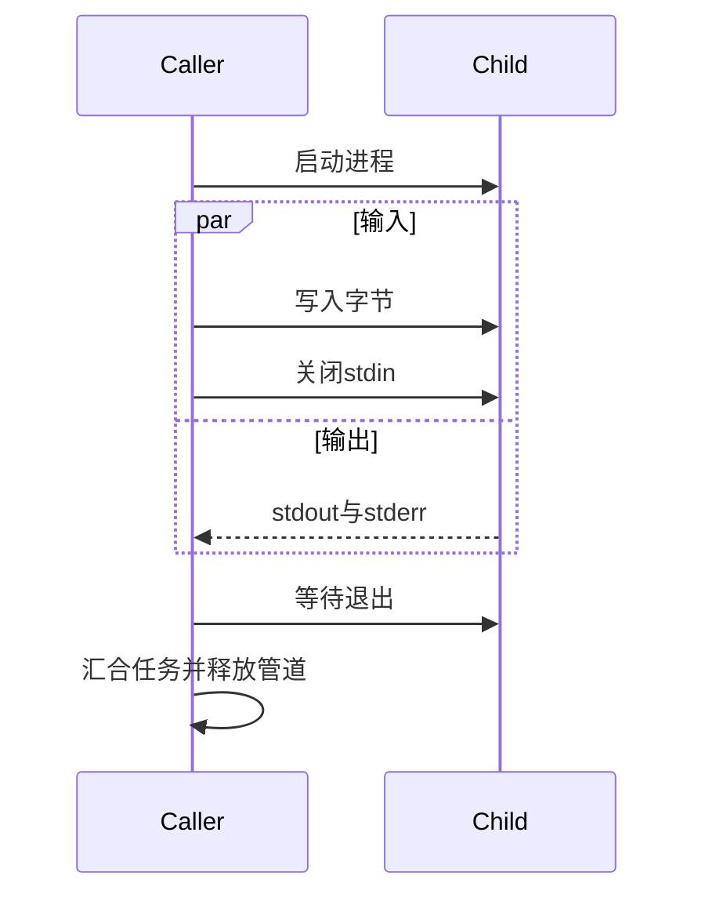

# 子进程标准输入实施计划

## Intent：最终目标

让 ZX/RX 能把字节输入直接交给外部进程，支持编译工具、求解器与普通数据处理程序，避免为了传入内容而强制写临时文件。维持显式 Io 能力、独立输出上限和同步结果语义。

## Data：可用证据

现有 std:child_process.spawnSync 调用 std.process.run，stdin 固定忽略；stdout/stderr 已为字节列表。当前 Options 的所有字段都属于既有公开结构，直接新增必填字段会破坏现有调用。

[Node.js 子进程文档](https://nodejs.org/api/child_process.html#child_processspawnsynccommand-args-options)提供同步调用的 input 选项与输出缓冲上限，作为功能参考。本实现保持 ZX 自身的静态类型接口，不承诺 JavaScript/V8 兼容。

## Edges：边界与限制

- 保留原 spawnSync 与 Options；新增带显式字节输入的调用，复用原命令、参数、目录、环境和输出上限验证。
- 写 stdin 必须与读取双输出并行推进。不能先写完输入再开始读输出，也不能用可能同步执行的任务接口假装有并发保证。
- 写入完成后关闭 stdin，让读取至 EOF 的子进程继续退出；空输入同样提供明确 EOF。
- 输出超限、写入失败、取消及进程启动失败都须清理本次直接子进程与管道任务。不得悄悄丢弃未写完的输入或返回截断数据伪装成功。
- 本阶段不引入 shell 拼接、后台进程句柄、通用事件循环或专用运行库。超时、进程树管理及长寿命交互式进程仍单独处理。
- 不新增测试套件，不运行全量测试或浏览器；用真实子进程、应用和发布库验证字节输入、双流输出与失败清理。

## Answer：交付与成功标准

在 child_process 职责目录实现输入与输出的协作，更新声明、使用参考及自举进度。普通应用能够原样传递二进制字节，大于管道容量的输入与双流输出不会互锁；空输入、提前关闭、非零退出和输出上限有明确行为。完成后独立提交推送。

## 自我复核

小输入成功不能证明无死锁；错误清理也不能只依赖正常退出。实现前须核对当前 Zig Io 的并发保证和取消语义，尤其是输出超限时写任务仍被阻塞的情况。

## 实施结果

公开接口增加 InputOptions（options 与 input）以及 spawnSyncWithInput，原 Options 和 spawnSync 调用形状不变。命令参数校验仍由现有 options.zig 承担；root.zig 复用结果转换，新增 run.zig 只负责三管道协调。

run.zig 使用 std.Io.Select 分别接收写入、收集完成结果。两项任务都成功才等待正常退出并取出输出；任一任务失败立即返回错误。defer 顺序为取消并汇合两任务、释放 MultiReader、终止并等待直接子进程。写任务独占 stdin 写端并在退出时关闭；成功派发后清空 Child.stdin，避免重复关闭。启动任务失败时尚未转移的句柄仍归 Child 清理。任务不持有调用结束后仍使用的输入借用。

最初的实现只在输出 EOF 后检查写任务结果，自我复核发现这会延迟“子进程关闭 stdin 但保持输出打开”的错误。最终用两个独立完成通知修正此问题。没有引入专用事件循环或语言运行库，使用显式宿主 Io 的并发能力。

## 验证记录

- 编译器必要构建 14/14 步成功；其中仓库构建图包含 compile test 步骤，但没有执行全量测试。
- 最终实现真实调用十项：二进制回显、空输入、大输入与双流输出、非零退出、提前关闭输入、关闭输入后继续存活、两个流的输出超限、恰好上限与超过上限。
- 大输入为 98,304 字节，子进程先写 stdout 131,072 字节和 stderr 131,072 字节，再读取输入并回写；得到 stdout 229,376 字节、stderr 131,072 字节，摘要与内容吻合。
- 子进程关闭 stdin 后 sleep 10 秒，调用约 0.018 秒报告 BrokenPipe；两个超限场景约 0.019 秒报告 StreamTooLong，未等待子进程自行结束。
- 输出收集 EOF 后再次检查限额，4 字节限额接受 4 字节、拒绝 5 字节，避免最后一次读取绕过检查。
- RX 发布库经 ZX 与 Zig 宿主消费，原样返回包含 NUL、255、128 的字节。数据保存在消费结果.json；发布目录可用参考文档命令重建，不提交整份生成库和二进制。

## 自我批判与未覆盖项

这是同步子进程字节输入功能完成，不能据此宣称 Node 子进程全部 API 或自举完成。正常双流收集仍可能等待后代持有的管道；没有超时、流式进程句柄或进程树管理。输出上限是接受上限，底层可能先扩容后检查，不能表述成严格内存上限。

Windows 只做交叉编译，未在 Windows 运行；宿主取消和资源不足的清理顺序已按 Zig Io 契约核对，本轮未注入这些错误。没有新建测试套件或调用浏览器；真实观测不等于所有平台和宿主组合的证明。
