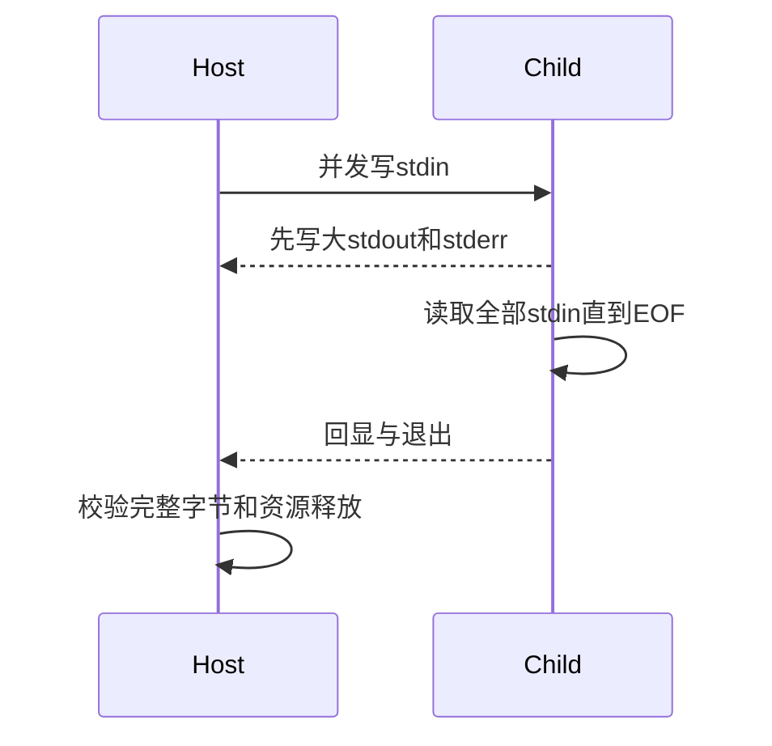

# 子进程输入验证计划

## Intent：最终目标

验证 spawnSyncWithInput 的完整字节输入、EOF、并发三管道推进和失败清理，保持旧 spawnSync 行为。

## Data：可用证据

基线实现 1cdb3ca9；标准库新增 InputOptions{options,input:u8[]}，写入和双流收集通过 Io.Select 并发完成。沿用 child_process 测试组织，并新增可控子进程夹具。

## Edges：边界与限制

不接受部分输入写完即成功；输出上限是接受上限，不是瞬时分配上限。夹具独立 watchdog 防止死锁测试无期限挂起，触发时必须使断言失败。仅直接子进程，暂不测试后代继承管道或生产超时接口。

## Answer：交付与成功标准

新 test-child-input：字节/EOF/大小边界、先输出后读取的大管道、非零退出、提前关输入、双流限额、参数校验、OOM和显式IO错误。生成源码与库编解码后实际执行。Debug、ReleaseSafe和旧接口回归通过后提交推送。

