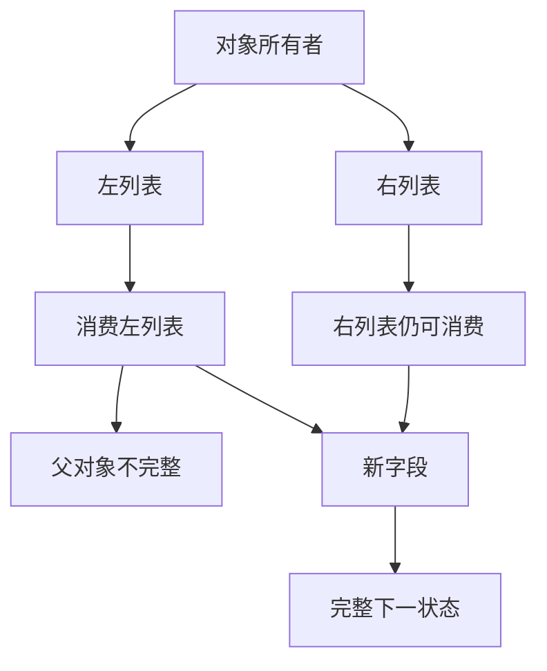

# 字段所有权实施计划

## Intent：最终目标

让递归独占对象的不同静态字段能够分别消费，支持通用多集合状态归约，同时禁止再次使用已经消费的字段或不完整的父对象。保持编译期检查，不增加运行时引用计数或唯一性检查。

## Data：可用证据

现有 ownership/check.zig 仅为 Symbol 保存一个状态，field 与 tuple_field 均回溯至根；receiverOwner 也丢弃字段路径。因此双列表状态在消费第一个字段后无法消费第二个字段。

现有 owned 已依赖递归独占：普通构造会移动引用字段，重复使用同一来源会被拒绝；callback 禁止外部捕获；原生函数强制 borrowed 输出；pop/splice 将原所有者消费后返回逻辑上不重叠的部分；元组解构已将整体 owned 拆给多个独立绑定。宿主必须保证可变子对象没有存活别名，这包含输入内部不同路径之间的别名。不能把无外部别名误当作完整契约。

## Edges：边界与限制

- 对 reference、静态 object field 与 tuple field 建立所有权位置树；动态索引继续消费对应列表整体。
- 移动父位置使全部子位置不可用；移动子位置使父聚合不完整，其他兄弟位置仍可用。完整父值传递、返回与 spread 不能绕过该限制。
- loan、freeze、分支合并、callback 状态与表达式求值缓存必须使用同一组位置状态。
- 按源码出现的静态投影建立节点，不递归展开整个类型，避免重复嵌套类型造成指数规模。
- 保持借用输入及原生返回的约束，不用新增 owned 元数据掩盖未知别名。
- 不新建测试用例，不执行全量测试，不调用浏览器。用真实应用、拒绝诊断、正式库消费与必要构建验证实施。

## Answer：交付与成功标准

将位置树放入 compiler 的 ownership 目录，现有检查流程继续负责表达式与控制流。运行双列表归约、独立字段转移、父子重叠拒绝与分支合并验证；检查发布库保留行为，更新使用参考并独立提交推送。原有“移动任意子字段后整个根均不可访问”的限制会放宽为禁止访问不完整父值，属于有意的语言能力扩展。

## 自我复核

不能把没有找到别名反例称为形式化证明。实现需尊重已有递归 owned 契约，并明确宿主责任。重点复核缓存是否让新访问绕过移动检查，以及父节点汇总状态是否错误污染兄弟字段。

## 实施与证据

位置树仅根据实际静态投影建立节点，控制流沿用原有完整数组快照与合并。父子状态传播放在 places.zig，表达式检查留在 check.zig。消费字段后父状态保持 moved，但兄弟字段状态独立；整体消费递归覆盖全部子节点。

复核中补充了借用父值的移动传播：一个字段已 borrowed 时，父值整体借用转交也必须冻结剩余 owned 子字段。borrow_sibling 应用证明单字段借用不阻止另一字段原地 reverse；父别名观测则得到 ownership 拒绝。

最终 dist 为 13/13 构建步骤成功。multiple 的空输入、全跳过与 [2,0,3] 均实际运行；生成源码有两个 ArrayList，各自在循环外分配并在结束时转交。nested 与 reorder 应用输出正确。choose 的 false 分支排序为 [1,2,3]，true 分支逆序为 [2,1,3]。正式 lib 发布后，独立 Zig 宿主返回 primary=[2,3,5]、secondary=[2,3,3,4,5,6]。

拒绝边界由临时源码经正式 fmt 后直接编译观测，保存诊断与源码记录，未创建测试套件或修改测试目录。首次未格式化的输入只触发 spacing，已重新格式化执行，最终记录均为 ownership 诊断；不能把词法或格式错误当作所有权安全证据。

旧 consumption_test.zig 中“moving a nested container consumes its root owner”用例要求转移 object.values 后读 object.count 失败；新语义有意允许读取独立标量字段。测试由另一会话负责，此处记录契约变化而不修改测试。未执行全量测试或浏览器。

## 尚未覆盖的独立边界

静态审查确认源码 spread 与显式字段分别生成不同引用 ExprId，不能借缓存制造源代码字段别名；实际展开观测也被拒绝。人工构造并共享已缓存 owned 表达式的 IR，仍需要单独审查缓存消费是否可伪造别名。这个问题不能用合法源码运行成功来证明已解决，也不能因此宣称完整形式化证明或整体自举已完成。
