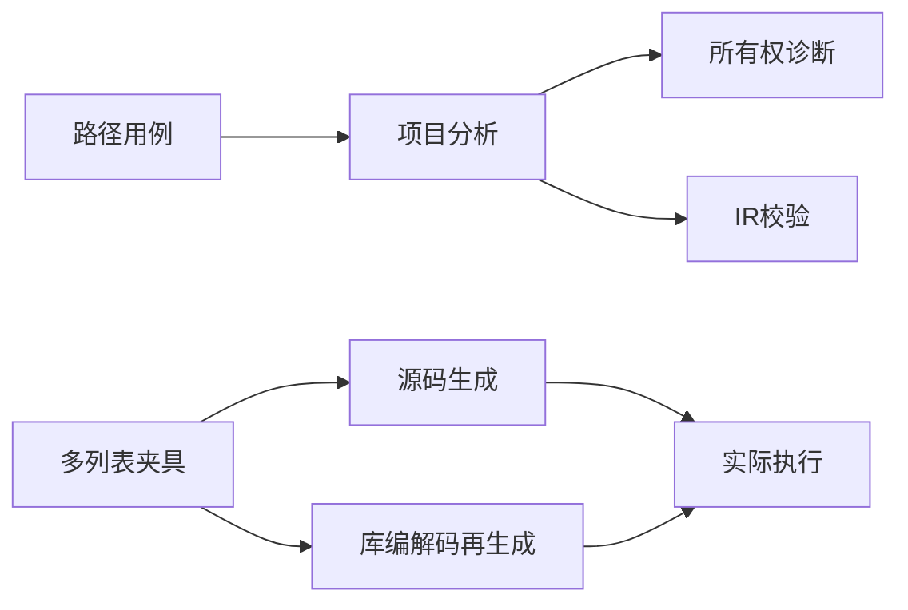
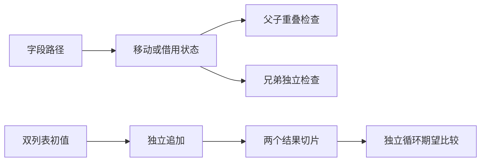

# 字段消费验证计划

## Intent：最终目标

检验字段级所有权是否以路径为单位保持独占性：允许独立兄弟路径消费，拒绝重叠路径重复使用；同时运行多列表归约证明前端许可与后端执行一致。

## Data：可用证据

基线 HEAD 49a14c00，正在实现的 compiler ownership/check.zig 和 places.zig，字段所有权参考与实现会话示例。测试沿用 ownership/loans 的 project.analyze 宿主及 object_append 的源码/库双路径运行框架。

## Edges：边界与限制

不修改实现会话生产代码。路径测试区分静态字段与动态索引；owned 宿主必须递归无别名。新契约允许消费字段后读取独立标量，核查旧测试是否依赖已废弃的整对象移动预期。发现实际缺陷发送指定实现会话。

## Answer：交付与成功标准

增加 test-field-ownership 和 test-multiple-append；前端覆盖成功、拒绝、分支、借用、嵌套、元组与 OOM；多列表检查精确内容、独立缓冲区、长序列分配增长和失败清理。Debug 与 ReleaseSafe 验证后形成记录并提交推送。

