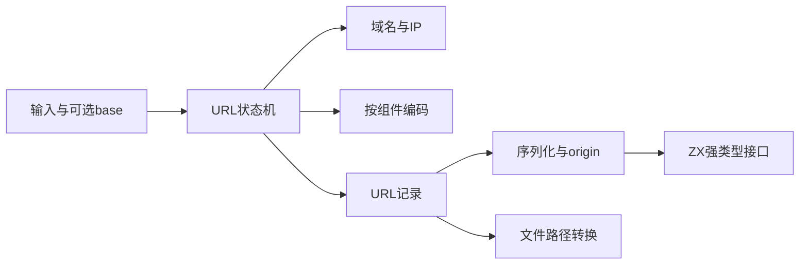
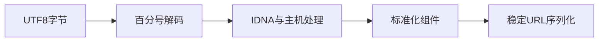
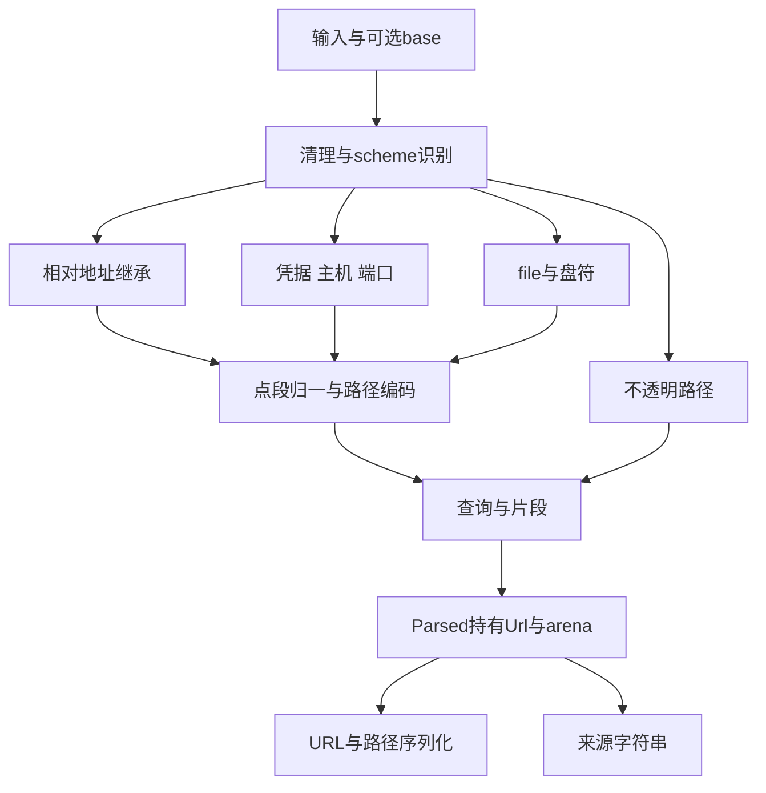

# 完整 URL 实施计划

## Intent：最终目标

为 std:url 提供 URL 解析、相对地址解析、序列化、origin、域名与文件路径转换能力，遵循 WHATWG 语义，并与现有 std:url/search_params 组合。保持显式分配、纯计算和静态原生链接。

## Data：可用证据

目前仅有独立查询参数 API；std.Uri 的 RFC 解析不能代替 WHATWG 的特殊 scheme、反斜杠、IPv4 简写及相对 file 行为。依据 [WHATWG URL Standard](https://url.spec.whatwg.org/)与 [Node.js URL API](https://nodejs.org/api/url.html)实现，不引入 Node/V8。

## Edges：边界与限制

按编码、地址、域名、状态机和公开接口分工，不把未完成解析器提前注册为完整标准库模块。Unicode 域名必须包含 IDNA 映射、规范化与校验，不能只有 Punycode 就宣称完整。保留查询和片段 null 与空字符串的区别。file 转换要显式平台及当前目录，不暗读进程状态。所有实现完成并形成应用及库消费证据后才认定 URL 功能完成。

## Answer：阶段交付

先实现内部模型、百分号编码及 IP 地址规则，随后接入域名处理、解析状态机、序列化和公开 ZX 接口。每层保留实际构建及官方实现对照记录；不新建测试套件、不执行全量测试。正式 API 尚未接通前，结果明确标记内部实现进行中。





## 当前状态

内部编码和地址层实施中。解析状态机、IDNA、公开接口与消费证据尚未完成，不对外声称已有完整 URL。

## 编码与地址层阶段

内部 Url 记录保留 scheme、凭据、可空 host/port、分段路径或不透明路径、可空 query/fragment。编码模块按 control、fragment、query、special_query、path、userinfo、component 分组，百分号解码返回原始字节并保留无效转义；域名层以后负责 UTF-8/IDNA 校验，不在低层擅自替换字节。

IPv4 支持十进制、八进制、十六进制及简写，检查非末段 255 与末段按剩余字节的上限。主机末段数字判断只看数字语法，不因机器整数溢出把巨大十六进制误判成普通域名。IPv6 使用固定八段布局，支持最终嵌入四段 IPv4，拒绝多个压缩点、非法段数、作用域标识和带前导零的嵌入 IPv4；序列化选取第一个最长且至少两段的零序列。

### 验证证据

观察工具直接链接生产内部模块编译为 /tmp/zxc_url_parts，成功运行。26 次 IPv4/IPv6 真实输入与本机 Node URL 的主机标准化及拒绝结果一致，见 [地址与编码观测](完整URL/地址与编码观测.json)。另外观测 query 与 special_query 的引号差异、路径与凭据编码、无效百分号保留及原始 NUL/FF 字节。未新增正式测试套件，不运行全量测试。

```sh
zig build-exe --dep ipv4 --dep ipv6 --dep percent --dep model \
  -Mroot=docs/2026-10-05/完整URL/观察工具/main.zig \
  -Mipv4=packages/compiler/standard/src/url/host/ipv4.zig \
  -Mipv6=packages/compiler/standard/src/url/host/ipv6.zig \
  -Mpercent=packages/compiler/standard/src/url/percent.zig \
  -Mmodel=packages/compiler/standard/src/url/model.zig \
  -femit-bin=/tmp/zxc_url_parts

/tmp/zxc_url_parts ipv4 127.1
/tmp/zxc_url_parts ipv6 ::ffff:192.0.2.128
```

### 自我批判与下一步

这只是完整 URL 所需的内部基础层，没有注册 std:url，也不能代替整个 URL 的应用与库消费验证。下一步是 IDNA、NFC 与 Unicode 校验，再实施 URL 解析状态机。Unicode 官方当前 UTS #46 为 18.0.0，需明确固定数据版本及来源，不使用旧版宿主 Unicode 数据冒充当前标准。Zig 原有 IPv6 解析的嵌入 IPv4 快捷路径不覆盖标准全部形式，因此没有直接复用它。

## Punycode 与 NFC 阶段

[RFC 3492 Punycode](https://www.rfc-editor.org/rfc/rfc3492.html) 编解码已实现内部接口，直接处理 Unicode scalar 列表，保留 ASCII 基本字符，执行偏置调整和整数溢出检查。20 次实际编解码与 Python Punycode 编码器结果一致，包括非拉丁文字、补充平面字符、纯 ASCII、空串、错误数字序列及往返；见 [Punycode 观测](完整URL/Punycode观测.json)。

[NFC](https://www.unicode.org/reports/tr15/) 使用固定 Unicode 18.0.0 官方数据，不使用宿主 Python Unicode 版本生成。生成器先核对原始数据 SHA-256，展开规范分解，生成 422 个组合类区间、2081 个规范分解条目、961 个组合对；排除 Full_Composition_Exclusion，Hangul 使用标准算法分解与组合。非起始组合字符使用稳定排序，保留相同组合类顺序；再执行受阻规则下的规范组合。

官方文件及地址、摘要保存在 [数据来源](完整URL/Unicode数据/来源.json)，附带 Unicode License V3；生成表内也带完整许可说明，避免源表被单独复制时丢失许可。生成器可离线运行，重复生成结果字节一致。源码生成工具与数据在 docs 中，生产只使用已生成常量表，没有启动时下载、解析数据文件或依赖 Python。

19 次 NFC 观测覆盖组合重排、相同组合类阻断、规范等价、Hangul、非组合项和补充平面字符，与宿主 Python 的这些共同字符行为一致。参考 Unicode 版本和生产数据版本均记录在 [NFC 观测](完整URL/NFC观测.json)；该观测不宣称覆盖 Unicode 18 新增字符的全部行为。

```sh
python3 docs/2026-10-05/完整URL/数据生成/normalization.py

zig build-exe --dep punycode --dep nfc \
  -Mroot=docs/2026-10-05/完整URL/域名观察/main.zig \
  -Mpunycode=packages/compiler/standard/src/url/host/idna/punycode.zig \
  -Mnfc=packages/compiler/standard/src/url/host/idna/nfc.zig \
  -femit-bin=/tmp/zxc_domain_parts
```

自我复核：Punycode 和 NFC 仍不是完整 IDNA。映射状态处理、连接字符上下文、双向文字校验、主机整合以及 URL 状态机仍需完成。此阶段不开放 std:url，不修改现有查询参数 API；数据表和算法的小范围观测不能替代完整规范一致性证据。

## IDNA 内部转换阶段

按 IDEA 继续收口：Intent 是为 URL 主机提供有效域名的 ASCII/Unicode 转换；Data 为固定 Unicode 18.0.0 映射、字符属性、NFC 数据和 UTS #46、RFC 5893、RFC 5892；Edges 是内部严格转换，不提供 UTS #46 带错误恢复结果的通用 ToUnicode API；Answer 为静态数据表、转换与校验实现及局部编译观测。

映射表含 9416 个连续区间，字符属性表含 1183 个非默认区间，生成前核对官方原始数据摘要。采用非 transitional 处理，不检查 DNS 长度和连字符位置，不启用 STD3；启用 Bidi、ContextJ，拒绝无效 Punycode。主机禁止字符与空域名由后续 host 层处理。

整个域名先映射和 NFC，再按点分标签；ACE 标签解码后必须包含非 ASCII 字符且已为 NFC，不对解码结果再映射或修正。所有标签通过字符合法性后，若任意标签含 R、AL、AN，则对所有非空标签检查 Bidi；连接字符按 virama 或 Joining_Type 上下文校验。临时分配统一随转换 arena 释放，返回字节由调用方 allocator 持有。

```sh
python3 docs/2026-10-05/完整URL/数据生成/idna.py

zig build-exe --dep idna \
  -Mroot=docs/2026-10-05/完整URL/域名观察/idna.zig \
  -Midna=packages/compiler/standard/src/url/host/idna/root.zig \
  -femit-bin=/tmp/zxc_idna
```

局部编译及 zig fmt 检查通过。[17 次 IDNA 观测](完整URL/IDNA观测.json)与本机 Node domainToASCII 的接受、拒绝和输出一致，包含全角映射、偏差字符、有效连接符、无效连接符、非 NFC ACE、空标签与域名级 Bidi 触发。没有新增测试套件或运行全量测试。

自我批判：这些小范围观测不构成完整 IDNA 一致性证明。Unicode 18 新增字符尚需独立规范数据核验；主机解析、URL 状态机和公开接口仍未完成。本阶段不把内部转换注册成完整 std:url。

## 主机解析整合阶段

Intent：把域名、IPv4、IPv6 和不透明主机接成可供 URL 状态机调用的内部入口。Data：2026-10-05 核对的 WHATWG URL Standard（页面更新日期为 2026-09-10），特别是 host parser、domain parser 与 forbidden host/domain code point 定义。Edges：入口接收 UTF-8 scalar 字节串；URL 层仍需处理整体输入清理、file 空主机及端口。Answer：host.parse 返回已序列化的规范主机字符串，由调用方释放；尚不注册 ZX 公开模块。

方括号主机优先解析 IPv6，并保留序列化括号。特殊主机执行百分号解码、域名转换、禁止字符检查，再依据末段数字语法分流 IPv4。不透明主机保留大小写和百分号串，检查禁止字符后按 C0 集编码。

关键规范差异：当前 [domain parser](https://url.spec.whatwg.org/#concept-domain-parser) 对纯 ASCII 输入直接转小写，不因 Unicode ToASCII 校验错误而拒绝；非 ASCII 输入才使用非 strict IDNA 转换。前阶段严格 IDNA 接口保持原有语义，URL 主机层实现该兼容规则。不可把 Node 的旧行为作为全部规范判定依据。

```sh
zig build-exe --dep url \
  -Mroot=docs/2026-10-05/完整URL/观察工具/host.zig \
  -Murl=packages/compiler/standard/src/url/root.zig \
  -femit-bin=/tmp/zxc_url_host
```

局部编译通过。[32 次主机观测](完整URL/主机观测.json)中 30 次与本机 Node 相符；纯 ASCII 的 xn-- 和 xn--8i7caa 在生产实现中按当前规范保留，Node 拒绝，差异已保留在原始记录中。没有执行全量测试。IDNA 生成器重新运行后，两份静态表 SHA-256 均与已提交版本一致。

自我批判：上述差异说明宿主对照不是规范证明；当前入口不返回非致命 validation error 诊断，也没有提供 strict 域名有效性 API。完整 URL 状态机、序列化、origin、file 与公开接口仍需实施，主机层的局部成功不能替代最终消费证据。

## URL 解析、序列化与 origin 阶段

Intent：把已有主机和编码层接成绝对地址、相对地址及 file URL 的原生解析链，并提供稳定序列化和来源字符串。Data：WHATWG basic URL parser 的 scheme、relative、authority、file、path、opaque path、query、fragment 状态及序列化、origin 算法。Edges：当前为内部 UTF-8 字符串接口；不模拟 HTML 文档编码、浏览器 blob 注册表或 URL setter 的 state override。Answer：Parsed 持有 arena 与 Url 记录，调用方 deinit 释放；序列化与 origin 返回调用方 allocator 持有的独立字节串。

实现按 parser/root（入口及相对地址）、authority（凭据、主机、端口）、path（路径段归一）、file（file 和盘符分支）分工。仅 ASCII 分隔符控制分支，非 ASCII 原始 UTF-8 字节交给对应编码或域名层。解析入口清除首尾 C0/空格及全串 TAB/CR/LF，保持可空 query/fragment 与空值的差别。基础 URL 与目标 URL 使用同一结果 arena，继承的切片不会悬空。

序列化直接使用已标准化的组件；无 host 且路径以空段开始时添加 /.，避免输出被重解析成 authority。origin 返回网络协议的 scheme/host/port 元组字符串；file 和非网络协议返回 null；blob 只从有效内嵌 http/https 地址提取元组来源，未引入浏览器资源注册表。



```sh
zig build-exe --dep url \
  -Mroot=docs/2026-10-05/完整URL/观察工具/url.zig \
  -Murl=packages/compiler/standard/src/url/root.zig \
  -femit-bin=/tmp/zxc_url

/tmp/zxc_url '../d?x#y' 'https://a/b/c?q#f'
/tmp/zxc_url --origin 'blob:https://example.com/id'
```

局部编译通过；[40 次解析观测](完整URL/解析观测.json)和[13 次来源观测](完整URL/来源观测.json)与本机 Node 相符。观测包含默认端口、无效端口、重复 @、相对地址继承、file localhost/盘符/UNC、空查询和片段、不透明基地址限制以及 blob 来源。未新建测试套件，未执行全量测试。

自我批判：这是内部解析入口的阶段证据，不是全规范一致性证明。尚未开放 ZX 接口、URL 字段修改、文件路径转换及应用/库消费。前述 ASCII ACE 与宿主 Node 的规范版本差异仍成立；后续公开语义要明确区分严格 IDNA 转换与 URL 域名兼容处理。完整功能与自举仍未完成。

## 文件路径转换阶段

Intent：补齐 POSIX/Windows 文件路径与 file URL 双向转换。Data：[Node URL 文档](https://nodejs.org/api/url.html#urlfileurltopathurl-options)及 v26.10.0 的 lib/internal/url.js、src/node_url.cc 文件路径编码实现。Edges：平台和 cwd 必须显式传入，不读宿主进程当前目录或每盘符环境变量；相对路径解析复用现有 path/resolve，遵循其绝对 cwd 要求。Answer：pathToFileUrl、fileUrlToPath、fileUrlToBytes 内部接口，输出由调用方 allocator 持有。

新增 url/file/from_path 与 to_path 分工实现。Windows 支持普通 UNC、扩展 UNC 前缀、盘符和相对路径；POSIX 保留反斜杠作为文件名字符。文件路径中的百分号、方括号、竖线、波浪号及 URL 控制字符编码后再构造 URL，避免文件名被当成 URL 语法。输入末尾目录分隔符在路径 resolve 后恢复。

反向文本转换严格检查百分号编码及 UTF-8，POSIX 禁止编码后的正斜杠，Windows 还禁止编码后的反斜杠；Windows 无主机路径需要盘符，有主机则生成 UNC，并将可解码域名转为 Unicode。字节转换允许非 UTF-8 和编码后的分隔符，并保留无效百分号字面量；这一分离对应 Node 的 fileURLToPath/fileURLToPathBuffer，不把两者悄悄混成同一语义。

标准库 Zig 根入口已导出内部 url，供跨 URL/path 目录的局部编译复用；modules.json 和 ZX 公共接口仍未注册。

```sh
zig build-exe --dep standard \
  -Mroot=docs/2026-10-05/完整URL/观察工具/file_paths.zig \
  -Mstandard=packages/compiler/standard/src/root.zig \
  -femit-bin=/tmp/zxc_file_urls

/tmp/zxc_file_urls from posix '../x' '/tmp/base'
/tmp/zxc_file_urls text windows 'file:///C:/a%20b'
```

局部编译通过，[45 次文件路径观测](完整URL/文件路径观测.json)与本机 Node 一致。相对路径的 Node 对照显式使用同一 cwd 先 resolve，避免依赖观察进程目录。二进制结果用十六进制记录，覆盖非 UTF-8、NUL、无效转义与编码分隔符。实现过程中发现 POSIX 的 /C|/a 被通用 file 解析误归一为盘符，已依照文件路径编码集合修正为 /C%7C/a。未运行全量测试。

自我批判：公开 ZX 类型与函数、字段修改接口以及应用/库消费仍未接通。本阶段是内部文件路径能力，不代表 URL 全功能已完成；Windows 每盘符当前目录没有被隐式补齐，缺失时仍按现有路径 API 返回错误。编码数据仅用于格式转换，不在此层执行文件系统操作。

## 公开 ZX 接口接入

Intent：让普通应用通过 std:url 使用上述原生能力，而不是仅保留内部 Zig 观察入口。Data：现有 std:path 与 std:url/search_params 的 ABI 类型、allocator 和 throws 契约。Edges：公开 Url 是不可变组件记录，不持有可变 JavaScript 对象；parse 返回字段独立复制到调用方分配器，内部临时 arena 随调用释放。Answer：注册 std:url 的声明与原生适配层，构建应用、发布库并验证独立消费；字段编辑仍需后续补齐。

Url 保留 scheme、username、password、可空 host/port、分段 path 或 opaque_path、可空 query/fragment。公开 parse、resolve、tryParse、canParse、stringify、pathname、origin、domainToASCII、domainToUnicode、pathToFileURL、fileURLToPath、fileURLToBytes。解析失败由 throws 表达；tryParse/canParse 将语义拒绝映射为 null/false，但不吞掉分配失败。域名转换保留 Node 空字符串失败结果及当前 URL ASCII 兼容规则。

### 接入验证结果

编译器 dist 构建 13/13 通过；应用调用全部 12 个入口并实际执行。相同应用发布为库后，ZX 工作区消费者构建运行成功，独立 Zig 消费者构建 3/3 并运行成功，三方 JSON 输出一致。示例最初误用 url.Url 类型路径，已改成现有语言支持的 import type；没有为示例扩大语言规则。Zig 新消费者按编译器提示生成了独立 fingerprint。

公开类型与复制命令见 [完整 URL 参考](完整URL参考.md)。未执行全量测试；字段编辑、可选格式化和 HTTP options 仍是明确待办，公开解析入口接通不代表整个 Node URL 功能或自举已完成。
