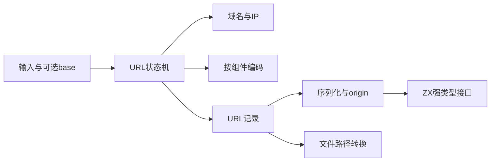
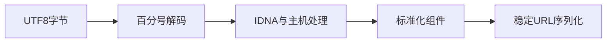

# 完整 URL 实施计划

## Intent：最终目标

为 std:url 提供 URL 解析、相对地址解析、序列化、origin、域名与文件路径转换能力，遵循 WHATWG 语义，并与现有 std:url/search_params 组合。保持显式分配、纯计算和静态原生链接。

## Data：可用证据

目前仅有独立查询参数 API；std.Uri 的 RFC 解析不能代替 WHATWG 的特殊 scheme、反斜杠、IPv4 简写及相对 file 行为。依据 [WHATWG URL Standard](https://url.spec.whatwg.org/)与 [Node.js URL API](https://nodejs.org/api/url.html)实现，不引入 Node/V8。

## Edges：边界与限制

按编码、地址、域名、状态机和公开接口分工，不把未完成解析器提前注册为完整标准库模块。Unicode 域名必须包含 IDNA 映射、规范化与校验，不能只有 Punycode 就宣称完整。保留查询和片段 null 与空字符串的区别。file 转换要显式平台及当前目录，不暗读进程状态。所有实现完成并形成应用及库消费证据后才认定 URL 功能完成。

## Answer：阶段交付

先实现内部模型、百分号编码及 IP 地址规则，随后接入域名处理、解析状态机、序列化和公开 ZX 接口。每层保留实际构建及官方实现对照记录；不新建测试套件、不执行全量测试。正式 API 尚未接通前，结果明确标记内部实现进行中。





## 当前状态

内部编码和地址层实施中。解析状态机、IDNA、公开接口与消费证据尚未完成，不对外声称已有完整 URL。

## 编码与地址层阶段

内部 Url 记录保留 scheme、凭据、可空 host/port、分段路径或不透明路径、可空 query/fragment。编码模块按 control、fragment、query、special_query、path、userinfo、component 分组，百分号解码返回原始字节并保留无效转义；域名层以后负责 UTF-8/IDNA 校验，不在低层擅自替换字节。

IPv4 支持十进制、八进制、十六进制及简写，检查非末段 255 与末段按剩余字节的上限。主机末段数字判断只看数字语法，不因机器整数溢出把巨大十六进制误判成普通域名。IPv6 使用固定八段布局，支持最终嵌入四段 IPv4，拒绝多个压缩点、非法段数、作用域标识和带前导零的嵌入 IPv4；序列化选取第一个最长且至少两段的零序列。

### 验证证据

观察工具直接链接生产内部模块编译为 /tmp/zxc_url_parts，成功运行。26 次 IPv4/IPv6 真实输入与本机 Node URL 的主机标准化及拒绝结果一致，见 [地址与编码观测](完整URL/地址与编码观测.json)。另外观测 query 与 special_query 的引号差异、路径与凭据编码、无效百分号保留及原始 NUL/FF 字节。未新增正式测试套件，不运行全量测试。

```sh
zig build-exe --dep ipv4 --dep ipv6 --dep percent --dep model \
  -Mroot=docs/2026-10-05/完整URL/观察工具/main.zig \
  -Mipv4=packages/compiler/standard/src/url/host/ipv4.zig \
  -Mipv6=packages/compiler/standard/src/url/host/ipv6.zig \
  -Mpercent=packages/compiler/standard/src/url/percent.zig \
  -Mmodel=packages/compiler/standard/src/url/model.zig \
  -femit-bin=/tmp/zxc_url_parts

/tmp/zxc_url_parts ipv4 127.1
/tmp/zxc_url_parts ipv6 ::ffff:192.0.2.128
```

### 自我批判与下一步

这只是完整 URL 所需的内部基础层，没有注册 std:url，也不能代替整个 URL 的应用与库消费验证。下一步是 IDNA、NFC 与 Unicode 校验，再实施 URL 解析状态机。Unicode 官方当前 UTS #46 为 18.0.0，需明确固定数据版本及来源，不使用旧版宿主 Unicode 数据冒充当前标准。Zig 原有 IPv6 解析的嵌入 IPv4 快捷路径不覆盖标准全部形式，因此没有直接复用它。

## Punycode 与 NFC 阶段

[RFC 3492 Punycode](https://www.rfc-editor.org/rfc/rfc3492.html) 编解码已实现内部接口，直接处理 Unicode scalar 列表，保留 ASCII 基本字符，执行偏置调整和整数溢出检查。20 次实际编解码与 Python Punycode 编码器结果一致，包括非拉丁文字、补充平面字符、纯 ASCII、空串、错误数字序列及往返；见 [Punycode 观测](完整URL/Punycode观测.json)。

[NFC](https://www.unicode.org/reports/tr15/) 使用固定 Unicode 18.0.0 官方数据，不使用宿主 Python Unicode 版本生成。生成器先核对原始数据 SHA-256，展开规范分解，生成 422 个组合类区间、2081 个规范分解条目、961 个组合对；排除 Full_Composition_Exclusion，Hangul 使用标准算法分解与组合。非起始组合字符使用稳定排序，保留相同组合类顺序；再执行受阻规则下的规范组合。

官方文件及地址、摘要保存在 [数据来源](完整URL/Unicode数据/来源.json)，附带 Unicode License V3；生成表内也带完整许可说明，避免源表被单独复制时丢失许可。生成器可离线运行，重复生成结果字节一致。源码生成工具与数据在 docs 中，生产只使用已生成常量表，没有启动时下载、解析数据文件或依赖 Python。

19 次 NFC 观测覆盖组合重排、相同组合类阻断、规范等价、Hangul、非组合项和补充平面字符，与宿主 Python 的这些共同字符行为一致。参考 Unicode 版本和生产数据版本均记录在 [NFC 观测](完整URL/NFC观测.json)；该观测不宣称覆盖 Unicode 18 新增字符的全部行为。

```sh
python3 docs/2026-10-05/完整URL/数据生成/normalization.py

zig build-exe --dep punycode --dep nfc \
  -Mroot=docs/2026-10-05/完整URL/域名观察/main.zig \
  -Mpunycode=packages/compiler/standard/src/url/host/idna/punycode.zig \
  -Mnfc=packages/compiler/standard/src/url/host/idna/nfc.zig \
  -femit-bin=/tmp/zxc_domain_parts
```

自我复核：Punycode 和 NFC 仍不是完整 IDNA。映射状态处理、连接字符上下文、双向文字校验、主机整合以及 URL 状态机仍需完成。此阶段不开放 std:url，不修改现有查询参数 API；数据表和算法的小范围观测不能替代完整规范一致性证据。

## IDNA 内部转换阶段

按 IDEA 继续收口：Intent 是为 URL 主机提供有效域名的 ASCII/Unicode 转换；Data 为固定 Unicode 18.0.0 映射、字符属性、NFC 数据和 UTS #46、RFC 5893、RFC 5892；Edges 是内部严格转换，不提供 UTS #46 带错误恢复结果的通用 ToUnicode API；Answer 为静态数据表、转换与校验实现及局部编译观测。

映射表含 9416 个连续区间，字符属性表含 1183 个非默认区间，生成前核对官方原始数据摘要。采用非 transitional 处理，不检查 DNS 长度和连字符位置，不启用 STD3；启用 Bidi、ContextJ，拒绝无效 Punycode。主机禁止字符与空域名由后续 host 层处理。

整个域名先映射和 NFC，再按点分标签；ACE 标签解码后必须包含非 ASCII 字符且已为 NFC，不对解码结果再映射或修正。所有标签通过字符合法性后，若任意标签含 R、AL、AN，则对所有非空标签检查 Bidi；连接字符按 virama 或 Joining_Type 上下文校验。临时分配统一随转换 arena 释放，返回字节由调用方 allocator 持有。

```sh
python3 docs/2026-10-05/完整URL/数据生成/idna.py

zig build-exe --dep idna \
  -Mroot=docs/2026-10-05/完整URL/域名观察/idna.zig \
  -Midna=packages/compiler/standard/src/url/host/idna/root.zig \
  -femit-bin=/tmp/zxc_idna
```

局部编译及 zig fmt 检查通过。[17 次 IDNA 观测](完整URL/IDNA观测.json)与本机 Node domainToASCII 的接受、拒绝和输出一致，包含全角映射、偏差字符、有效连接符、无效连接符、非 NFC ACE、空标签与域名级 Bidi 触发。没有新增测试套件或运行全量测试。

自我批判：这些小范围观测不构成完整 IDNA 一致性证明。Unicode 18 新增字符尚需独立规范数据核验；主机解析、URL 状态机和公开接口仍未完成。本阶段不把内部转换注册成完整 std:url。
