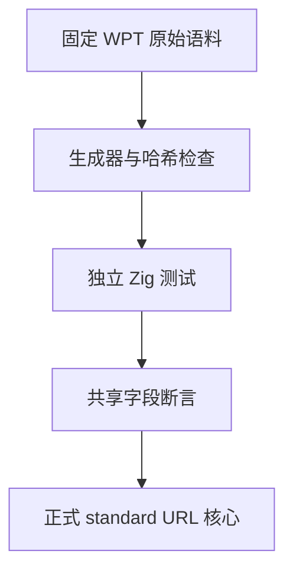
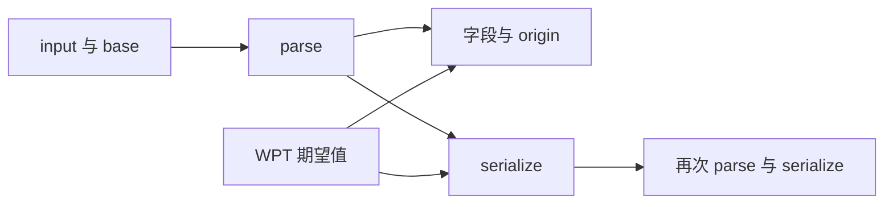

# 完整 URL 验证计划

## Intent：最终目标

以固定版本 WPT 验证 zxc URL 核心解析、相对地址、序列化、字段与 origin；失败不得删例或放宽断言。生产问题通知指定实现会话修复。

## Data：可用证据

语料来自 web-platform-tests/wpt，提交 c48d58747e1f211527fb695fd60548a997fae617。原始 JSON、README、BSD 许可证与 SHA256 清单保存于 packages/test/upstream/wpt。896 个对象，其中 627 个成功、269 个失败；穿插字符串仅是上游注释。语料不含孤立代理码点。

## Edges：边界与限制

本部分覆盖 URL 内部核心，不代替 ZX 公共 API、原生库消费、文件路径转换、setter 或浏览器集成。origin 只检查上游给出期望的对象。错误用例仍传播内存分配失败，不能把 OOM 当正确拒绝。编译器 standard 模块作为根以保留正式导入边界。

## Answer：交付格式与成功标准

生成 896 个独立 Zig 测试，按每百条分组保存；保留原数组索引定位上游。每个成功对象检查全部给定 URL 字段及 href 再解析幂等。Debug 与 ReleaseSafe 必须全部通过。生成脚本提供 --check，验证哈希、计数和生成内容。测试接入 test-standard-resources。完成后记录实测结果、自审并提交推送。

