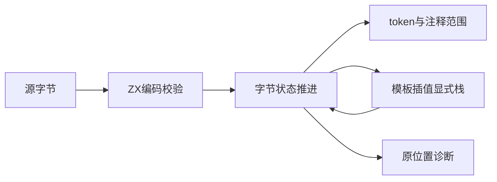
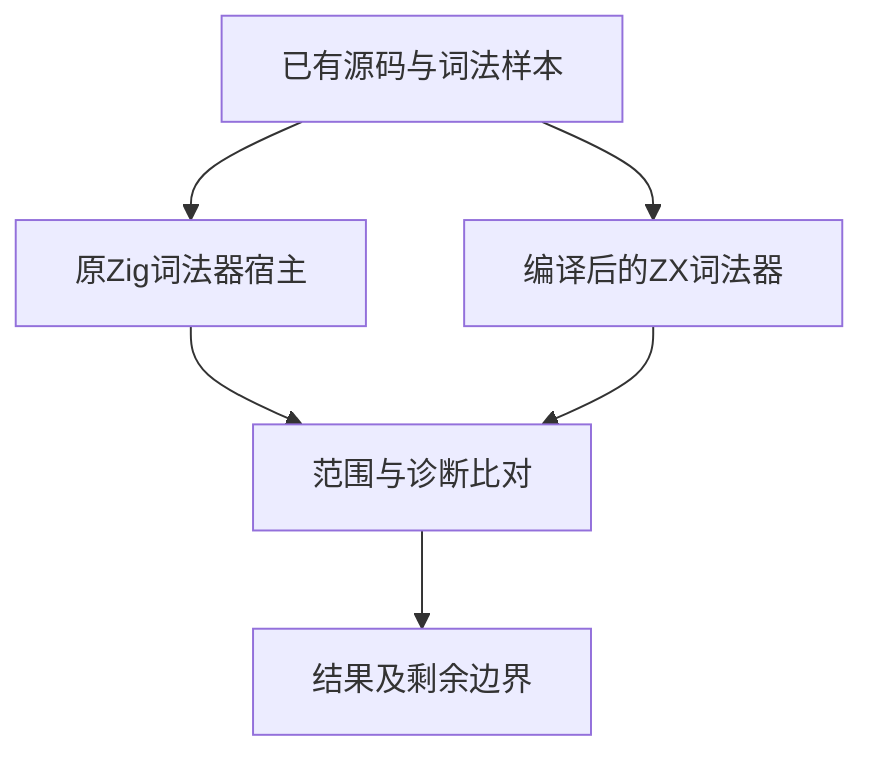

# 完整词法扫描实施

## Intent：最终目标

用 ZX 实现实际词法核心，覆盖当前 Zig 词法器的标识符、关键字、数值、字符串、运算符、注释与嵌套模板扫描，为后续解析和阶段自举提供真实源码。当前作为迁移草稿，不切换正式入口。

## Data：可用证据

依据 compiler/src/zx/frontend/lex.zig、template.zig 与 core/src/syntax.zig。数字扫描及内部值返回优化已交付；完整词法器仍未迁移。词法阶段的模板插值只定位结构，具体表达式合法性留给后续解析，不能提前扩大错误范围。

## Edges：边界与限制

输入使用原始 UTF-8 字节，先由 ZX 状态机校验编码，保留非法编码的全源诊断。扫描按输入字节推进，不调用原 Zig 词法器执行新路径。模板用显式帧栈，保持原有 256 层限制、错误类别和起止字节位置。原词法器只作为独立核对依据。

每个语义块独立文件，源码与宿主核对资源全部存于本日期功能目录。已有 ownership、归约和集合接口用于构建结果；完整状态包含列表，不声称上一轮扁平值返回已消除其全部分配。不得用生成样本预期值替代一般扫描规则。不新增正式测试、不运行全量测试、不进行 UI 验证。

## Answer：交付与验收

交付可编译的 ZX 字节输入词法器、原词法器只读宿主、已有源码样本的实际比对记录及生成成本分析。成功要求源码规则完整、token/comment 范围及诊断与原实现一致；仍须明确实际核验范围。完成词法草稿不代表解析器、语义、模块联结、生成器、CLI 或 stage 1/2/3 已迁移。

## 实施结果

- 新词法逻辑全部由 27 个 ZX 文件实现，按编码、普通扫描、模板栈与关键词语法表分组。生成代码只导入 Zig std，没有导入原 Zig 词法器或任何旧编译器 API，见 [生成记录](完整词法扫描/生成记录.json)。
- UTF-8 校验为纯 ZX 状态转移，覆盖续字节范围、过长编码、代理区与 U+10FFFF 上界；先验证编码再扫描，保留原有错误优先级。
- 以两个字节前瞻替代源数组存入可消费状态，避免复制源数据及借用来源混入整体所有权。普通文本按字节推进；嵌套模板通过帧栈恢复模式、括号计数、起点与深度。
- 关键词表按语法数据生成，当前 25 个关键词与原 syntax.zig 一致。转换函数较长是静态语法表，保持单一职责，没有为文件名或输入样本设置分支。
- 字段列表消费后显式构建保留字段；普通状态更新先计算需要读取的标量，再移动旧状态，避免整对象消费后重读。数字辅助函数 Done 分支改为显式构造新的标量状态，避免返回借用别名冻结外层可消费状态。
- 正式 CLI 成功构建独立原生程序。837 份去重输入（既有词法与模板源码、source_hex 编码样本及本草稿源码）与旧词法器逐项匹配，没有新建正式测试用例或运行全量测试。

## 分配核对

[独立 Zig 宿主](完整词法扫描/observe.zig)直接执行新生成模块，不把输入读取内存算入扫描 arena。228 字节的 shipping 示例得到 53 个 token，arena 为 122714 字节；1094 字节的 model 源码得到 224 个 token，arena 为 800124 字节；9750 字节的关键词转换表得到 2283 个 token，arena 为 32423436 字节。

根因不是源文本复制，而是普通列表 push 每次复制已有槽位，以及包含列表、子对象的状态跨函数返回仍使用 arena 对象。上一轮扁平标量值返回不能涵盖这种状态。后续必须处理结果列表增长及通用状态的生命周期，不能用关闭检查、换用旧原生词法器或限制输入规模规避该问题。

## 自我复核

已形成真正可执行的 ZX 词法逻辑，核对覆盖也明显超过此前数字扫描；但 837 份样本仍不是全域证明，当前内存成本也不适合正式替换编译器前端。词法阶段的模板结构检查与后续表达式解析保持分工，避免靠提前报错掩盖行为差异。

正式 parser、语义分析、所有权、模块联结、生成器与 CLI 尚未迁入 ZX/RX，阶段自举未完成。当前继续作为迁移草稿保存；完成内存路径核对与修正后再推进正式集成。使用入口见 [完整词法扫描参考](完整词法扫描参考.md)。
