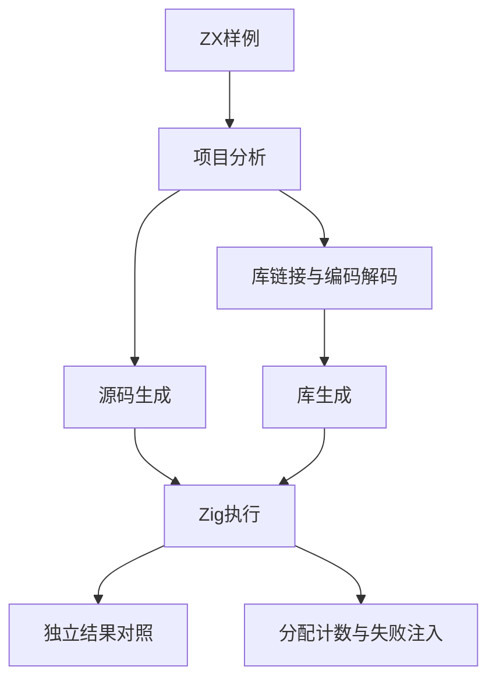
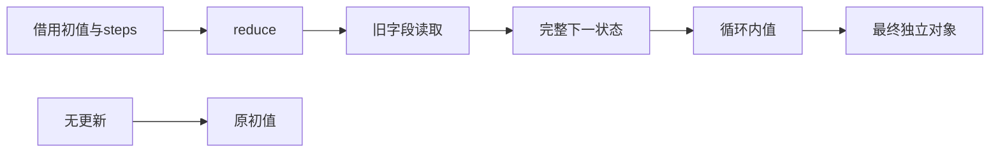

# 对象归约布局验证计划

## Intent：最终目标

第 394 部分验证对象 reduce 值存储优化在不逃逸与回退路径的真实执行、旧字段读取、借用别名和分配上界。

## Data：可用证据

依据 e56141c8、object_reduce analysis/root、归约状态布局参考。可接受对象/条件/保持原值，完整 accumulator 传递与根 helper 调用回退；字段借用存储不移动，初值仅求值一次，空源与全保持返回初值。成熟实现参考 collections/reduce 的 allocator 计数与 process/compile 的源码及库 codec 两路径。

## Edges：边界与限制

当前实现会话还在增加状态字段列表追加，本部分先隔离顶层对象值存储，不混入未提交追加优化。只改 tests/docs。分配上界使用独立宿主计数，不以生成源码出现某个变量名作为成功标准。嵌套对象与回退路径不强加常量分配承诺。

## Answer：交付格式与成功标准

新 test-object-reduce，按功能样例和宿主检查分组，真实执行源码与发布库编码/解码后生成的模块。两模式完成结果、输入不变、初值指针、借用字段、容量界限、OOM 与错误恢复检查，记录自审后提交 push。

## 执行结论

10 个样例分别经源码和库 codec 往返生成，完成 192 项新检查。Debug 与 ReleaseSafe 均通过，未发现本部分生产缺陷。分配界限和剩余范围详见对象归约布局验证记录。
