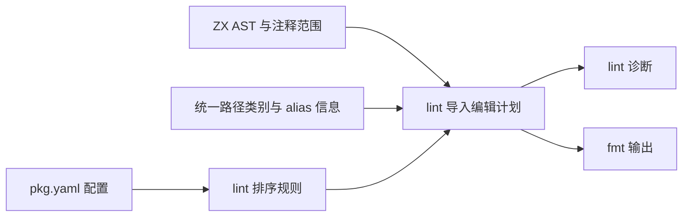

# import 排序与 lint 规则设计

## Intent：最终目标

import 的分组、顺序和组间空行属于 `packages/lint` 的规则。检查与格式化共用排序计划：`zxc lint` 报告不符合规则的位置，`zxc fmt` 生成相同规则下的规范源码。编译器接入检查，不在语义分析或代码生成中复制排序实现。

参考 [@ianvs/prettier-plugin-sort-imports 官方说明](https://github.com/IanVS/prettier-plugin-sort-imports#importorder)的有序分组、空字符串分隔和 `<TYPES>` 类型分组能力。参考配置模型，不为 zxc 引入 Node、Prettier 或应用运行时依赖。

## Data：可用证据

当前 `packages/lint/src/source.zig` 调用名称检查与空行检查；`spacing.zig` 按原有 import 顺序计算边界，没有实现 import 重排。项目配置尚未提供下文拟定的排序字段。本文件是待实施设计，不能把示例直接视为现有 CLI 已支持的配置。

用户提供的参考配置，整理为有效 JSON 如下：

```json
{
	"importOrder": [
		"^react$|^(react)$",
		"<THIRD_PARTY_MODULES>",
		"",
		"^@/(.*)$",
		"",
		"^[./](?!.*\\.css$)",
		"",
		"^.*\\.module\\.css$",
		"",
		"<TYPES>^(node:)",
		"<TYPES>",
		"<TYPES>^[.]"
	]
}
```

其中 React 正则可等价简化为 `^react$`。`^@/` 只覆盖默认包根 alias，自定义 alias 必须单独识别。官方同样给出 `<TYPES>` 位于具体相对类型组之前的示例；不能把它当普通的前置全匹配正则，否则会吞掉后续类型组。类型兜底应在具体类型规则匹配后决定，组的位置仍由数组确定。

React、Node 和 CSS 是参考项目的分类，不是 ZX 的内置分类。此处保留用户示例，不改变本仓库自有 TypeScript/TSX 的 `import type` 置顶规则。

## Edges：边界与限制

- 只排序 ZX 的静态 import 声明；RX 的 Call 是执行编排，禁止为路径美观重排 fn/service 调用。
- 路径解析遵循[统一路径引用设计](统一路径引用设计.md)。排序使用源码引用与解析器提供的引用类别；不重复实现 alias 展开，也不按机器绝对路径排序。
- 默认 `@/` 和已声明自定义 alias 属于本地引用；不能把所有 `@` 开头的包误认作本地 alias。未知 alias、包冲突等仍由模块解析器报告。
- 排序不删除未使用 import，不合并类型与值声明，不改变绑定名称，不自动把相对路径改成 alias。后缀省略与路径规范化是独立规则。
- import 必须携带所属注释整体移动。文件头注释固定；无法确认归属的独立注释形成排序边界，不能猜测移动。
- 不引入副作用导入语法。若以后语言允许有顺序语义的导入，它必须形成不可跨越的边界；这是排序安全条件。
- 规则只影响源码排列，不改变模块身份、依赖边、无环检查或生成程序的语义；所有工作在编译与工具阶段完成。

## Answer：交付格式与成功标准

### ZX 的配置方向

拟在 `pkg.yaml` 的 lint 配置中提供 `import_order`。下面是 ZX 示例方案，字段名与特殊组属于待实现接口，不是现有插件配置的直接兼容承诺：

```yaml
lint:
    import_order:
        - '^std:'
        - '^zig:'
        - '^c:'
        - '<THIRD_PARTY_MODULES>'
        - ''
        - '^@/'
        - '<ALIASES>'
        - ''
        - '^[.]'
        - ''
        - '<TYPES>^std:'
        - '<TYPES>'
        - '<TYPES>^@/'
        - '<TYPES><ALIASES>'
        - '<TYPES>^[.]'
```

`<ALIASES>` 是 zxc 拟新增的语义组，来自当前包配置的自定义 alias，不宣称是参考插件的功能。默认 `@/` 单列；自定义 alias 不需要在 paths 与排序正则中维护两份名单。

用户可调整组顺序，包含把全部类型组移到最前。ZX 示例采用用户参考中的类型后置方向；不将仓库 TypeScript 风格要求自动推广到另一门语言。

### 匹配与规范输出

1. 先根据 AST 区分 `import type` 和其他导入。枚举导入仍按其实际声明类别处理，不因绑定名为 PascalCase 就归入类型组。
2. 存在 `<TYPES>` 规则时，类型导入先尝试具体类型规则；未命中者进入类型兜底。其余导入按具体规则顺序取首次命中，最后进入第三方兜底。未设置类型规则时，类型导入与其他导入共用路径组。
3. `<THIRD_PARTY_MODULES>` 与 `<TYPES>` 是兜底槽位，不是顺序执行时立即接受所有输入的正则。缺省兜底采用确定的内置位置；具体规则不能使声明被丢弃。
4. 同组按源码模块引用作区分大小写的 UTF-8 字节序稳定排序；同路径声明保持原序。第一版只排序声明，不增加具名绑定排序与合并。
5. 空字符串表示组间空行；空组不输出，连续分隔符折叠为一行，不产生文件开头或结尾的多余空行。全部格式化必须幂等。
6. 空数组表示关闭排序。无效规则、未知特殊组或重复兜底在读取配置时诊断，不静默忽略。正则支持范围应在实现前明确；不能为模仿 JavaScript 正则而引入 JS 执行器。

### 实施边界




实施时先确定配置校验与默认规则，再在 `packages/lint` 内增加独立 import 排序职责，最后接入 source 检查与格式化。必须统一 import 区段的重排和空行编辑，避免原 `spacing.zig` 基于旧位置生成与排序重叠的 edits。

验收标准：组序与空行符合配置；默认与自定义 alias 分类一致；类型具体组不会被兜底吞掉；注释不丢失、不错误归属；重复格式化输出不变；排序前后静态绑定与依赖关系一致；lint 与 fmt 使用同一结果。后续按用户要求复用已有材料核对，不在此阶段新增测试用例或执行全量测试。

## 自我复核

核心需求是稳定且可配置的源码组织，不是完整复制一个 JavaScript 插件。第一版保持“声明分组、稳定排序、空行”三个职责，不顺带引入 import 合并、路径重写或副作用分析。当前只交付设计文档；排序配置、自定义 alias 语义组与自动修复仍需实现与验证。
