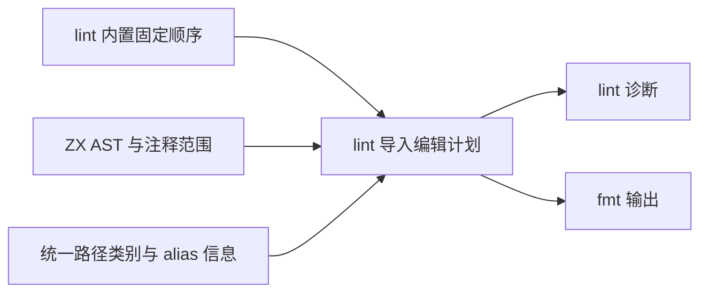

# import 排序与 lint 规则设计

## Intent：最终目标

import 的分组、顺序和组间空行是 zxc 内置且不可修改的规则，由 `packages/lint` 实现。不提供项目配置、命令行覆盖、文件级排序配置或关闭排序的开关。检查与格式化共用排序计划：`zxc lint` 报告不符合规则的位置，`zxc fmt` 生成相同规则下的规范源码。编译器接入检查，不在语义分析或代码生成中复制排序实现。

参考 [@ianvs/prettier-plugin-sort-imports 官方说明](https://github.com/IanVS/prettier-plugin-sort-imports#importorder)的有序分组、空字符串分隔和 `<TYPES>` 类型分组能力。参考分组与输出效果，不采用其可配置机制，也不为 zxc 引入 Node、Prettier 或应用运行时依赖。

## Data：可用证据

当前 `packages/lint/src/source.zig` 调用名称检查与空行检查；`spacing.zig` 按原有 import 顺序计算边界，没有实现 import 重排。本文件是待实施设计；不向项目配置增加 import_order 或 importOrder 字段。

用户提供的第三方插件参考配置，整理为有效 JSON 如下。它仅用于说明参考来源，不是 zxc 配置：

```json
{
	"importOrder": [
		"^react$|^(react)$",
		"<THIRD_PARTY_MODULES>",
		"",
		"^@/(.*)$",
		"",
		"^[./](?!.*\\.css$)",
		"",
		"^.*\\.module\\.css$",
		"",
		"<TYPES>^(node:)",
		"<TYPES>",
		"<TYPES>^[.]"
	]
}
```

其中 React 正则可等价简化为 `^react$`。`^@/` 只覆盖默认包根 alias，自定义 alias 必须单独识别。官方同样给出 `<TYPES>` 位于具体相对类型组之前的示例；不能把它当普通的前置全匹配正则，否则会吞掉后续类型组。这是参考插件的匹配规则；zxc 直接按 AST 与路径类别确定固定组别，无需执行这些正则。

React、Node 和 CSS 是参考项目的分类，不是 ZX 的内置分类。此处保留用户示例，不改变本仓库自有 TypeScript/TSX 的 `import type` 置顶规则。

## Edges：边界与限制

- 只排序 ZX 的静态 import 声明；RX 的 Call 是执行编排，禁止为路径美观重排 fn/service 调用。
- 路径解析遵循[统一路径引用设计](统一路径引用设计.md)。排序使用源码引用与解析器提供的引用类别；不重复实现 alias 展开，也不按机器绝对路径排序。
- 默认 `@/` 和已声明自定义 alias 属于本地引用；不能把所有 `@` 开头的包误认作本地 alias。未知 alias、包冲突等仍由模块解析器报告。
- 排序不删除未使用 import，不合并类型与值声明，不改变绑定名称，不自动把相对路径改成 alias。后缀省略与路径规范化是独立规则。
- import 必须携带所属注释整体移动。文件头注释固定；无法确认归属的独立注释形成排序边界，不能猜测移动。
- 不引入副作用导入语法。若以后语言允许有顺序语义的导入，它必须形成不可跨越的边界；这是排序安全条件。
- 规则只影响源码排列，不改变模块身份、依赖边、无环检查或生成程序的语义；所有工作在编译与工具阶段完成。

## Answer：交付格式与成功标准

### ZX 的内置顺序

按以下固定顺序排列。值导入包括函数和枚举导入；只有 AST 标记为 `import type` 的声明进入类型组。保留用户参考中的“值导入在前、类型导入在后”方向，不将本仓库 TypeScript/TSX 的类型置顶规则自动推广到 ZX。

| 顺序 | 导入类别                                                                    | 与前一非空大组的分隔 |
| ---- | --------------------------------------------------------------------------- | -------------------- |
| 1    | 值：`std:` → `zig:` → `c:` → 外部包                                         | 文件头不额外插入空行 |
| 2    | 值：默认 `@/` → 已声明的自定义 alias                                        | 一行空行             |
| 3    | 值：相对路径 `./`、`../`                                                    | 一行空行             |
| 4    | 类型：`std:` → `zig:` → `c:` → 外部包 → 默认 `@/` → 自定义 alias → 相对路径 | 一行空行             |

箭头表示同一大组内的固定子类顺序，不额外插入空行。空组省略，不累积空行。同一子类按源码模块引用作区分大小写的 UTF-8 字节序稳定排序；同路径声明保持原序。第一版只排序声明，不增加具名绑定排序与合并。

自定义 alias 只来自当前包的路径配置，用于区分本地模块和外部包。它不附带排序权重，也不能改变任何组别的位置。用户只维护 paths，不维护第二份导入分类名单。

### 分类与规范输出

1. 根据 AST 区分类型与值，再读取统一模块解析层的引用类别，计算内置的组序和子类序。
2. 默认 `@/`、已声明自定义 alias、相对路径和外部包各有确定位置；不能把未知 alias 静默归类成本地引用。
3. 在每个可排序区段内按固定规则稳定排列，保持同一声明及其附属注释完整。
4. 按固定大组输出一行空行；空组不输出，不产生文件开头或结尾的多余空行。全部格式化必须幂等。
5. 不读取用户排序正则，不支持替换内置顺序或关闭规则。现有配置检查应将未定义的排序字段作为无效配置处理，不静默接受成无效设置。

### 实施边界




实施时将固定分类与顺序定义在 lint 内，再在 `packages/lint` 内增加独立 import 排序职责，最后接入 source 检查与格式化。必须统一 import 区段的重排和空行编辑，避免原 `spacing.zig` 基于旧位置生成与排序重叠的 edits。

验收标准：组序与空行符合内置规则，且不存在排序覆盖入口；默认与自定义 alias 分类一致；类型具体组不会被兜底吞掉；注释不丢失、不错误归属；重复格式化输出不变；排序前后静态绑定与依赖关系一致；lint 与 fmt 使用同一结果。后续按用户要求复用已有材料核对，不在此阶段新增测试用例或执行全量测试。

## 自我复核

核心需求是全项目一致且不可配置的源码组织，不是完整复制一个 JavaScript 插件。第一版保持“声明分组、稳定排序、空行”三个职责，不顺带引入 import 合并、路径重写或副作用分析。当前只交付设计文档；内置排序、自定义 alias 分类与自动修复仍需实现与验证。此前可配置方案已撤回。
