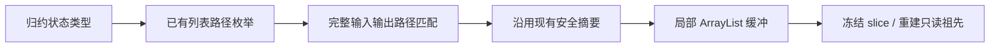
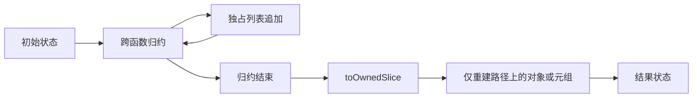

# 嵌套归约缓冲实施计划

## Intent

让固定来源、未逃逸的嵌套列表字段在 reduce 中复用已有静态追加缓冲，避免仅因字段位于对象或元组内而回退到重复列表复制。只扩展已有安全分析通过的跨函数 lane，不改变公共列表 ABI。

## Data

buffer_call 的 Lane.input/output 已支持对象和元组路径，flow.leaves 已递归发现列表。object_reduce/append/root 仍只遍历顶层 list，buffer_call/reduce 的入口匹配仍要求长度 1，因此嵌套路径在外层 reduce 被丢弃。

成熟实现采用每条 lane 一个 Zig ArrayList、started 标志、结束时 toOwnedSlice。对象与元组在生成布局中为只读指针，嵌套写回不能直接修改其字段，必须沿路径构造新祖先，保持其余字段与列表引用不变。

## Edges

保留现有 audit 所有拒绝条件，不放行容器逃逸、pop、会话来源切换和保存后继续修改。模板 streams 的 active session 转移仍是独立未完成项。直接 lambda 内部追加分析保持现有顶层支持；本次仅扩展已有跨函数 lane 的 reduce 接入。

不新增测试用例、不运行全量测试。重建编译器，以既有模板、类型、词法与列表材料进行差分、生成及构建核对；不将未覆盖组合声称完整证明。

## Answer

交付完整路径匹配、递归列表发现和不可变祖先写回，生成普通 Zig，缓冲仅存在于编译产物局部函数中。成功标准为至少一个既有嵌套 lane 实际启用，既有语义差分不变，保存会话 lane 仍被拒绝。

## 自我复核要求

空迭代不创建结果、started 为 false 不写回；相同祖先的多个 lane 顺序写回时保留先前写回字段；重建元组保留布局类型；初始借用列表及已保存结果不能因优化被改写。逐条核对本次 diff，不能删除拒绝条件以获得性能数字。
