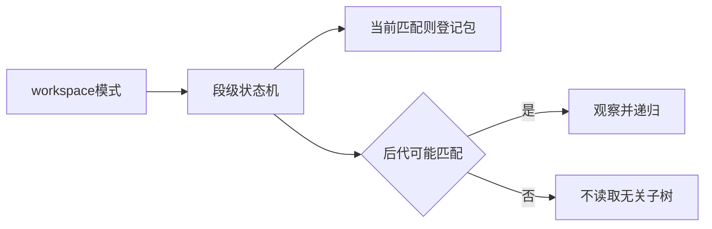
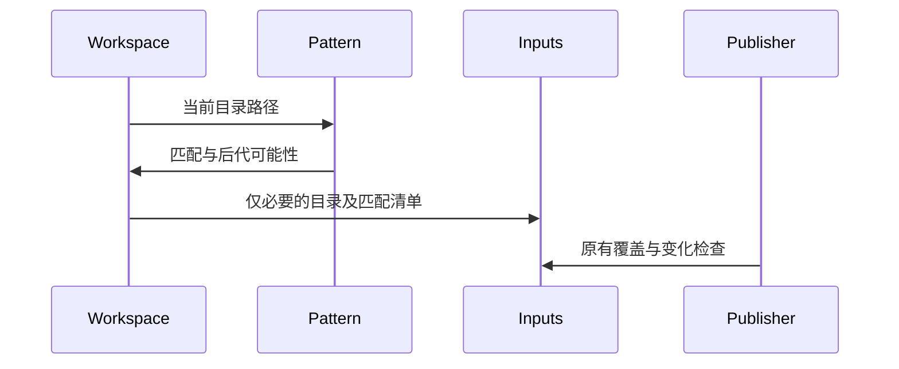

# 工作区无关目录扫描修复

## Intent：最终目标

工作区发现只扫描可能匹配正向模式的目录，避免把无关发布目录登记为编译输入，保持输出覆盖输入保护。

## Data：可用证据

Store初始化再发布工作区只声明packages: [counter]，第一次发布到其产物子目录成功，第二次失败OutputOverlapsInput。workspace.collect无条件遍历并观察每个目录，将产物目录误当作输入。

## Edges：边界与限制

复用原glob状态机，不用目录名特例、不放宽发布检查。正向模式还能匹配后代时才递归；精确命中的包仍读取并观察pkg.yaml。排除规则保持既有匹配语义，不据排除父目录擅自跳过可能合法的后代。

## Answer：实现与标准

模式检查返回当前是否匹配及后代是否可能匹配；workspace据此进入目录。运行现有workspace用例，并在同一目录重复发布Store库，确认实际重复发布成功。

## 自我复核

存在双星通配符时仍需继续扫描；精确匹配和有剩余模式段不同。保护条件不能因输出目录碰巧已存在而变化。目录新增仍由父目录快照捕获。

## 验证结果

现有workspace专项31/31通过，覆盖精确路径、星号、双星、排除、重叠、缺失清单与符号链接。原先失败的Store初始化工作区在同一产物目录重复发布成功，再次执行显示generated=0、reused=3。当前工作区根构建14/14通过。未新增测试或执行全量测试。
