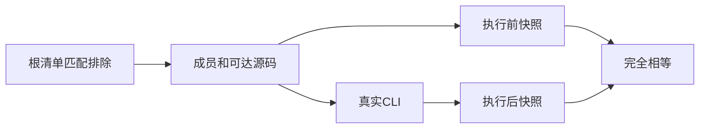

# 工作区检查回归计划

## Intent：最终目标

阶段403：将工作区语义检查的成员范围、依赖图、错误汇总和路径契约变为真实 CLI 回归。

## Data：可用证据

生产提交 290d01da 提供 --workspace，de45fb5d 修复显式清单路径。复用上一阶段只读快照 fixture，在临时工作区创建跨包源码和排除目录。

## Edges：边界与限制

无入口组织包应检查配置，不误要求业务入口；未声明及排除目录不扫描。图错误会阻止成员分析，多个无图错误的独立成员应汇总语义错误。所有检查只读，不自动安装。不把本组 CLI 回归计作 Test262 适配。

## Answer：交付与成功标准

新增 workspace 专项文件并接入 test-semantic-lint，Debug 与 ReleaseSafe 真实 CLI 通过。异常同时断言错误类别及涉及成员，路径测试覆盖符号链接。发现实现问题时通知指定会话；完成后提交推送。




## 验证与自我批判

新增 15 项工作区用例；与单包 36 项合计 51 项。临时目录含空格，另创建指向工作区根的目录符号链接，通过 alias/pkg.yaml 运行；快照记录符号链接目标，不把链接当普通文件读取。无入口的根组织包和成员组织包均通过，有格式问题的组织包拒绝。

跨包合法依赖、显式 --semantic 并用均通过；两个无依赖关联的坏成员在同一次调用中分别定位到 app/main.zx 与 other/main.zx。重复包名、包图环、缺失入口、缺失工作区依赖、未安装外部依赖均拒绝；不安装依赖，所有项目路径与内容保持不变。

最初缺失依赖断言过宽，包含通用 workspace 字样，可能误接受其它工作区错误；核对实际诊断后改为精确验证 dependency absent 与无匹配本地包，外部依赖明确验证 external is not installed。没有观察到生产缺陷，因此未发送实现会话消息。

测试不覆盖所有 glob 组合，也未证明大规模工作区性能；这里只验证 CLI 编排的真实行为。归档库消费属于下一部分，不以本组通过宣称完整语义检查覆盖完成。全包 tsc 的既有错误不在本次改动范围。

## 最终结果与复验命令

Debug 与 ReleaseSafe 均 13/13 步骤、51/51 测试通过，包含本阶段新增 15 项。两模式共 102 次执行，不计成独立用例数量。修改 fixture 后已复验全部语义检查组；专项 TypeScript、Zig 格式和 diff 检查通过。没有新增生产修改或发现生产缺陷。

在 packages/test 执行：

```sh
zig build test-semantic-lint --summary all
zig build test-semantic-lint -Doptimize=ReleaseSafe --summary all
npx tsc --ignoreConfig --noEmit --strict --target ES2024 --module NodeNext --allowImportingTsExtensions --erasableSyntaxOnly --types node tests/semantic_lint/*.ts
```

日志保存在 工作区检查回归/Debug验证.log 与 ReleaseSafe验证.log，仅清理行尾空白，保留实际命令结果。
