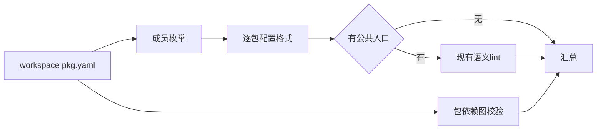

# 工作区语义检查实施计划

## Intent：最终目标

以单个 lint 命令检查 pkg.yaml 声明的完整 workspace 成员，覆盖每包公共入口、配置格式及整个包依赖图，不因根包没有业务入口而漏掉成员。

## Data：可用证据

现有 package/workspace.load 已定义匹配、排除、稳定排序和重复包名检查；package/graph.load 已检查 workspace 依赖、安装状态和无环约束；semantic.run 已覆盖包公共面、Gateway 与 Store entry。复用这些入口，不复制 glob 或包解析规则。

## Edges：边界与限制

新增 lint pkg.yaml --workspace，隐含语义检查；不与 --project 或 --kind 混用。只枚举清单声明的本地成员，外部依赖由正常加载器校验，不把安装缓存当作工作区成员。没有 entry/exports 的组织包只检查配置与图；存在入口的包执行现有语义检查。继续收集不同成员错误，整体任一失败即失败。只读，不安装、不构建、不求解，不扫描各包不可达私有文件。

## Answer：交付与成功标准

CLI 只编排 workspace 和现有 semantic lint。合法跨包依赖通过；根包无入口仍检查成员；两个互不依赖成员同时出错时均报告；排除目录不检查；重复包名和包图错误拒绝。记录 IDEA 文档、可复制示例与实际观测后提交推送。

## 实施与自我复核

--workspace 独立触发工作区检查，可与 --semantic 同用但不必重复。复用 workspace.load 获取本地成员、graph.load 验证完整依赖；每个有公共入口的成员复用 semantic.run，无入口组织包使用配置校验。成员失败继续下一成员，包图无法成立时直接报告图诊断。

实际观测发现 macOS 临时目录的 /var 与 /private/var 表示差异会使根包源码与包归属路径不一致。工作区入口现在将根清单 realPath 后传入成员项目检查，成员清单也从物理工作区根构造，避免同一文件拥有两个路径身份。

实现复用现有单包分析，因此成员的共同依赖可能重复分析；没有引入跨成员语义缓存，不能宣称大型工作区已实现最优检查成本。命令检查声明的公共面，不扫描不可达私有代码，也不替代证明和原生后端构建。现有安装图校验失败时不会自动安装或修复配置。

## 验证结果

最终必要构建 14/14 步成功。合法跨包调用、无入口工作区根、排除目录、显式同时设置 --semantic、修复后的单包与符号链接路径均通过；两个独立成员错误在一次调用中完整报告。重复包名、包图环、缺失 workspace 依赖、未安装外部依赖、缺失成员入口及参数冲突均拒绝。所有主观测的文件名与内容摘要前后相同，没有全量测试、自动安装或浏览器操作。运行结果保留了物理路径修复前的单包失败与修复后的通过，不将历史失败改写成成功。
