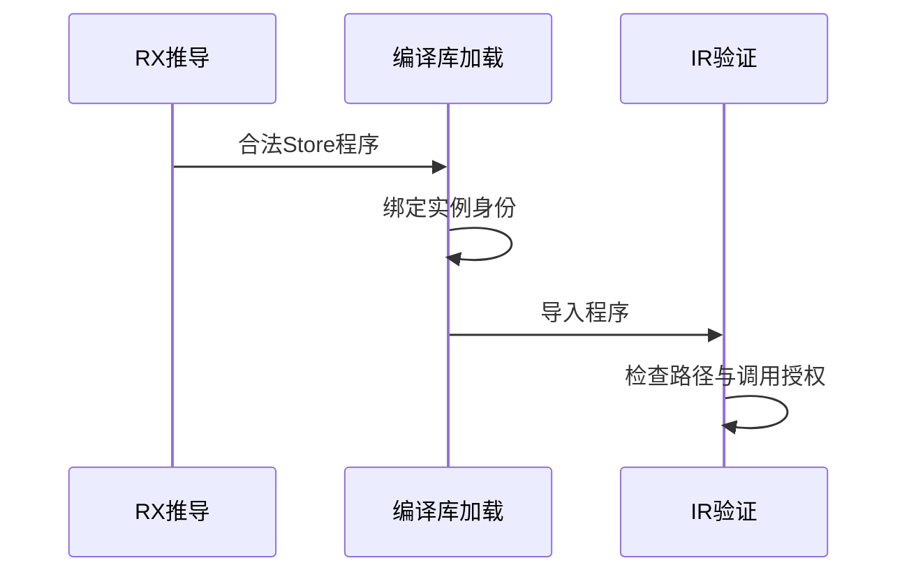

# 已编译 Store 身份与授权验证

## Intent：最终目标

阶段三百五十六：验证Store库导入后的实例路径仍满足IR契约，普通ZX调用不能隐式获得Store权限。

## Data：可用证据

compiled/load.zig通过identity.scope给Store路径加library实例前缀；zx/ir/stores.zig要求slot.path以store.开头。需要真实库导入确认冲突，不仅凭源码推断。

## Edges：边界与限制

真实XML Store和RX项目推导后联结、编码解码，再通过Package.compiled导入。只修改测试，确认生产缺陷后发给实现聊天。不放宽Store路径校验或修改测试来接受无效IR。

## Answer：交付格式与成功标准

覆盖不调用的导入仍保持IR合法、不同实例Store路径隔离、无授权调用的明确拒绝。后续在合法路径上验证真实宿主读写。保留最小复现和结果，完成一部分提交push。

## 自我复核

未使用的函数导入仍可能装载IR，必须区分加载合法性与实际调用权限。普通ZX不能通过import隐式得到Store访问，此项应明确诊断，不能以生成阶段InvalidIr替代。

## 已确认缺陷（修复前）

基线a301c864。真实Store库先经library.link和codec往返验证，再导入到无Store访问、仅返回in的普通ZX消费者。单实例和双实例都被project末端验证拒绝，diagnostic.code为contract，消息为invalid ZX IR version, structure, types or bindings。路径重绑定使用library:前缀，而IR stores.validate仍要求store.，契约冲突已经实测。

回归位于packages/test/tests/library/compiled_store_test.zig，运行 `cd packages/test && zig build test-library-link --summary all`。前两项要求未调用Store时仍能合法导入并保持调用者stores为空、双实例路径隔离；第三项要求无授权调用给capability诊断，而非生成无效IR后报contract。

首次宽泛第三项仅要求diagnostic，会让无效IR伪装成权限正确，已收紧为capability；不能用当前错误行为作为成功断言。

## 并行补齐实际Store库消费

等待生产修复期间，新增真实RX写入口、读入口及重复写入口的统一库Bundle测试。声明和ZX处理函数复用既有Store成熟测试形状，通过XML解析、RX推导、library.link、codec跨进程往返及emitLibrary生成，再用共享ABI和实际依赖表编译消费。

宿主持有显式给定的对象指针并负责发布pending更新；程序从共享指针读取最新值。四项消费者测试覆盖跨公开入口状态延续与旧数组读取视图、只读入口不重新初始化、提交冲突丢弃本次更新且保留先前更新、不同宿主隔离。正反公开顺序均执行。

这里验证显式宿主和库生成契约，不把宿主给定的初始对象当成Store声明初始化已被codec保留，也不证明独立请求arena的长期所有权已解决。

## 修复与验证结果

已向实现聊天01a1017f-f09f-7001-95ef-8e966ebd6aee发送具体复现与路径冲突。生产修复由该聊天提交为cc213ace：Store实例身份保留store.前缀，普通ZX调用具有Store效果的函数在调用点返回capability诊断。本测试会话未修改生产源码。

修复候选执行test-library-link成功：20/20步骤、42/42直接测试，其中新增3项全部通过。修复随后提交；核对生产工作区无剩余修改。库运行全专项test-library-runtime通过72/72步骤、108次Zig消费者测试执行、22Node驱动，其中Store正反序新增4项测试共8次执行。

新Store宿主首次编译时按对象值理解了pending字段，实际ABI使用可选对象指针；按真实zx_pending字段类型修正为持有对象指针的槽位后成功。此测试接入错误与上述生产路径缺陷分别记录，未把宿主错误归因生产实现。

Zig格式与手写源码diff检查通过，生成证据保留原始字节。未执行完整根回归；库声明初始化序列化、独立请求内存生命周期以及实际compiled Store编排调用仍未由本轮证明。测试数量和Test262审阅计数保持此前基线，新增专项不重复计入JSONL。
