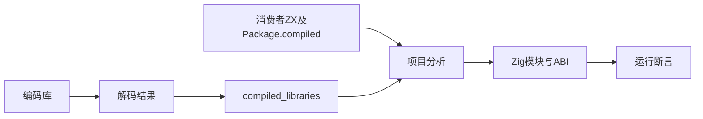
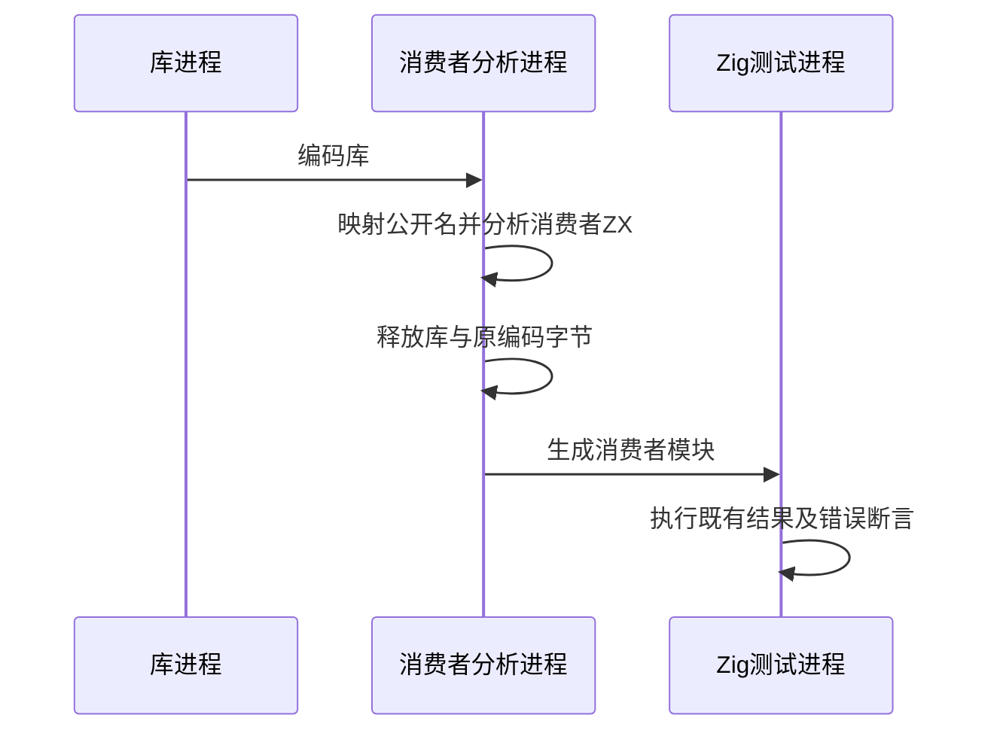

# 已编译库公开模块导入验证

## Intent：最终目标

阶段三百五十四：覆盖dce06289引入的compiled_libraries和Package.compiled，证明ZX消费者能够执行已编译的ZX/RX公开入口，并保持类型身份与边界诊断。

## Data：可用证据

上一阶段直接消费库生成的Zig，没有经由ZX包导入重新分析。新实现通过实例、产物路径与公开名解析目标，加载时重映射函数和名义类型。

## Edges：边界与限制

测试只提供消费者ZX源码，不提供库原始源码。真实库先编码、在另一个进程解码，再通过compiled_libraries导入。公开名不是源文件路径。原生重绑定与Store另行覆盖。只修改测试。

## Answer：交付格式与成功标准

四组纯ZX/RX正反序库运行原有独立消费者断言；增加公开模块错误诊断及实例类型身份测试。释放解码输入后仍能生成和执行。记录并提交push。

## 自我复核

不能以直接emitLibrary代替compiled导入，不能提供库源码供解析器回退。原实例身份共享与不同实例隔离须分别证明。成功运行不等于包管理器已经能发布安装。

## 验证结果

`zig build test-library-link test-library-import --summary all` 全部通过：31/31步骤、36/36直接Zig测试，另有22次真实消费者Zig测试执行、4Node驱动。其中新增12项API测试：所有权1、同实例枚举共享1、不同实例枚举隔离1、导入拒绝边界9。

四组库均先编码，独立进程解码并清零编码字节，再只用消费者源码通过Package.compiled导入。三个公开入口分别经过ZX消费者包装，释放分析及原库后，重新联结并生成模块，原有结果、短路和错误传播断言全部执行通过。原库源码未进入消费者的source set。

首次混合库导入测试假定RX入口公开Input/Output名，实际RX推导程序未导出这两个名称，收到正确的未导出诊断。修正测试消费者：ZX读取公开类型，RX使用独立fixture中明确的结构签名；所有结果仍通过真实函数执行产生，没有生产代码特例。

9项拒绝测试检查缺失库输入、同实例产物不匹配、重复实例、把源文件路径当公开名、type-only默认调用、非法公开表、源入口与compiled目标并存、重复包specifier、不存在的公开类型。除命名类型错误测试外，均同时检查模块诊断码及源索引；消息均精确匹配。

Zig格式检查通过。没有生产缺陷，因此未向实现聊天发送消息。未执行完整根回归；原生重绑定、Store实例状态、增量缓存与发布安装仍须继续覆盖。本轮不增加JSONL或Test262审阅计数。草稿目录保存源码、实际生成依赖表及文件哈希和结构化结果。
