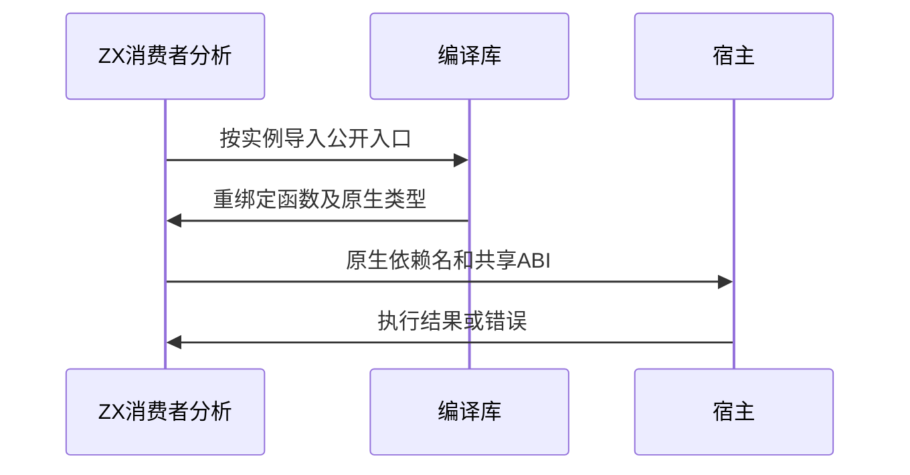

# 已编译库原生身份重绑定验证

## Intent：最终目标

阶段三百五十五：验证已编译库导入时原生模块及名义类型按实例重绑定，且消费者实际可调用宿主。

## Data：可用证据

dce06289 compiled/load.zig对非std原生模块修改identity和import_name；阶段353直接Bundle消费尚未经过该重绑定，阶段354尚未运行原生已编译库。

## Edges：边界与限制

保留真实编码解码和ZX导入路径。通过compiler.zig.abi_view.render把实际身份映射到宿主声明名称；本轮运行链路使用单原生模块fixture，API检查覆盖两个实例。运行测试不伪造模块依赖、返回值或原生签名。

## Answer：交付格式与成功标准

原生库正反序导入复用3项消费者行为测试；补同实例原生合并及不同实例身份隔离检查。通过后提交push。仅修改测试。

## 自我复核

身份字符串不同不足以证明可用，必须编译并执行；反过来单实例运行也不足以证明隔离，需要双实例API检查。不要把多宿主或Store覆盖计入本轮。

## 验证结果

原生库新增正反序compiled导入路径，各执行3项现有原生消费者测试，共6次新增执行。共享宿主枚举类型、调用顺序、helper/调用者失败及重复公开入口行为全部通过。

新增3项API测试：同实例公开别名共享一个重绑定原生模块和枚举类型；两个实例的module key/import_name/枚举type_id隔离且IR有效；释放库与消费者分析之后，生成结果的原生描述及ABI身份仍然有效。双实例API检查不计作双实例运行验证。

首次原生导入运行报ABI缺少native命名空间。检查生产输出发现它按设计提供native_by_identity；测试驱动尚未使用abi_view。接入compiler.zig.abi_view.render生成每个宿主的ABI视图，把真实identity映射回specifier，并依照native.json import_name接入依赖后，原有宿主源码无需改动即可通过。此为测试接入问题，没有生产缺陷通报。

联合执行 `zig build test-library-link test-library-runtime --summary all`：83/83步骤、39/39直接Zig测试、100次消费者Zig测试执行、20Node驱动全部通过。覆盖原有直接生成、编码重放、统一Bundle、ZX/RX以及compiled导入所有现有运行路径。TypeScript类型检查、Prettier、Zig格式通过。仅修改测试与文档。

未执行完整根回归，未验证双实例宿主运行状态隔离或Store状态。JSONL及Test262审阅计数不变。生成证据包含正反序native配置、依赖表、canonical ABI、实际宿主ABI视图与文件哈希；本地完整日志位于草稿目录。
