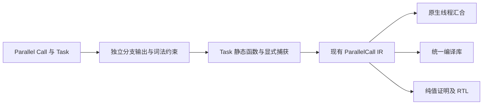
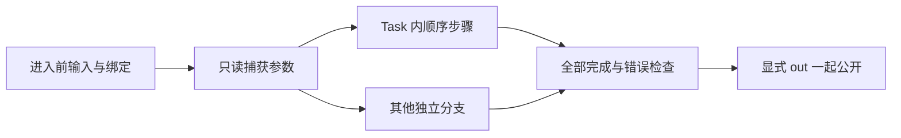

# 并行任务实施计划

## Intent：最终目标

将 Parallel 直属 Task 编译为静态纯函数，在现有原生线程 fork/join、库 IR 和证明管线上执行多步骤分支。保留词法作用域、借用输入、完整错误传播与显式结果汇合，不增加任务解释器或通用运行库。

## Data：可用证据

当前 Task 仅有 name，普通顺序 Task 的 Return 结束模块。Parallel 仅接受 Call，已经提供线程、纯度、所有权、库序列化、证明及 FPGA 生成。Task.name 没有隐式结果绑定契约。

## Edges：边界与限制

Parallel 直属 Task 是独立执行边界：内部 Return 结束该分支，可选 out 显式公开结果。未写 Return 的分支为 void，不能绑定 out；非 void 分支必须覆盖全部返回路径。普通顺序 Task 继续作为分组，其 Return 结束所在执行边界，不新增 out。name 只保留分组含义。

各分支读取进入 Parallel 前的环境，内部顺序 Call.out 不外泄。全部分支完成后公开直属 Call.out 和 Task.out，路径不得重叠。分支失败仍等待其他分支，再按声明顺序报告首个错误。

Task 内 Store 读取发生于工作线程，不等价于父线程快照，因此 Task 的函数闭包必须整体通过纯度检查；不得把读取悄悄提升到父线程。父流程可先捕获数据再供纯分支读取。事件、Gateway、Store 并发仍另行实现。

## Answer：实现与成功标准

准备阶段保留分支结构；约束阶段为每个 Task 建独立输出类型并隔离局部绑定；编译阶段将外层环境映射为显式元组输入，生成普通函数；直属 Task 最终转为已有 ParallelCall，无需更改 core IR 版本。

完成标准：含捕获、分支局部绑定、Switch 和嵌套 Parallel 的真实程序能构建执行与库消费，受支持数值程序可证明与生成 RTL；错误作用域、非纯调用及缺失返回继续拒绝。只运行相关已有专项，不新增测试、不执行全量测试。

## 自我复核

并行 Task 此前没有执行语义，本阶段必须公开独立返回边界，不能借 Task.name 推导隐式 out，也不能改变普通顺序 Task 的返回行为。静态函数捕获不得复制可变所有权或让工作分支消费父作用域所有者；最终 IR 仍需完整验证。

## 实施细节

Task 通过准备阶段的模块内递增 ID 保持身份，不使用 name 或源码偏移充当唯一键。提取函数采用模块路径与该 ID 组合的内部身份，避免多个 Task 与根模块在 Zig 生成缓存中碰撞。

捕获选择读取表达式 IR 的环境投影符号，只保留实际引用的外层值；同名 lambda 参数不会误触发捕获。联结按名称与类型映射环境符号，省略未引用投影，实际缺失引用仍报错。Task 内纯调用可以保留未使用的 native 导入元数据，正常合并原生表，纯度检查仍禁止实际 external 执行。

测试会话反馈：三个并行输出依次为同名、同名、其他名称时，旧实现用最后属性定位冲突。现在每个绑定保存原始 out span，冲突与 void out 均指向具体属性；适用于 Call 与 Task。测试会话新增的中文前导注释回归已通过，本会话不修改测试。

## 验证结果

- 根构建 14/14 步通过。相关 RX 推导、顺序执行与并行执行专项 135/135 步、403/403 测试通过；测试会话随后扩展并行推导后再次执行两个推导专项，7/7 步、196/196 测试通过，其中并行推导 58 个。没有运行全量测试，也没有修改或新增测试文件。
- [构建记录](并行任务/构建记录.json) 保存真实 verify、组合与时钟 FPGA、标量应用、列表应用、带契约统一库发布、离线安装和消费端构建的命令与输出，全部退出 0。
- Z3 证明前提可满足（sat），反例查询不可满足（unsat）。Task 内仍保留原恒等函数契约，未关闭证明门禁。
- [原生执行](并行任务/原生执行.json) 与 [消费执行](并行任务/消费执行.json) 各包含四组 bool 与 u8 边界输入，均返回保留数值并翻转布尔。示例有外层捕获、局部顺序调用、Switch、嵌套 Task、混合 Call/Task 与无输出 Task。
- [动态数据示例](并行任务/示例/lists.rx) 输入 `[2,3,7]`，输出为 `{"mapped":[3,4,8],"saved":[[3,4],8],"total":12}`。Task 分配的列表在汇合后有效；未被分支引用的 saved 没有被捕获，父流程可继续执行消费式 pop。记录见 [动态数据执行](并行任务/动态数据执行.json)。
- RTL 与端口清单生成成功，时钟版延迟 1；没有进行 RTL 仿真、综合或板级验证。函数语义证明不等于线程资源和同步实现的证明。

## 交付复核

正式实现仅扩展 RX 准备、推导、静态函数提取和帮助文本，没有增加专用运行库、另一个并行 IR 或库格式版本。直接 Call 的既有执行路径保持同一线程后端。Task 的独立返回边界和显式 out 已同步到使用参考、应用指导、RX 模块说明及进度核对。

已修复实现中的函数身份碰撞、过宽捕获、未使用 native 表丢失和输出冲突定位问题。后续仍需实现 Store 并发、事件、Gateway、长期内存回收及完整自举，不能将纯 Task 这一阶段视为整个目标完成。

测试会话后续发现 Module 的 dsl.choice 直接解码 Task，绕过 steps 的作用域检查。已将顺序 Task 的 out 禁止规则收回 Task 标签本身的 Sequential refine，并让 Module 与 Switch 等顺序作用域共同选择该 Schema；Parallel 才使用允许 out 的 Task。这样不会出现模块直属 Task.out 静默忽略而 Switch 内拒绝的入口差异。

顺序 Task.out 的统一 Schema 修复后，现有 RX 推导 138/138 通过；测试会话补齐的并行推导与 Schema 边界最终 68/68 通过。本会话未修改测试。

格式化发布库后已重算受管文件 SHA，并用最终编译器再次构建源码应用与消费端，各重跑四组输入，全部通过。证据见 [最终构建记录](并行任务/最终构建记录.json)。
