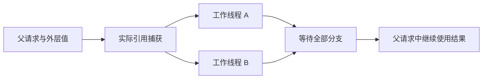

# 第 376 阶段：并行任务运行专项验证

## Intent：最终目标

验证 Parallel Task 的真实线程执行、捕获和输出内存寿命、嵌套汇合及失败路径，补足上一阶段仅推导通过的边界。完整 Test262 对齐与全部 zxc 特性覆盖继续保留。

## Data：可用证据

起始 HEAD 3c2b5797；Task 实现依据 23890419，最终借用修复提交 e9f79cdf7e868ae05ba0a0b73e9ff8cf2fbf38c6。已阅读最新 RX 并行任务参考。沿用真实 XML/ZX 项目推导、IR 校验、生成 Zig 和独立宿主执行链，复用已有 direct/service 对照与线程记录器。

## Edges：边界与限制

仅修改测试、测试构建和文档。确认生产问题后通知实现聊天，不改生产源码。线程 ID 证明工作线程实际执行，不证明所有计算时段重叠；不引入有副作用的伪纯函数或计时阈值。操作系统线程资源耗尽与全部调度交错仍需单独验证。

## Answer：交付与成功标准

添加 Task 直接/服务/嵌套运行夹具及错误、输入失败、已捕获和未捕获 owned 数据测试。逐元素核对独立预期、保持输入、观察工作线程、检查请求 arena 释放。专项通过后按阶段提交 push。

## 执行记录

- 扩展现有 `test-rx-parallel-runtime` 到 18 个真实项目模式、75 项 Zig 测试。旧直接 Call/服务数值结果测试继续运行；新增 Task 直接/服务/嵌套结果、正反错误顺序、工作线程输入失败、未捕获 owned 值可消费、共享 owned 捕获及嵌套输出存活。
- Task 夹具故意使用相同 name 和相同局部变量名，验证它们不是生成函数唯一身份；所有结果逐元素核对，空数组、单元素、重复值、顺序、u64 安全边界、连续请求均有用例。
- `worker_failure.zig` 只拒绝非父线程的分配/扩容，保留父线程捕获构造。对 8192 元素的分支分配强制 OutOfMemory，同时另一分支触发 IndexOutOfBounds，按声明顺序检查首个错误，并断言注入确实发生。无 out Task 也执行并传播错误。
- 新增 8 项 RX 编译期所有权对照：两个 Task 共享 owned 捕获可经对象或嵌套列表返回；捕获后父流程消费和 Task 内消费仍拒绝；普通聚合返回中重复移动同一 owner 仍拒绝；返回标量的 Store setter 仍冻结发布的参数，保留只读访问。
- 发现真实缺陷：父流程产生的 owned saved 列表被两个只读 Task 捕获时，第二个 Task 报 previous owner was consumed。已发送一次消息给实现聊天。根因是聚合参数的子值无条件使用 move，覆盖了 Parallel 输入的 read 语义；实现先改为在列表/元组/对象中传播外层模式，随后加入参数求值期间的临时借用，按调用范围释放；借用结果或 Store 写入使借用永久逃逸。测试未复制 saved 绕过问题，实际验证共享原捕获和新分支结果的地址、数值与清理。
- 首轮还暴露我方既有线程观测断言不可靠：渐进 map 的 arena 容量可能被另一分支复用，底层 allocator 只记录到一个线程，不能据此判断生成器串行。已移除 map 结果组里的线程数断言，改为四个独立单次大块分配夹具（direct/service/Task/nested Task），每个重复 32 个新请求。
- 线程夹具通过合法的空 owned 列表 concat 输入分配完整结果；8192 元素输出使每个分支必须访问底层 allocator，避开渐进扩容遗留空闲容量。已检查并保存 [生成源码展示副本](并行任务运行测试草稿/线程观测/program.zig)，实际测试不修改生成产物；展示副本按仓库格式整理。最初尝试数组 spread 被当前 ZX 文法拒绝，改用既有 concat API；这是测试夹具选择修正，不是生产问题。
- 修复工作区上，`zig build test-rx-parallel-runtime test-rx-parallel-inference test-rx-inference --summary all` 在 packages/test 执行，**81/81 步骤、287/287 Zig 测试**通过（75 运行、74 并行推导、138 原有 RX 推导）。四组线程夹具的 128 次执行不额外计为 128 个 Zig test。
- 因修复涉及公共所有权规则，另执行 `test-frontend test-ownership-contracts test-match-module-types`：**13/13 步骤、5313/5313 测试**通过，包括 5305 个前端目录案例。未运行根全量回归。
- 实现方进一步收紧临时借用后，新增 13 项 ZX 项目测试，接入既有 `test-ownership-contracts`：对象/元组/列表临时参数允许调用后消费；同一参数表达式内后续消费、嵌套对象消费、嵌套调用提前释放外层借用均拒绝；新 map 结果不错误冻结原列表；返回借用结果持续冻结；成功与冲突各有逐次分配失败检查。
- 正式生产提交 `e9f79cdf fix(ownership): preserve scoped borrows in aggregate call arguments` 后，执行六个目标：`test-rx-parallel-runtime test-rx-parallel-inference test-rx-inference test-frontend test-ownership-contracts test-match-module-types`，**93/93 步骤、5615/5615 Zig 测试**全部通过，退出 0。其中运行 75、并行推导 76、原有 RX 推导 138、前端 5305、所有权契约 16、跨模块 match 5。回归结束时 compiler/core/genz 无未提交源码修改，见 [最终回归结果](并行任务运行测试草稿/最终回归结果.txt)。
- Store 后续核对确认：现有 memory 宿主用同一长期 arena，尚未覆盖 State.request 的独立请求交接链。已形成 [后续验证计划](Store请求内存验证计划.md)，该计划未增加测试覆盖计数。

## 自我复核

修正了上一阶段线程观测依赖 arena 扩容路径的不足，保留当时实际观测结果作为历史，不把偶发单线程分配记录当作生产串行缺陷。新观测夹具针对线程执行证据，普通 map 数值与生命周期夹具仍完整保留；没有通过降低线程数量预期让旧断言通过。

单次大块分配依据当前固定 Zig 0.16 arena 与 genz concat 实现，后续分配策略变化需要复核观测方式。线程身份和结果正确性不能证明所有计算时段重叠、所有调度顺序及线程创建失败处理。逐次分配失败只覆盖观测到的请求路径。

未验证全部 Parallel Task 控制流、编译库 round-trip、证明和 RTL 后端，未覆盖 Store 请求 arena 的完整生命周期。Test262 审阅计数保持不变，完整目标仍未达到。
