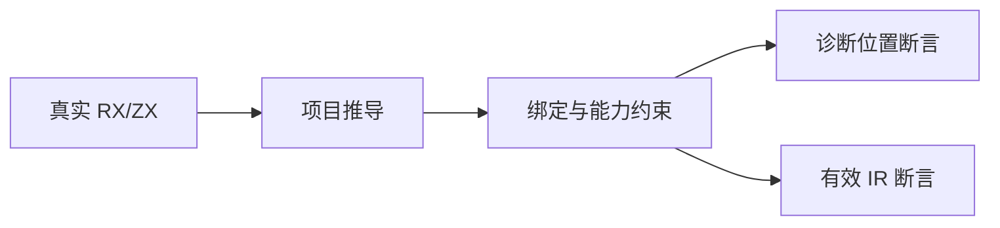
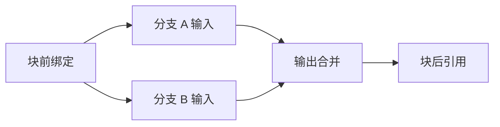

# 第 375 阶段：并行约束专项验证

## Intent：最终目标

验证 Parallel 在真实项目推导中的独立输入、输出作用域、路径互斥和纯调用约束，避免只验证可执行的正向路径。继续推进完整 Test262 对齐及 zxc 全特性覆盖。

## Data：可用证据

起始基线 0a7c606e，最终生产依赖提交为 238904199050b2386666a48dd9a0ef2c7c791d62。已阅读 RX 开发约定、Parallel 项目准备、约束收集、flow_compile 和 isParallelSafe 实现；对照已有 RX 推导、Store 权限、原生接口声明及多文件诊断定位测试。

## Edges：边界与限制

只修改测试和构建注册。生产修复由实现聊天负责；确认缺陷才发消息。测试使用真实 XML 和 ZX，不构造替代 AST，不放宽约束。本阶段验证编译期语义，不代替上阶段运行证据，也不覆盖完整证明/RTL 后端。

## Answer：交付与成功标准

增加独立并行推导目标，接入总回归。拒绝测试核对诊断类别、来源路径和相关原始位置；正向测试核对推导成功与 IR 有效性。覆盖资源失败清理，保存执行结果，并在完成部分后提交 push。

## 执行记录

- 新增 `test-rx-parallel-inference`，接入 test 包总回归。68 个 Zig 测试：作用域 21、Task 边界 16、结构入口 4、原始位置 7、路径矩阵 1、能力边界 19。
- 路径矩阵独立列出 7 条路径与预期祖先关系，执行 49 个有序路径对（17 拒绝、32 允许）；包含相同路径、祖先/后代、共同前缀、不同根以及冲突后追加无关 Call。数字不会计为 49 个新增 Zig test，避免混淆统计口径。
- 正向覆盖：兄弟读取块前绑定、汇合后顺序消费、后续并行组读取前一组结果、Task/Switch 作用域、无输出纯调用、无关原生 import、纯 service 的未使用 Store 声明、父线程 Store 快照、并行前后顺序原生调用。
- 拒绝覆盖：前后兄弟输出依赖、输出同名/祖先/后代冲突、覆盖旧绑定、逃逸局部绑定、输入和 Store 命名空间、直接/传递 ZX/两级 RX 原生调用、无输出原生调用、直接 Store setter 及 service 内 Store 读写。拒绝断言包括类别、来源、原始 offset/行列；能力诊断再核对稳定的语义说明。
- 5 项逐次分配失败枚举覆盖成功推导、兄弟输入诊断、路径冲突诊断、原生能力诊断、Store 能力诊断。全部通过 std.testing.allocator 检查释放。
- 首轮 33 项中 23 通过、10 失败：9 项因并行 Task 实现正在把提示 calls 改为 branches，改为匹配共同语义；另外 1 项是实际输出冲突定位缺陷。扩展后 39/42 通过，3 个失败均指向同一定位根因。
- 真缺陷：第二分支 `ctx.value` 与第一分支重名时，第三分支 `ctx.other` 被误标。真实中文前导 XML 应为 offset 117，实际 164。针对该缺陷已发送一次消息给实现聊天；生产修复让绑定保留自身 span，冲突时使用该 span。测试保持正确位置断言，未改写预期迎合错误。
- 修复后补充实体编码、CRLF、子模块、Task/Call 混合冲突定位。47 项推导与上阶段 26 项运行合计 73/73 通过；追加 49 对路径矩阵后，74/74 通过；增加 Task 捕获、局部同名、兄弟隔离和纯度边界 10 项后，**26/26 构建步骤、84/84 Zig 测试**（58 推导 + 26 运行），退出 0。
- 相关回归曾以 58 项推导版本运行 `test-rx-inference test-rx-runtime test-rx-parallel-inference test-rx-parallel-runtime`，135/135 步骤、419/419 Zig 测试及 3 个 Node 组通过；不将后续新增的 10 项算入该次结果。
- 扩展返回路径与结构入口后发现第二个真实缺陷：Module 直属普通 Task.out 被接受并忽略，Switch 内却正确拒绝。原因是 Module 的 dsl.choice 直接使用 Task Schema，绕过 steps.children 的顺序作用域检查。已再次通知实现聊天；生产代码让两入口统一使用 Task.Sequential。修复后 68/68 新专项通过，单文件 rx.validate 与集合 rx.validateModules 都覆盖了拒绝与允许上下文。
- 新增返回边界同时覆盖 void 分支绑定拒绝、无 out void 分支成功、非 void 完整返回路径、普通 Task.out 和 Switch 内 Task.out 拒绝。结构辅助测试曾错误地把 Diagnostic.element 当成 optional，按真实签名修正；此测试编译错误不是生产缺陷。
- 命令在 `packages/test`：`zig build test-rx-parallel-inference test-rx-parallel-runtime --summary all`。原始失败与最终结果保存在 [测试草稿目录](并行约束测试草稿/)。Zig fmt --check 已通过；本阶段 git diff 检查通过。
- 实现聊天已提交 `23890419 feat(rx): compile parallel Task branches with explicit scoped outputs`，包含两处修复。该提交后复跑上述四个 RX 推导/运行目标，**135/135 构建步骤、429/429 Zig 测试、3/3 Node 组**通过，退出 0；新专项占 68 项。复跑前后 compiler/core/genz 范围无未提交源码改动，结果保存在 [提交后相关回归](并行约束测试草稿/提交后相关回归.txt)。
- 编译器原有结构入口另在 `packages/compiler` 执行 `zig build test-rx --summary all`，**3/3 步骤、39/39 测试**通过。

## 自我复核

不把新的 Task 执行能力整体计为本阶段覆盖；这里验证其编译期捕获和作用域边界、纯度限制及与 Call 共用的输出冲突位置，未补完整运行矩阵。纯度正向对照证明限制没有扩散到未调用的 import 或父线程快照，反向用例则沿真实调用链触发拒绝。

诊断辅助逻辑按原始文本计算位置，预期路径关系由显式表给出，没有复用生产 overlaps 函数。49 对有限矩阵不是任意路径规模的证明。内存失败枚举限于这些推导路径，不能推广到全部编译器操作。

本阶段未运行根全量回归；未验证完整 Task 捕获、线程启动失败、编译库 round-trip、Parallel 证明/RTL 后端。完整 Test262 审阅仍未完成，既有审阅计数未因本阶段改变。
