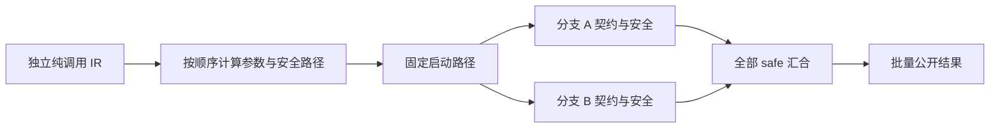
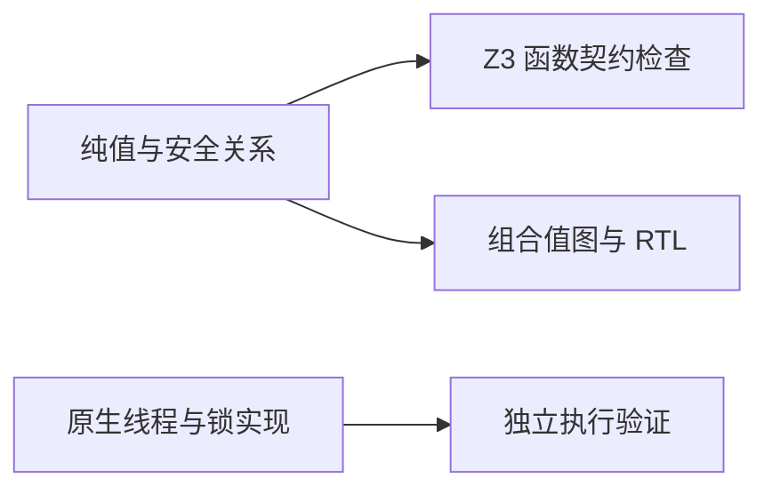

# 并行纯计算证明

## Intent：最终目标

为已通过独立性、纯度与所有权校验的 Parallel Call 建立函数语义模型，检查全部分支的算术安全、调用契约和结果，并让 FPGA 后端复用相同纯值图。接通含契约的并行编译库发布。

## Data：可用证据

IR 校验已经限制分支可达函数不含 Store 或 external，参数不能读取兄弟输出；genz 先计算全部输入，再启动线程，最后等待全部线程并按声明顺序传播错误。实施前 Conditions.block 明确拒绝 parallel；本次已接通下述三阶段模型。

既有 Expressions 缓存按 ExprId 保留参数值，calls.evaluate 返回值与包含 requires、函数体、ensures 和正常返回的 safe 条件；硬件生成通过 Conditions.model 构造组合值图。因此无需新增一套并发解释器或把线程概念放入硬件 IR。

## Edges：边界与限制

证明以已有 IR 独立性和纯度门禁为前提，只覆盖支持的 bool、枚举、定宽整数及对象、元组。字符串、动态列表、浮点等仍按既有边界拒绝。不把纯函数值证明扩大为操作系统资源充足、线程启动成功、锁实现正确、调度时序或一般无数据竞争证明。

参数在父线程按顺序求值；前一参数失败后后续参数不执行。所有参数成功后，所有分支都有执行义务，不能因先列分支失败而隐藏后列分支的安全检查。无 out 的分支同样参与证明。仅在全部分支成功的路径上公开结果并继续后续语句。

FPGA 复用纯函数关系生成值电路，不承诺线程资源一一对应、独立计算单元数量或调度延迟。原有契约证明和硬件输入类型门禁继续保留。

## Answer：实现与成功标准

Conditions.block 的 parallel 处理分为参数、分支、汇合三个阶段：参数路径逐步收窄；启动路径固定，用它检查每个分支；继续路径累积全部 safe；最后批量发布可选输出符号。复用既有求值缓存，不修改 calls 的缓存键。

用现有纯函数与契约源码建立实际并行编排，运行真实 Z3、生成组合和时钟型 RTL，并完成含契约库的发布消费；复用既有反例检查未使用分支也不会绕过契约。仅运行相关既有专项，不新增测试用例、不执行全量测试。

## 自我复核

纯分支的函数关系与完成顺序无关，但实现里的同步仍需执行验证；这里没有证明线程库本身。必须检查无输出分支、嵌套调用和失败路径，不能只验证最后返回的那一个值。硬件图的共享表达式属于纯计算优化，不代表已经实现指定的并行硬件资源布局。

## 实施与验证记录

正式源码仅修改 `packages/compiler/src/verification/conditions.zig`，保留同一表达式缓存，新增参数、分支和汇合三阶段处理。全部分支使用固定启动路径检查，只有后续语句使用累积成功路径。源码草稿位于 [conditions.zig](并行纯计算证明/草稿/conditions.zig)。

- 真实 Z3：前提可满足（sat），安全义务反例查询不可满足（unsat）；证据位于 [生成目录](并行纯计算证明/生成/parallel.smt2)。
- 嵌套 Parallel：外层调用数值恒等函数与 RX 布尔模块，内层包含有输出和无输出分支。原生应用及带契约统一库的 ZX 消费端各执行四组输入（bool 两值、u8 的 0 与 255），结果均为保留数值、翻转布尔。见 [原生记录](并行纯计算证明/原生执行.json) 与 [消费记录](并行纯计算证明/消费执行.json)。
- 未使用分支：复用既有库发布契约反例，只替换无 out 的函数；verify、FPGA 与 lib 发布均报告反例并退出 1。原有 RTL、端口清单与整个已发布库文件的 SHA 保持不变。已恢复有效源码；历史坏源码、命令与输出保存在 [反例记录](并行纯计算证明/未使用分支契约反例.json)。
- 硬件：生成组合与时钟型 SystemVerilog 及清单；组合延迟 0、时钟型延迟 1。这里验证的是生成和证明门禁，未进行 RTL 仿真、综合或板级验证。
- 根构建 14/14 步；既有验证、证明资源和硬件资源专项 22/22 步、8/8 Zig 测试通过，包含验证 CLI 20 个场景、枚举 74 个、公有接口 8 个场景。未执行全量测试，未新增测试用例。

## 交付复核

原生执行用四组输入确认实际调用链，不能替代全输入证明；SMT 的结论只覆盖已建模类型及到达契约。硬件产物没有表达操作系统线程，不能据此宣称并发运行库已经形式化验证。动态数据、Parallel Task、Store 并发、事件及 Gateway 仍需后续实现，本阶段不作为自举完成证据。
