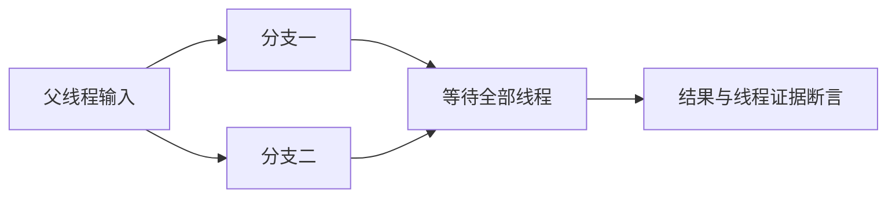

# 第 374 阶段：并行运行专项验证

## Intent：最终目标

为 RX 原生 Parallel 添加可持续执行的独立测试，推动全部 zxc 特性覆盖。完整 Test262 对齐仍是长期目标。

## Data：可用证据

当前基线 0f3f688a，原生并行实现 21e32116。已阅读 RX 规则、README、项目推导和 genz 并行生成器，以及已有 RX 项目运行测试。

## Edges：边界与限制

只修改 packages/test 测试及构建注册；生产问题交由实现聊天修复。当前工作区存在其他聊天未提交修改，保留。线程 ID 观测证明线程执行，不能证明所有计算时段重叠；不以耗时作为并行正确性判据。线程创建资源耗尽和所有调度交错不在本阶段证明范围。

## Answer：交付与成功标准

真实 RX/ZX 文本经项目推导、IR 校验、Zig bundle 生成后执行。验证两分支结果独立、父输入不变、空输入、整数边界、多个请求、分支错误与内存失败。通过专项后提交并推送，记录命令与实际结果。

## 执行记录

- 新增 `packages/test/build/rx_parallel_runtime.zig`，注册 `test-rx-parallel-runtime`，并接入 test 包总回归。
- 项目编译驱动读取真实 RX/ZX 夹具，调用 project.infer、validateIr 和 emitBundle。宿主测试直接执行生成源码，未修改生成代码或添加生产特例。
- 直接调用与 service 各 7 项：空数组、单元素、顺序与重复值、u64 安全运算边界、8192 元素的两个工作线程记录、连续调用结果存活、逐次内存分配失败清理。所有运行结果逐元素对照宿主算术，验证父输入不变以及输出不互相别名。
- 两种声明顺序各 5 项：无 out 分支索引越界、成功无 out 分支、索引越界与 OutOfMemory 同时发生时的错误优先级、单独分配失败、失败后新请求成功。分配失败通过 std.testing.FailingAllocator 注入；显式检查 has_induced_failure，确认另一失败分支实际执行。
- 输入求值 2 项：第二个输入索引越界时，没有工作线程分配；成功输入的临时数组跨 join 保持有效。第一分支使用大数组确保若执行就有可观测分配。
- 初次 7/7 通过；扩展测试时驱动本地变量与 main 函数重名导致编译失败，修正为 entry_text 后 26/26 通过。初次误在根目录调用专项目标被拒绝，正确入口为 packages/test。均为测试接入问题，没有生产缺陷，未通知实现聊天。
- 最终命令在 `packages/test`：`zig build test-rx-parallel-runtime --summary all`，退出 0，**23/23 构建步骤、26/26 Zig 测试**。结果保存于 [专项回归结果](并行运行测试草稿/专项回归结果.txt)。Zig fmt --check 和本阶段 git diff --check 均通过。
- 验证期间实现聊天提交 c92a0d36，新增 Parallel 证明及 RTL 能力；本阶段不据此声称已覆盖该后端。本次没有运行根全量回归。

## 自我复核

线程记录器只锁自身固定大小的线程记录表，不锁底层 allocator 调用；生产生成器仍负责并行 arena 访问的同步。大数组确保两次分支输出需要各自进行底层分配。结果断言与线程记录共同排除仅验证数值而未确认线程执行的问题。

线程 ID 不能证明计算持续重叠；本阶段未使用计时阈值或带副作用的伪纯函数。注入分配失败不等于线程启动失败覆盖，逐次失败枚举只覆盖实际观察的分配路径。未穷举线程调度，也未证明所有平台线程实现安全。

后续仍需覆盖并行闭包的 Store/external 拒绝、兄弟输出依赖与重叠路径拒绝、嵌套与顺序组、编译库序列化及再消费，以及新加入的证明/RTL 后端。全部 Test262 对齐仍未完成；本阶段没有改变 Test262 审阅计数。
