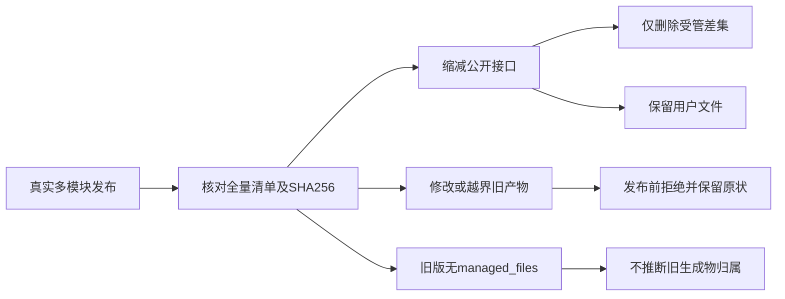
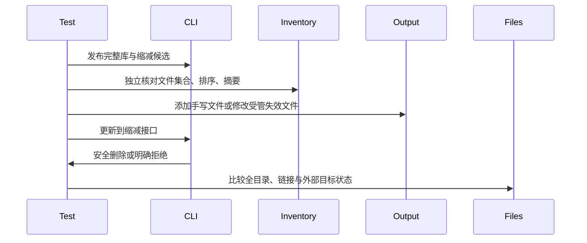

# 库受管文件清理验证

## Intent：最终目标

阶段三百七十：为d6303aa7的库受管文件清理建立回归测试，证明成功更新删除失效生成物，同时保护未登记文件、被修改文件和输出目录外的文件。

## Data：可用证据

library/inventory记录除library.json外实际生成文件的路径与摘要；library_resources在发布前计算差集并校验内容、物理路径和输入关系。旧清单没有managed_files时只处理bundled_files，不推断旧生成文件所有权。现有发布专项没有覆盖该新清理协议。

## Edges：边界与限制

只编辑测试与构建注册。使用真实多公开模块发布及类型接口缩减发布，按实际清单差集定位失效文件，不写死生成文件名。测试临时目录中的清单损坏、目录与符号链接均仅作用于临时fixture。未测试并发TOCTOU、平台所有文件系统差异或整目录原子替换。

## Answer：交付与成功标准

验证清单全量、排序、摘要准确；缩减公开导出后所有受管失效文件消失，未登记说明文件及生成目录中的手写文件保留。缺失旧文件允许恢复发布，旧无managed_files清单保留未知旧生成文件。修改旧文件、文件类型替换、符号链接逃逸、越界清单、非受管路径和损坏清单必须拒绝，并保留输出及外部文件。

## 自我复核

失效集合来自两次真实发布，而非假设某个散列路径。负例要核查诊断与文件状态，链接场景不能只使用忽略链接的文件快照。清单不是来源签名，不声称能防止具有输出目录写权限的攻击者篡改所有权和摘要。

## 实施与验证结果

新增test-library-inventory并接入主发布回归。inventory助手独立读取生成清单，以实际目录文件集合校验全量性、去重和排序，逐文件重算SHA256，明确排除library.json自引用。先发布完整库，再单独发布仅types的候选库，取得真实旧新差集，并确认同时包含public与modules失效文件。

在完整输出加入keep.txt、public/manual.zig、modules/manual.zig、interfaces/manual.d.zx，均不登记到旧清单。8个拒绝场景每次从同一完整副本恢复：修改失效文件内容、以带文件的目录替换、以文件符号链接替换、把父public目录改为指向输出外副本的链接、增加越界路径、增加非受管keep.txt路径、格式版本99、损坏JSON。分别要求LibraryResourceModified、LibraryResourceOutsideOutput、InvalidLibraryInventory或SyntaxError。每次检查输出文件快照、外部文件快照；链接显式检查readlink，目录显式检查lstat，不让普通文件快照遗漏链接类型变化。

3个成功更新场景为正常受管差集、事先缺少一份失效文件、旧清单不含managed_files。前两者全部失效文件消失；缺失文件不阻塞发布，旧摘要大写仍能正确比较。旧清单场景保留全部未知归属的生成文件，符合保守兼容约定。所有场景中4份手写文件保持原字节，新清单以及候选库的全部文件均与独立候选一致。

| 验证                   | 实测结果                                       |
| ---------------------- | ---------------------------------------------- |
| test-library-inventory | 首次通过，10/10构建步骤                        |
| Node测试               | 12/12：1个父测试、8个拒绝场景、3个成功更新场景 |
| 成功发布               | 5次：完整基线、独立候选、3次更新               |
| 拒绝发布               | 8次，均保留输出及外部状态                      |
| 清单独立核对           | 完整基线、缩减候选的实际文件集合、排序及SHA256 |
| @zxc/test typecheck    | 退出码0                                        |
| 格式与diff检查         | 通过                                           |

基线06bb524f，本轮CLI重新构建，工作区同时存在实现聊天的compile相关未提交变更；测试只提交本轮新增测试与文档。没有发现新生产缺陷，未向实现聊天发送消息。未执行根目录全量回归，本专项没有应用运行断言；此前消费执行证据不能替代本专项之外的新实现验证。JSONL用例和Test262审阅数量不变。

自我复核：本轮旧清单兼容使用format_version=2但省略managed_files，未覆盖v1或真实native bundled_files退役；未覆盖重名当前文件的覆盖策略、并发修改窗口和watch完整循环。因此只声称当前受管差集及拒绝路径通过。完整测试与源码输入副本、机器可读结果保存在库受管文件测试草稿，日志本地忽略。
